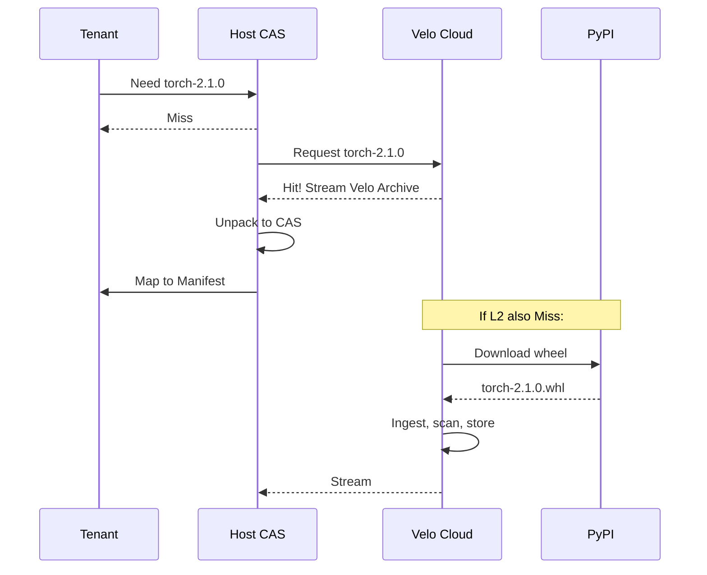

# Velo Rift™ Technical Architecture Specification

> **Status**: Living Document  
> **Language**: English Only  
> **Scope**: Low-level implementation details, directory structures, data schemas, and internal protocols.

---

## 0. Design Philosophy: "Full Path = Content = ID"

VeloVFS is built on a single, powerful first principle that fundamentally changes how filesystems work:

### 0.1 The Core Equation

```text
Traditional FS:  Path → (Tree Traversal) → Inode → Block → Content
VeloVFS:         Path → Hash(Path) → Content_ID → mmap(Pointer)
```

**In an immutable snapshot**, the full path string `/src/utils/helper.js` uniquely determines:
1. **The content bytes** (there's no ambiguity about which version)
2. **The content hash** (BLAKE3 of those bytes)
3. **The physical location** (CAS offset or packfile pointer)

Therefore: `Hash(Full_Path) → Content_ID` — The directory tree disappears.

### 0.2 Implications

| Traditional FS Problem | VeloVFS Solution |
|------------------------|-----------------|
| O(depth) tree traversal for `open()` | O(1) hash lookup |
| String comparison on each level | Single integer comparison |
| Directory locking for concurrent access | Lock-free (immutable data) |
| Random I/O for nested paths | Sequential packfile access |

### 0.3 The Semantic Gap Bridge

```text
Application Layer:  "Load React library"     (Semantic intent)
                          ↓
Traditional FS:     "Read Block #998"         (No context)
                          ↓
VeloVFS:            "Hash 0xABC → mmap ptr"   (Content-aware)
```

VeloVFS understands that a hash represents a complete logical unit — enabling:
- **Atomic deduplication**: Same content = same hash = stored once
- **Intelligent packing**: Related files placed contiguously
- **Zero-copy delivery**: Return pointer, not copied bytes

### 0.4 Design Mantra

> "VeloVFS is not a storage system — it's a **data virtualization layer**.  
> Below: Leverage cheap commodity storage (S3, NVMe, Ceph).  
> Above: Deliver optimized, content-aware data views for high-density compute."

---

## 0.5 Why VeloVFS Exists (The Paradigm Shift)

### The Inode Model is Broken

Traditional filesystems were designed for **human-edited documents** (1970s):
- Files have names, live in directories
- Mutability is primary (edit in place)
- Identity = path (same path = same file)

In 2026, **99% of filesystem I/O is machine-generated**:
- Package managers download immutable artifacts
- Build systems produce deterministic outputs
- Containers layer read-only images
- AI agents execute in hermetic environments

**The mismatch**: We're using a mutable, path-centric filesystem for immutable, content-centric workloads.

### Why AI Agents Need Immutable Worlds

```text
Traditional Agent:
  Agent → mutate file → observe result → ??? (non-deterministic)

Velo Agent:
  Agent → create snapshot → execute in snapshot → 
         → diff result → deterministic replay possible
```

**Guarantees**:
- Every agent action can be **replayed** (same snapshot = same behavior)
- Agent state can be **forked** (parallel exploration)
- Execution can be **audited** (snapshot hash = proof of environment)

### Why Builds, Tests, and Runtime Should Share One Substrate

```text
Current World:
  Build: Bazel sandbox → artifacts
  Test:  Docker container → disposable
  Prod:  Kubernetes pod → yet another copy

Velo World:
  Build: Snapshot A → artifacts (hash: 0xDEAD)
  Test:  Same Snapshot A → deterministic
  Prod:  Same Snapshot A → guaranteed identical
```

**One hash, three environments, zero drift.**

---

## 1. System Directory Layout (Physical View)

To achieve the "Hard Link Farm" efficiency and "OverlayFS" illusion, Velo enforces a strict physical layout on the Host Machine.

### 1.1 The RAM Disk Root
All tenant runtime data lives in a high-performance memory-backed location.
*   **Path**: `/mnt/velo_ram_disk` (Mounted as `tmpfs`)
*   **Purpose**: Ensures `link()` (hard links) work between the Warehouse and Tenant Roots.

### 1.2 Structure Hierarchy
```text
/mnt/velo_ram_disk/
├── pool/                       # The "Warehouse" (Shared Read-Only)
│   ├── numpy-1.26.0/           # Exploded package trees
│   │   ├── numpy/
│   │   └── numpy-1.26.0.dist-info/
│   └── torch-2.1.0/
│
├── tenants/                    # Tenant Runtime Roots (Ephemeral)
│   ├── tenant_A/
│   │   ├── upper/              # OverlayFS UpperDir (Private Writes)
│   │   ├── work/               # OverlayFS WorkDir
│   │   └── merged/             # The Tenant's Rootfs (Pivot Root Target)
│   └── tenant_B/
│
└── the_source/                 # The Source (Raw Blob Store, Matrix reference)
    └── blake3/                 # RFC-0039 Layout: 3-level sharding
        ├── a8/
        │   └── f9/
        │       └── a8f9c1...efgh_1048576.bin  # hash_size.ext (size in decimal bytes)
        └── b2/
            └── d3/
                └── b2d3e4...ijkl_256     # hash_size (256 bytes, decimal)
```

> **RFC-0039 CAS Layout**: `blake3/ab/cd/hash_size.ext`  
> - 3-level sharding prevents inode exhaustion  
> - Self-describing filename: hash (hex) + size (**decimal bytes**) + extension  
> - O(1) integrity check: compare file length vs filename size

### 1.3 Persistent Storage (NVMe/Disk)
*   **Path**: `~/.vrift/the_source/` → Primary CAS storage (RFC-0039 §3.4)
*   **Path**: `.vrift/manifest.lmdb` → Per-project LMDB manifest (RFC-0039 §7)
*   **Path**: `.vrift/session.json` → Session state (mode, ABI context)

---

## 2. Naming, Addressing & IDs

Velo uses a "Content-Addressable" everything approach. ID collision is impossible by design.

### 2.1 Hash Standard
*   **Algorithm**: **BLAKE3**.
*   **Length**: 256-bit (32 bytes).
*   **Encoding**: Hex string (64 chars) for display; Raw bytes for storage.

### 2.2 ID Formats
| Type | Prefix | Format | Example |
| :--- | :--- | :--- | :--- |
| **Blob ID** | `blob:` | `blake3:{hash}` | `blob:a8f9c1...` |
| **Tree ID** | `tree:` | `blake3:{hash}` | `tree:d4e5f6...` |
| **Commit ID** | `commit:` | `sha1:{git_hash}` | `commit:998877...` |
| **Tenant Ref** | `ref:` | `refs/tenants/{id}/HEAD` | `refs/tenants/user_123/HEAD` |
| **uv Lock Hash** | `uvlock:` | `sha256:{hash}` | `uvlock:7f8a...` (Derived from `uv.lock` content) |

---

## 3. Data Structures & Protocols

### 3.1 `vrift.lock` (The Execution Spec)
This is the compiled "Bytecode" derived from `uv.lock`. It bridges the intent (Package Name) to the physical capability (Tree Hash).

```json
{
  "meta": {
    "engine": "velo-native-v1",
    "generated_at": 1706448000,
    "uv_lock_hash": "sha256:7f8a...",
    "target_platform": "linux_x86_64_gnu"
  },
  "roots": {
    "site_packages": {
      "mount_point": "/app/.venv/lib/python3.11/site-packages",
      "tree_hash": "tree:root_site_packages_merged_hash"
    }
  },
  "packages": {
    "numpy": {
      "version": "1.26.0",
      "source_tree": "tree:numpy_1.26.0_hash",
      "dist_info_tree": "tree:numpy_1.26.0_dist_info_hash"
    },
    "pandas": {
      "version": "2.1.0",
      "source_tree": "tree:pandas_2.1.0_hash"
    }
  }
}
```

### 3.2 In-Memory Git Schema (Within LMDB)
We "flatten" the Git graph into Key-Value pairs for O(1) access.

*   **Database 1: Objects**
    *   **Key**: `[Hash (20 bytes)]` ← *SHA-1 for Git compatibility; Velo internal uses BLAKE3 (32 bytes)*
    *   **Value**: `[Type (1 byte)] + [Payload]`
*   **Database 2: References**
    *   **Key**: `refs/tenants/A/HEAD`
    *   **Value**: `[Commit Hash]`

### 3.3 The "Pointer Blob" Structure
Instead of storing file content in Git, we store a pointer to the CAS.

```rust
#[repr(C)]
struct VeloBlob {
    cas_hash: [u8; 32],  // BLAKE3 Hash of physical content
    size: u64,           // File size in bytes
    flags: u8,           // e.g., IsExecutable
}
```

---

## 4. The "Warehouse" Model (Implementation Logic)

How Velo achieves "Instant Install" and "Zero-Copy Sharing" using Hard Links.

### 4.1 The Pre-requisite
The **Host Warehouse** (`/mnt/velo_ram_disk/pool`) and the **Tenant Directory** (`/mnt/velo_ram_disk/tenants/A`) **MUST** reside on the same filesystem (Mountpoint). This allows `link()` syscalls to work.

### 4.2 The Construction Algorithm (O(1) Install)
When `vrift.lock` says "Tenant A needs Numpy 1.26":

1.  **Lookup**: Velo checks `pool/numpy-1.26.0/`.
2.  **Link Farm Generation**:
    *   Velo creates destination dir: `tenants/A/lower/site-packages/numpy/`.
    *   For each file in `pool/numpy-1.26.0/numpy/`:
        *   `link(src="/pool/.../core.so", dst="/tenants/A/.../core.so")`.
    *   *Result*: The tenant has a physical file entry, but it points to the same inode as the pool.
3.  **Overlay Mount**:
    *   The `lower` directory (full of hard links) becomes the read-only base of the OverlayFS.

---

## 5. Isolation Implementation (The Sandwich Mount)

Details of the syscall sequence to build the "Standard VM Illusion".

### 5.1 The Layer Stack
1.  **LowerDir 1 (Base OS)**: `/opt/images/alpine-base` (or `debian-slim` for glibc compat).
2.  **LowerDir 2 (Injects)**: `/mnt/velo_ram_disk/tenants/A/lower` (The Hard Link Farm constructed above).
3.  **UpperDir**: `/mnt/velo_ram_disk/tenants/A/upper` (Private Tmpfs).

### 5.2 The Mount Sequence
```bash
# 1. Create Tenant Workspace
mkdir -p /mnt/velo_ram_disk/tenants/A/{upper,work,merged,lower}

# 2. Populate Lower (The Link Farm) via Velo Engine
velo-internal populate-links --lock vrift.lock --target .../lower

# 3. Mount OverlayFS
mount -t overlay overlay \
    -o lowerdir=/mnt/velo_ram_disk/tenants/A/lower:/opt/images/alpine-base \
    -o upperdir=/mnt/velo_ram_disk/tenants/A/upper \
    -o workdir=/mnt/velo_ram_disk/tenants/A/work \
    /mnt/velo_ram_disk/tenants/A/merged

# 4. Bind Mount /dev/shm (For shared memory communication)
mount --bind /dev/shm/tenant_A /mnt/velo_ram_disk/tenants/A/merged/dev/shm
```

---

## 6. Distribution Architecture (Tiered Caching)

The traffic flow for "Miss & Backfill".

> **Note**: Cache layer definitions (L1-L4) vary by deployment topology. This section describes the **standard 3-tier** model. See §15 for multi-region deployments with additional layers.

### 6.1 The Hierarchy (Standard 3-Tier)
*   **L1: Host Cache** (`/mnt/velo_ram_disk/pool`)
    *   Serving latency: **< 1ms** (Link)
    *   Hit rate goal: 95%
*   **L2: Region Blob Store** (Internal S3 / MinIO)
    *   Serving latency: **10-50ms** (LAN Stream)
    *   Format: Compressed Velo Trees (e.g., `numpy-1.26.tar.zst` containing CAS-ready structures).
*   **L3: External Ecosystem** (PyPI / GitHub)
    *   Serving latency: **Seconds**
    *   Action: Ingest Workers download, verify, re-pack into Velo/CAS format, push to L2.

### 6.2 The "Backfill" Protocol
When a Tenant requests a `tree_hash` not present in L1:
1.  **Pause**: Tenant spawn is paused.
2.  **Fetch**: Host requests `tree_hash` from L2.
3.  **Stream**: L2 streams the specialized Velo archive.
4.  **Unpack**: Host unpacks directly into `/mnt/velo_ram_disk/pool`.
5.  **Resume**: Link Farm generation proceeds.

---

## 7. Shared Memory Security Details

### 7.1 "Read-Only" Enforcement
*   **Memory Object**: Created via `memfd_create`.
*   **Sealing**: `fcntl(F_SEAL_WRITE | F_SEAL_SHRINK | F_SEAL_GROW)`.
*   **Capability Downgrade**:
    *   Host holds: `fd_rw` (Sealed).
    *   Tenant receives: `fd_ro` (Created via `open("/proc/self/fd/...", O_RDONLY)`).
*   **Tenant Mapping**: Must use `mmap(..., PROT_READ)`. `PROT_WRITE` triggers `EPERM`.

### 7.2 Safety Valves
*   **Cgroups v2**: Hard limits on memory usage (`memory.max`) to prevent DoS via massive allocations in UpperDir.
*   **Seccomp**: `SCMP_ACT_ERRNO` for `mprotect` on mapped shared regions.

---

## 8. Multi-Tenant Isolation Architecture

Velo provides a complete "VM illusion" where tenants can perform any operation (pip install, apt, etc.) within a fully isolated environment.

### 8.1 Alpine Linux Security Shim

Alpine Linux serves as the base rootfs layer for tenant isolation:

*   **Rootfs Template**: `/opt/images/alpine-base` (Minimal ~5MB image)
*   **Why Alpine**: Musl libc + BusyBox = smallest attack surface, fast pivot.
*   **Role**: Provides standard POSIX environment (`/bin`, `/lib`, `/etc`) without glibc bloat.

**Alternative**: Debian-slim for full glibc compatibility when required.

### 8.2 Namespace Isolation Stack

Each tenant runs in isolated Linux namespaces:

```c
// Namespace Creation Sequence
unshare(
    CLONE_NEWNS   |  // Mount namespace (isolated filesystem view)
    CLONE_NEWPID  |  // PID namespace (process isolation)
    CLONE_NEWNET  |  // Network namespace (network isolation)
    CLONE_NEWIPC  |  // IPC namespace (shared memory isolation)
    CLONE_NEWUSER    // User namespace (UID/GID mapping)
);
```

**Post-Unshare Actions**:
1. `pivot_root(merged_view, old_root)` — Switch rootfs
2. `umount(old_root, MNT_DETACH)` — Hide host filesystem
3. Mount pseudo-filesystems: `/proc`, `/sys`, `/dev`

### 8.3 OverlayFS In-Depth Mechanics

OverlayFS is the core technology enabling the "appears writable, actually shared" illusion.

**Layer Architecture**:
```text
┌─────────────────────────────────────────────────┐
│              MergedDir (Tenant View)            │  <- /
├─────────────────────────────────────────────────┤
│   UpperDir (Tmpfs, Private, Read-Write)         │  <- Tenant writes here
├─────────────────────────────────────────────────┤
│   LowerDir[0]: Link Farm (Package Dependencies) │  <- Hard links to pool
├─────────────────────────────────────────────────┤
│   LowerDir[1]: Base OS (Alpine/Debian)          │  <- Read-only base
└─────────────────────────────────────────────────┘
```

**Key Mechanisms**:

| Operation | OverlayFS Behavior | Physical Action |
|-----------|-------------------|-----------------|
| **Read** | Top-down search | Upper → Lower[0] → Lower[1] |
| **Write (new file)** | Direct write | Written to UpperDir only |
| **Modify (existing)** | Copy-Up | File copied from Lower to Upper, then modified |
| **Delete** | Whiteout | Creates special whiteout file in Upper, hides Lower file |

**Copy-Up Trigger**: When tenant executes `echo "x" >> /etc/hosts`:
1. OverlayFS detects `/etc/hosts` exists in LowerDir
2. Creates copy in UpperDir
3. Appends modification to the copy
4. Future reads see the UpperDir version

### 8.4 Process-Level View Isolation (FUSE Mode)

When running VeloVFS as FUSE without full containers, isolation uses PID-based context:

```rust
struct SessionTable {
    // Maps process tree to their virtual root
    sessions: DashMap<Pid, VeloSession>,
}

struct VeloSession {
    root_tree_hash: Blake3Hash,   // Virtual filesystem root
    tenant_id: TenantId,
    dirty_files: HashSet<PathBuf>, // Tracked modifications
}
```

**FUSE Request Handling**:
```python
def fuse_lookup(req, parent_ino, name):
    pid = req.context.pid
    session = session_table.get_session_for_pid(pid)
    
    # Same path, different content based on caller
    tree = session.root_tree_hash
    return resolve_path(tree, parent_ino, name)
```

---

## 9. VeloVFS Runtime Architecture

### 9.1 LD_PRELOAD Shim Layer

For maximum performance without FUSE overhead, Velo uses syscall interception:

```text
[ User Code (Python) ]
       |  open("/app/main.py")
       v
[ libvelo_fs.so (LD_PRELOAD) ] <--- Intercepts open(), stat(), read()
       |
       | 1. Check Manifest: "/app/main.py" == Hash(0xDEADBEEF)
       | 2. Redirect: open("/dev/shm/cas/0xDEADBEEF", O_RDONLY)
       v
[ Linux Kernel ]
       |
       v
[ Physical RAM (The Source) ]  <--- Zero-copy mmap
```

**Intercepted Syscalls**:
*   `open()`, `openat()` — Path resolution & redirection
*   `stat()`, `lstat()`, `fstat()` — Metadata from Manifest
*   `readlink()` — Synthetic symlink resolution
*   `readdir()` — Virtual directory listing from Tree

### 9.2 The Manifest Data Structure

Manifest provides "Path → Hash" mapping with two layers:

**A. Base Layer (Immutable, Shared)**
*   Contains: System libraries, common packages
*   Storage: Perfect Hash Map (PHF) or FST
*   Properties: Zero-copy mmap, O(1) lookup

**B. Delta Layer (Mutable, Per-Tenant)**
*   Contains: Tenant modifications, new files, deletions
*   Storage: High-performance HashMap (SwissTable)
*   Properties: Copy-on-Write semantics

```rust
struct ManifestLookup {
    base: MmapedPHF<PathHash, VnodeEntry>,   // Global, shared
    delta: DashMap<PathHash, DeltaEntry>,    // Per-tenant
}

enum DeltaEntry {
    Modified(VnodeEntry),   // Points to new hash
    Deleted,                // Whiteout marker
}
```

### 9.3 Vnode Entry Structure

Each file/directory in Manifest is represented by a compact Vnode:

```rust
#[repr(C, packed)]
struct VnodeEntry {
    // Content addressing (32 bytes)
    content_hash: [u8; 32],  // BLAKE3 Hash
    
    // Hot metadata for stat() acceleration (24 bytes)
    size: u64,               // File size
    mtime: u64,              // Modification time (Unix epoch)
    mode: u32,               // Permission bits (rwxr-xr-x)
    flags: u16,              // IsDir, IsSymlink, IsExecutable
    _pad: u16,
}
// Total: 56 bytes per entry
// 1M files = ~56 MB memory
```

### 9.4 Lookup Flow Algorithm

```python
def vfs_open(path: str, mode: int) -> FileDescriptor:
    path_hash = blake3(path.encode())
    
    # 1. Check Delta Layer (tenant modifications)
    if (entry := delta.get(path_hash)):
        if entry == Deleted:
            raise FileNotFoundError(ENOENT)
        return open_from_cas(entry.content_hash, mode)
    
    # 2. Check Base Layer (shared packages)
    if (entry := base.get(path_hash)):
        if mode & O_WRONLY:
            # Trigger Copy-on-Write
            new_hash = copy_to_private_area(entry.content_hash)
            delta.insert(path_hash, Modified(new_hash))
            return open_from_cas(new_hash, mode)
        return open_from_cas(entry.content_hash, O_RDONLY)
    
    # 3. Not found
    raise FileNotFoundError(ENOENT)
```

### 9.5 Directory Tree Handling Strategies

**Strategy A: Flat Map + Prefix Scan (Runtime Optimized)**
*   `readdir()` scans all paths with matching prefix
*   Pros: `open()` extremely fast (most common operation)
*   Cons: `ls -R` slower on large directories

**Strategy B: Merkle DAG (Git-like, Integrity Optimized)**
*   Directories are CAS objects containing child hashes
*   Pros: Fast `readdir()`, cryptographic verification
*   Cons: Write amplification (modify one file → rehash parent chain)

**Recommendation**: Strategy A for Python runtime (import-heavy, ls-rare).

### 9.6 Tiered Asset Model (RFC-0039)

Assets are classified by write frequency for optimized protection strategies.

| Tier | Type | Write Frequency | Strategy | Examples |
|------|------|-----------------|----------|----------|
| **Tier-1** | Immutable | Never | Owner transfer + immutable flag + symlink | Toolchains, registry deps |
| **Tier-2** | Mutable | Rare | Hardlink + Break-Before-Write (VFS) | Build artifacts (`.rlib`, `.js`) |

**Tier-1 Enforcement**:
- Transfer ownership to `vrift` user
- Set immutable flag (`chattr +i` / `chflags uchg`)
- Replace source with symlink to CAS
- Write attempts return immediate `EACCES`

**Tier-2 Enforcement**:
- Hardlink to CAS with `chmod 444`
- VFS intercepts write attempts
- Break link before write proceeds

### 9.7 Break-Before-Write Protocol (RFC-0039)

When VFS detects a write-intent `open()` on a Tier-2 ingested file:

```rust
fn vfs_open_write(path: &Path, flags: OpenFlags) -> Result<File> {
    if !is_tier2_ingested(path) {
        return File::open(path, flags);
    }

    if flags.contains(O_TRUNC) {
        // Fast path: truncate-write, no need to copy old content
        fs::remove_file(path)?;           // O(1) unlink
        manifest.mark_stale(path);
        return File::create_with_reingest_on_close(path);
    }

    // Slow path: append/update, must preserve old content
    let content = fs::read(path)?;
    fs::remove_file(path)?;
    fs::write(path, &content)?;
    chmod_writable(path)?;
    File::open_with_reingest_on_close(path, flags)
}
```

**Optimizations**:
- `O_TRUNC` detection skips content copy (most build tools truncate before write)
- Re-ingest triggered on `close()` with new hash

### 9.8 Persistence & Crash Recovery (RFC-0039)

#### 9.8.1 Manifest Persistence

Storage: `.vrift/manifest.lmdb` (per-project, LMDB-backed)

```rust
pub struct LmdbManifest {
    env: heed::Env,
    entries: Database<Str, SerdeBincode<ManifestEntry>>,
}
```

**Properties**:
- O(1) mmap reads (zero-copy)
- ACID transactions
- MVCC (readers never block)

#### 9.8.2 Startup Recovery

```rust
fn startup_recovery() -> Result<()> {
    let manifest = Manifest::load()?;
    for (path, entry) in &manifest.entries {
        match entry.tier {
            Tier::Tier1 => validate_symlink(path, &entry.hash)?,
            Tier::Tier2 => validate_hardlink_inode(path, &entry.hash)?,
        }
    }
    Ok(())
}
```

#### 9.8.3 Crash Recovery Matrix

| Scenario | Detection | Recovery |
|----------|-----------|----------|
| Clean shutdown | Manifest valid | Normal startup |
| Manifest missing | File not found | Scan CAS, rebuild from symlinks |
| Manifest corrupted | Parse error | Restore from backup |
| CAS entry missing | Hash lookup fails | Remove from Manifest, warn user |

### 9.9 Manifest Registry & Garbage Collection (RFC-0041)

Multi-project environments share a global CAS. This creates management challenges:
- Which blobs belong to which projects?
- How to safely delete orphaned blobs?
- How to handle deleted project directories?

#### 9.9.1 Manifest Registry

Central tracking of all registered manifests:

```
~/.vrift/registry/
├── manifests.json           # Active manifest list (SSOT)
├── manifests/
│   └── <uuid>.manifest      # Cached copies for offline GC
├── orphans.json             # Pending orphan blobs (with timestamps)
└── .lock                    # flock for concurrent access
```

**manifests.json Schema**:
```json
{
  "version": 1,
  "manifests": {
    "<uuid>": {
      "source_path": "/path/to/.vrift.manifest",
      "source_path_hash": "blake3:...",
      "project_root": "/path/to/project",
      "registered_at": "2026-01-31T12:00:00Z",
      "last_verified": "2026-01-31T18:00:00Z",
      "status": "active"  // or "stale"
    }
  }
}
```

#### 9.9.2 Garbage Collection Algorithm

**Two-Phase Mark-and-Sweep**:

```
Phase 1: Mark (vrift gc)
  1. Acquire exclusive flock on ~/.vrift/registry/.lock
  2. Load all registered manifests
  3. Build reference set: all blob hashes in all manifests
  4. Walk CAS directory, identify unreferenced blobs
  5. Record orphans with timestamp in orphans.json
  6. Release lock

Phase 2: Sweep (vrift gc --delete)
  1. Load orphans.json
  2. Filter: only orphans older than GRACE_PERIOD (default: 1 hour)
  3. Re-verify: confirm each blob still orphan (handle race condition)
  4. Delete confirmed orphans
  5. Log deletions to ~/.vrift/gc.log
```

**Grace Period**: Prevents TOCTOU race where a new `ingest` references a blob between mark and sweep.

#### 9.9.3 Stale Manifest Detection

When `source_path` no longer exists:

1. GC marks manifest as `status: "stale"`
2. Stale manifests **still protect their blobs** (safe default)
3. User must explicitly run `vrift gc --prune-stale` to remove
4. After pruning, blobs become orphans for next GC cycle

#### 9.9.4 Concurrency Control

**File-based locking (flock)**:

| Operation | Lock Type | Timeout |
|-----------|-----------|---------|
| `vrift ingest` | Exclusive | 30s (configurable) |
| `vrift gc` | Exclusive | 30s |
| `vrift status` | Shared (read-only) | 5s |

**Atomic Registry Writes**:
```rust
fn atomic_write(path: &Path, data: &[u8]) -> Result<()> {
    let tmp = path.with_extension(".tmp");
    fs::write(&tmp, data)?;
    fs::rename(&tmp, path)?;  // POSIX atomic
    Ok(())
}
```

---

## 10. Python-Specific Optimizations

### 10.1 PEP 683: Immortal Objects

PEP 683 enables truly read-only shared memory for Python objects:

```python
# Standard Python: Reference counting on every access
obj = shared_numpy_array  # Py_INCREF() writes to memory → Cache invalidation

# PEP 683 Mode: Immortal objects skip refcount
# Reference count locked at special value, never modified
```

**Velo Integration**:
*   Pre-loaded modules marked as immortal during Warehouse construction
*   Shared across processes without refcount traffic
*   Requires Python 3.12+

### 10.2 Import Hook Mechanism

Velo injects into Python's import machinery:

```python
# /opt/velo/lib/velo_import_hook.py
import sys
from importlib.abc import MetaPathFinder, Loader

class VeloImportFinder(MetaPathFinder):
    def find_spec(self, fullname, path, target=None):
        # Query VeloVFS for module location
        manifest_entry = velo_vfs.lookup_module(fullname)
        if manifest_entry:
            return ModuleSpec(
                fullname,
                VeloLoader(manifest_entry.cas_hash),
                origin=manifest_entry.virtual_path
            )
        return None

# Injected via PYTHONPATH or sitecustomize.py
sys.meta_path.insert(0, VeloImportFinder())
```

### 10.3 Bytecode (.pyc) Caching

Velo pre-compiles and caches bytecode in the CAS:

```json
// CAS Entry for "numpy/__init__.py"
{
  "source_hash": "blake3:abc123...",
  "variants": {
    "cpython-311": "blake3:bytecode_def456...",
    "cpython-312": "blake3:bytecode_ghi789..."
  }
}
```

**Runtime Flow**:
1. Import requests `numpy/__init__.py`
2. Velo checks for cached bytecode matching current Python version
3. If hit: Return bytecode blob directly to interpreter
4. If miss: Compile, cache for next time

---

## 11. uv Deep Integration

### 11.1 Resolution-Only Mode

Velo leverages uv's resolver without performing actual installation:

```bash
# Traditional uv: Download + Extract + Install
uv pip install numpy pandas

# Velo-uv: Resolve Only → Query CAS → Instant Link
uv pip compile requirements.txt --universal -o deps.lock
vrift ingest deps.lock  # Check CAS, download missing only
```

### 11.2 Virtual Installation Flow

```python
def handle_pip_install(packages: List[str]):
    # 1. Resolve (no network I/O if cached)
    lock_plan = uv_resolve_only(packages)
    
    # 2. Check Global CAS
    install_plan = {}
    missing = []
    for pkg in lock_plan:
        cas_key = f"{pkg.name}-{pkg.version}-{platform}"
        if (hash := global_cas.get(cas_key)):
            install_plan[pkg.name] = hash
        else:
            missing.append(pkg)
    
    # 3. Backfill missing packages
    if missing:
        staged = uv_install_to_staging(missing)
        for pkg, files in staged:
            tree_hash = ingest_to_cas(files)
            install_plan[pkg] = tree_hash
    
    # 4. Instant Install (pointer update only)
    tenant_manifest.update(install_plan)
    print(f"Installed {len(lock_plan)} packages in 0ms")
```

### 11.3 Metadata Deception

Making `pip list` and other tools see installed packages:

```text
/site-packages/
├── numpy/                    <- Mapped from CAS
├── numpy-1.26.0.dist-info/   <- Also mapped from CAS
│   ├── METADATA              <- Version: 1.26.0
│   ├── RECORD                <- File checksums
│   └── INSTALLER             <- "velo"
```

Standard tools scan `.dist-info` directories — Velo ensures they exist in the virtual view.

---

## 12. Performance Optimizations

### 12.1 Packfile / Blob Packing (Hotspot Consolidation)

Small files (node_modules, .pyc) cause random I/O. Velo packs related files together:

**Profile-Guided Packing**:
```python
# Trace: Record access order during startup
startup_trace = [
    ("hash_A", 0ms),   # index.js
    ("hash_B", 2ms),   # utils.js  
    ("hash_C", 5ms),   # config.js
]

# Pack: Write frequently co-accessed files contiguously
packfile = create_packfile([hash_A, hash_B, hash_C])
# Physical layout: [ContentA][ContentB][ContentC]

# Benefit: OS readahead loads all 3 with single I/O
```

**Index Update**:
```json
// Before: Hash → Loose Blob
{ "hash_A": { "type": "blob", "path": "/cas/a1/b2..." } }

// After: Hash → Packfile Offset
{ "hash_A": { "type": "packed", "pack": "pack_001", "offset": 0, "len": 1024 } }
```

### 12.2 V8 Bytecode Caching (Node.js)

For Node.js acceleration, Velo caches compiled V8 bytecode:

**Injection via NODE_OPTIONS**:
```bash
export NODE_OPTIONS="--require /opt/velo/lib/accelerator.js"
```

**Accelerator Logic**:
```javascript
const Module = require('module');
const v8 = require('v8');

Module._extensions['.js'] = function(module, filename) {
    const sourceHash = getVeloHash(filename);
    const v8Version = process.versions.v8;
    
    // Shadow path for cached bytecode
    const cachePath = `/.velo/cache/${sourceHash}/${v8Version}.bin`;
    
    if (fs.existsSync(cachePath)) {
        const cachedData = fs.readFileSync(cachePath);
        const script = new vm.Script(source, { cachedData });
        // V8 skips parsing, directly deserializes bytecode
        return script.runInThisContext();
    }
    
    // Fallback: compile and cache for next time
    const compiled = compileAndCache(filename, cachePath);
    return compiled;
};
```

### 12.3 vriftd Daemon Architecture

The Velo daemon (`vriftd`) manages background tasks:

```text
┌──────────────────────────────────────┐
│               vriftd                  │
├──────────────────────────────────────┤
│  ┌────────────┐  ┌────────────────┐  │
│  │ CAS Manager│  │ Session Tracker│  │
│  └────────────┘  └────────────────┘  │
│  ┌────────────┐  ┌────────────────┐  │
│  │ Pack Daemon│  │ Prefetch Worker│  │
│  └────────────┘  └────────────────┘  │
│  ┌─────────────────────────────────┐ │
│  │          LMDB Store             │ │
│  └─────────────────────────────────┘ │
└──────────────────────────────────────┘
```

**Components**:
*   **CAS Manager**: Hash → Location resolution
*   **Session Tracker**: PID → Manifest mapping
*   **Pack Daemon**: Background hotspot consolidation
*   **Prefetch Worker**: Predictive blob loading

---

## 13. Hash & ID Optimization Strategy

### 13.1 Storage vs Runtime Hash Sizes

| Layer | Hash Size | Rationale |
|-------|-----------|-----------|
| **Disk/Network** | 256-bit BLAKE3 | Cryptographic safety, global uniqueness |
| **Memory/Runtime** | 32-bit Local ID | Cache efficiency, CPU optimization |
| **CLI/Display** | Hex prefix (8+ chars) | Human readability |

### 13.2 Interning Pattern

Convert large hashes to compact sequential IDs:

```rust
struct HashRegistry {
    // Full Hash → Local ID
    hash_to_id: HashMap<Blake3Hash, u32>,
    // Local ID → Full Hash (array index = ID)
    id_to_hash: Vec<Blake3Hash>,
}

impl HashRegistry {
    fn intern(&mut self, hash: Blake3Hash) -> u32 {
        if let Some(&id) = self.hash_to_id.get(&hash) {
            return id;  // Already seen
        }
        let id = self.id_to_hash.len() as u32;
        self.id_to_hash.push(hash);
        self.hash_to_id.insert(hash, id);
        id  // New sequential ID
    }
}
```

**Benefits**:
*   Array access `O(1)` vs HashMap lookup
*   `u32` fits in single cache line with neighbors
*   32-bit comparison = single CPU instruction

> **Note**: For hot paths where speed is critical, 32-bit indices suffice. For long-lived storage with embedded metadata flags, use the 48-bit VeloId format below.

### 13.3 Bit-Packed IDs (48-bit ID + 16-bit Flags)

Optimal memory layout using bit packing:

```rust
#[derive(Clone, Copy)]
pub struct VeloId(u64);

impl VeloId {
    const ID_MASK: u64   = 0x0000_FFFF_FFFF_FFFF;  // Low 48 bits
    const FLAG_MASK: u64 = 0xFFFF_0000_0000_0000;  // High 16 bits
    
    pub fn new(index: u64, flags: u16) -> Self {
        VeloId((index & Self::ID_MASK) | ((flags as u64) << 48))
    }
    
    #[inline(always)]
    pub fn index(&self) -> usize {
        (self.0 & Self::ID_MASK) as usize
    }
    
    #[inline(always)]
    pub fn is_dir(&self) -> bool {
        (self.0 & (1 << 63)) != 0
    }
}
```

**48-bit capacity**: 281 trillion IDs — physically impossible to exhaust (memory would OOM first).

---

## 14. Cross-Language Ecosystem Support

### 14.1 Protocol Adapter Architecture

VeloVFS is language-agnostic. Language-specific logic lives in adapters:

```text
┌─────────────────────────────────────────────────┐
│                 Application Layer               │
│  Node.js    Python    Rust/Cargo    Go         │
└────────┬────────┬────────┬────────┬────────────┘
         │        │        │        │
         v        v        v        v
┌─────────────────────────────────────────────────┐
│              Protocol Adapters                  │
│  npm-adapter  uv-adapter  cargo-adapter  go-mod│
└────────────────────┬────────────────────────────┘
                     │
                     v
┌─────────────────────────────────────────────────┐
│               VeloVFS Core                      │
│    CAS Storage  |  Git Trees  |  Mounting      │
└─────────────────────────────────────────────────┘
```

### 14.2 Cargo/Rust Acceleration

**Problem**: Path-based fingerprinting causes rebuild across projects.

**Velo Solution**: Path Illusion
```bash
# All projects see same virtual path
/app/workspace/  ← Project A code
/app/workspace/  ← Project B code (different physical location)

# Cargo computes identical fingerprints → cache hit
RUSTFLAGS="--remap-path-prefix $(pwd)=/app/workspace" cargo build
```

**Result**: Global compilation cache across all Rust projects.

### 14.3 NPM/Node.js node_modules Deduplication

**Problem**: `node_modules` black hole (100k+ files, GB of duplicates).

**Velo Solution**: Virtual node_modules
```json
// Manifest generates virtual tree
{
  "/node_modules/react/index.js": "hash_A",
  "/node_modules/lodash/lodash.js": "hash_B",
  "/node_modules/foo/node_modules/lodash/lodash.js": "hash_B"  // Same hash!
}
```

*   1000 packages → 1000 entries in manifest (not files)
*   Physical storage: Only unique content
*   `npm install` time: O(1) pointer updates

---

## 15. Cluster / Distributed Mode

### 15.1 Tiered Caching Architecture

```text
┌─────────────────────────────────────────────────────────┐
│ L1: Host Memory/NVMe                                    │
│     Latency: <1ms | Capacity: 10-100GB | Shared: Local  │
├─────────────────────────────────────────────────────────┤
│ L2: Datacenter Cache (Redis/Memcached)                  │
│     Latency: 1-5ms | Capacity: TB | Shared: Region      │
├─────────────────────────────────────────────────────────┤
│ L3: P2P Mesh (BitTorrent-style)                        │
│     Latency: 10-50ms | Capacity: ∞ | Shared: Cluster   │
├─────────────────────────────────────────────────────────┤
│ L4: Origin (S3/MinIO)                                   │
│     Latency: 50-200ms | Capacity: ∞ | Shared: Global   │
└─────────────────────────────────────────────────────────┘
```

### 15.2 Lazy Loading Protocol

Container starts before all data is downloaded:

```python
def lazy_start_container(manifest_hash):
    # 1. Download only metadata (KB)
    tree = fetch_tree(manifest_hash)  # ~10KB
    
    # 2. Mount immediately (VFS virtual view)
    vfs.mount(tree, "/app")
    
    # 3. Start process
    proc = spawn("/app/main.py")
    
    # 4. On page fault: fetch blob on-demand
    # VFS intercepts read() → triggers L1→L2→L3→L4 lookup
```

**Cold Start Time**: From minutes (full pull) → seconds (metadata only).

### 15.3 P2P Cache Sharing

When 1000 nodes need the same model weights:

```text
Traditional: 1000 × S3 download = $$$, bandwidth bottleneck

Velo P2P:
  - Node 1 downloads from S3
  - Node 2-1000 discover Node 1 has the blob
  - Parallel transfer within datacenter (free, 100Gbps)
```

**Discovery Protocol**: Gossip-based hash announcement.

---

## 16. Persistence & Recovery

### 16.1 LMDB Memory-Mapped Store

Why LMDB for Git metadata:
*   **mmap-based**: Data stays in kernel page cache
*   **Zero-copy reads**: No deserialization
*   **Instant restart**: Open file = ready to serve
*   **ACID transactions**: Crash-safe via CoW B-tree

```rust
// Restart time comparison
// SQLite: Load → Parse → Index Build → Ready (seconds)
// LMDB:   mmap() → Ready (milliseconds)
```

### 16.2 Turbo Configuration

For maximum performance with acceptable durability trade-offs:

```c
// Velo LMDB Config
mdb_env_set_flags(env, MDB_WRITEMAP);   // Direct memory writes
mdb_env_set_flags(env, MDB_NOSYNC);     // Async flush (~30s by OS)
mdb_env_set_flags(env, MDB_MAPASYNC);   // Non-blocking dirty page write
```

**Worst case**: Crash loses last 30 seconds of `pip install` — easily recoverable from `uv.lock`.

### 16.3 Rebuild from Source of Truth

LMDB is derived data. If lost, rebuild from:
1. **uv.lock / package-lock.json** — Intent (what packages)
2. **CAS Blobs** — Content (the actual files)

```python
def rebuild_metadata():
    lmdb = create_empty_lmdb()
    
    for tenant in discover_tenants():
        lockfile = read_lockfile(tenant.uv_lock_path)
        
        for package in lockfile.packages:
            tree_hash = build_tree_from_cas(package)
            lmdb.insert(f"refs/tenants/{tenant.id}/HEAD", tree_hash)
    
    print("Recovery complete")
```

**Recovery time**: Proportional to number of tenants, not data size.

---

## 17. Comparison with Existing Systems

### 17.1 VeloVFS vs Traditional Cluster Filesystems

| Feature | Ceph/GlusterFS | NFS | VeloVFS |
|---------|---------------|-----|---------|
| **Primary Goal** | Store data reliably | Share files | Accelerate code execution |
| **Deduplication** | Block-level (expensive) | None | Content-addressable (free) |
| **Mutable Data** | First-class | First-class | CoW overlay, immutable base |
| **Cold Start** | Full download | Remote mount | Lazy page fault |
| **Best For** | Large files, databases | General sharing | Package management, CI/CD |

### 17.2 VeloVFS vs Package Managers

| Feature | npm/pip | pnpm | Velo |
|---------|---------|------|------|
| **Dedup Scope** | None | Per-machine | Global/Cloud |
| **Install Mechanism** | File copy | Hard links | VFS pointers |
| **Cross-Project Share** | No | Yes | Yes + Memory |
| **Cold Start Overhead** | High | Medium | Near-zero |

### 17.3 Bun vs Node+Velo

| Dimension | Bun | Node.js + Velo |
|-----------|-----|----------------|
| **I/O Performance** | io_uring | mmap (no I/O) |
| **Install Speed** | Fast (hardlinks) | Instant (manifest) |
| **Ecosystem Compat** | ~95% | 100% |
| **Migration Cost** | High (new runtime) | Zero (same Node) |
| **Disk Usage** | Per-project cache | Global CAS |

---

## 18. Git Internal Format Optimization

Native Git storage format has three "performance sins" that VeloVFS must address:

### 18.1 Zlib Compression (The CPU Wall)

**Problem**: Git compresses every object with Zlib.
*   Each read requires CPU decompression (tens of microseconds)
*   Compressed data cannot be mmap'd directly
*   Memory copy required after decompression

**Velo Solution**:
*   Hot metadata: Store as raw binary (no compression)
*   File content: LZ4 (10x faster than Zlib) or uncompressed for mmap

### 18.2 Text Protocol Parsing

**Problem**: Git Tree objects are text/semi-binary format requiring parsing.

```text
100644 blob a906cb... index.js
040000 tree 8f02b3... src
```

*   String parsing is CPU-unfriendly (branch misprediction)
*   O(N) scan required for large directories

**Velo Solution**:
*   Binary serialization (rkyv, FlatBuffers)
*   B-Tree/HashMap layout on disk
*   O(1) or O(log N) lookup via Perfect Hash or binary search

### 18.3 SHA-1/SHA-256 Performance

**Problem**: SHA-1/SHA-256 are not optimal for high-throughput hashing.

**Velo Solution**:
*   Internal: BLAKE3 (several times faster, SIMD-parallelized)
*   Export: Async background conversion to SHA-1 only when pushing to Git

### 18.4 The "Hydrated Format" (Internal Representation)

Velo ingests Git data and transforms it into a high-performance internal format:

```rust
// Velo's memory/disk layout
#[repr(C)]
struct VeloTree {
    magic: u32,
    entry_count: u32,
    entries: [VeloEntry; entry_count],  // Sorted for binary search
}

#[repr(C)]
struct VeloEntry {
    name_hash: u64,      // Filename hash for fast comparison
    content_offset: u64, // Offset in Packfile
    flags: u32,
    _padding: u32,
}
```

**Flow**: mmap tree → binary search name_hash → return `ptr + offset` — zero malloc, zero memcpy.

---

## 19. Physical Storage Layout Design

### 19.1 Directory Depth Analysis

| Structure | Directories | Files per Dir (10M blobs) | Recommendation |
|-----------|-------------|---------------------------|----------------|
| `ab/...` (1-level) | 256 | ~39,000 | Good for local |
| `ab/cd/...` (2-level) | 65,536 | ~152 | Best for servers |
| `abc/...` | N/A | N/A | **Never** (1.5 bytes = misaligned) |

**Decision**: Use 2-level (`ab/cd/...`) for 10 billion file capacity.

### 19.2 First-Level Pre-initialization

Create all 256 first-level directories (`00` to `ff`) at startup:
*   Eliminate runtime `stat()` calls to check existence
*   Pre-open all 256 directory FDs into `[RawFd; 256]` array
*   Use `openat(shard_fds[idx], "subpath")` for O(1) access

### 19.3 Second-Level Lazy Creation with BitSet

```rust
struct StoreLayout {
    l1_fds: [RawFd; 256],           // Pre-opened at startup
    l2_existence: BitSet<65536>,    // 8KB, tracks created dirs
}
```

**Write flow**:
1. Extract `l1_id = hash[0]`, `l2_id = hash[1]`
2. Check `l2_existence.has(l1_id, l2_id)` — pure CPU operation
3. If 0: `mkdirat(l1_fds[l1_id], "xx")`, update bitset
4. Write file via `openat(l1_fds[l1_id], "xx/rest_hash...")`

---

## 20. FD Cache (Hot File Pool)

### 20.1 Why FD Caching Matters

| Operation | Without FD Cache | With FD Cache |
|-----------|-----------------|---------------|
| `openat()` | ~2.0 µs | Skipped |
| `read()` | ~0.5 µs | ~0.5 µs |
| `close()` | ~0.5 µs | Skipped |
| **Total** | ~3.0 µs | ~0.5 µs |

**Result**: 5-7x throughput improvement for small file reads.

### 20.2 LRU Architecture

```rust
struct HotFileCache {
    cache: Mutex<LruCache<u64, RawFd>>,
    base_fds: [RawFd; 256],
}

impl HotFileCache {
    fn read_blob(&self, hash: &[u8], buf: &mut [u8]) -> io::Result<usize> {
        let full_id = hash_to_id(hash);
        
        let fd = {
            let mut cache = self.cache.lock().unwrap();
            if let Some(&fd) = cache.get(&full_id) {
                fd  // Cache hit!
            } else {
                // Evict if full
                if cache.len() >= cache.capacity() {
                    let (_, old_fd) = cache.pop_lru().unwrap();
                    unsafe { libc::close(old_fd) };
                }
                let new_fd = self.physical_open(hash);
                cache.put(full_id, new_fd);
                new_fd
            }
        };
        
        // pread is atomic, supports concurrent reads on same FD
        unsafe { libc::pread(fd, buf.as_mut_ptr() as _, buf.len(), 0) }
    }
}
```

### 20.3 Important: Use `pread`, Not `read`

*   `pread` is atomic and doesn't modify file offset
*   Multiple threads can share same FD without locks
*   Essential for high-concurrency scenarios

---

## 21. Single-Threaded Core + State Machine (The Redis Model)

### 21.1 Why Single-Threaded?

For metadata-heavy systems, multi-threading creates overhead:
*   Lock contention wastes CPU cycles
*   Context switching
*   Cache thrashing between cores

Single-threaded event loop:
*   All requests enter a Ring Buffer queue
*   One "brain" thread processes at extreme speed (nanoseconds)
*   Zero lock contention, 100% cache hit rate

### 21.2 State Machine Design

Each blob has a defined lifecycle:

```rust
enum BlobState {
    Idle,       // Not loaded
    Opening,    // IO in progress
    Ready(RawFd), // FD available
    Evicting,   // LRU cleanup
    Error,      // Open failed
}

enum CoreCommand {
    Open { hash: u128, reply: Sender<Fd> },
    IoFinished { hash: u128, fd: RawFd },
}
```

**State transitions prevent race conditions**:
*   If blob is `Opening`, new requests queue up (no duplicate `open()`)
*   When `IoFinished` arrives, all waiters are notified

### 21.3 Architecture Separation

```text
┌─────────────────────────────────────────────────┐
│         The Brain (Single-Threaded)             │
│   State Machine | LRU | Path Resolution         │
│   Ring Buffer Consumer | Command Dispatcher     │
└────────────────────┬────────────────────────────┘
                     │ Ring Buffer
                     v
┌─────────────────────────────────────────────────┐
│         The Muscle (Multi-Threaded/io_uring)    │
│   pread() | openat() | memcpy() | Syscalls      │
└─────────────────────────────────────────────────┘
```

---

## 22. Ring Buffer (Zero Runtime Allocation)

### 22.1 Where to Use Ring Buffers

| Location | Producer | Consumer | Benefit |
|----------|----------|----------|---------|
| Command Queue | Workers | Core | Lockless task dispatch |
| Completion Queue | Workers | Core | Lockless result return |
| Flight Recorder | Core | Debug | Crash forensics |

### 22.2 Zero-Alloc Implementation

```rust
const RING_SIZE: usize = 4096;  // Must be power of 2
const RING_MASK: usize = RING_SIZE - 1;

#[derive(Clone, Copy)]
struct Task {
    op: u8,
    hash: u128,
    reply_ptr: u64,
}

struct CommandRing {
    buffer: [MaybeUninit<Task>; RING_SIZE],
    
    #[repr(align(64))]  // Prevent false sharing
    head: AtomicUsize,
    
    #[repr(align(64))]  // Separate cache line
    tail: AtomicUsize,
}
```

**Key points**:
*   Fixed-size array allocated at startup (static or stack)
*   Use `& RING_MASK` instead of `% RING_SIZE` for wrap-around
*   Cache-line padding (64 bytes) between head and tail

### 22.3 io_uring Integration (The Ultimate Async Backend)

The single-threaded core must never block on syscalls. io_uring provides kernel-level async I/O without thread pool overhead.

**Architecture**:
```text
┌─────────────────────────────────────────────────────────┐
│                   VeloVFS Core Thread                    │
│  ┌─────────────┐         ┌─────────────────────────┐    │
│  │ State Machine│ ──────→ │ io_uring Submission Q  │    │
│  │ (No blocking)│         │ (SQ Ring)              │    │
│  └─────────────┘         └───────────┬─────────────┘    │
│         ↑                            │                   │
│         │ Completions                │ Syscall batching  │
│  ┌──────┴──────┐                     ↓                   │
│  │ io_uring    │         ┌─────────────────────────┐    │
│  │ Completion Q│ ←────── │     Linux Kernel        │    │
│  │ (CQ Ring)   │         └─────────────────────────┘    │
│  └─────────────┘                                         │
└─────────────────────────────────────────────────────────┘
```

**Key Operations**:
```rust
use io_uring::{IoUring, opcode, types};

struct VeloIoEngine {
    ring: IoUring,
    pending: HashMap<u64, PendingOp>,
}

impl VeloIoEngine {
    fn submit_open(&mut self, path: &CStr, callback_id: u64) {
        let entry = opcode::OpenAt::new(types::Fd(-1), path.as_ptr())
            .flags(libc::O_RDONLY | libc::O_NOATIME)
            .build()
            .user_data(callback_id);
        
        unsafe { self.ring.submission().push(&entry).unwrap(); }
    }
    
    fn submit_read(&mut self, fd: i32, buf: &mut [u8], offset: u64, callback_id: u64) {
        let entry = opcode::Read::new(types::Fd(fd), buf.as_mut_ptr(), buf.len() as u32)
            .offset(offset)
            .build()
            .user_data(callback_id);
        
        unsafe { self.ring.submission().push(&entry).unwrap(); }
    }
    
    fn poll_completions(&mut self) -> Vec<Completion> {
        self.ring.submit_and_wait(0).unwrap();  // Non-blocking
        
        self.ring.completion()
            .map(|cqe| Completion {
                callback_id: cqe.user_data(),
                result: cqe.result(),
            })
            .collect()
    }
}
```

**Benefits over Thread Pool**:
| Metric | Thread Pool | io_uring |
|--------|-------------|----------|
| Context switches | Per syscall | Batched |
| Memory overhead | Stack per thread | Single ring buffer |
| Latency | ~2-5 µs | ~0.5-1 µs |
| Throughput | Limited by threads | Kernel-limited |

### 22.4 ByteDance Monoio Reference Architecture

VeloVFS's "Brain + Muscle" design is inspired by [ByteDance Monoio](https://github.com/bytedance/monoio), a thread-per-core Rust runtime.

**Core Principles from Monoio**:

1. **Thread-per-Core Model**
   - Each CPU core runs one event loop
   - No cross-thread data sharing = No locks
   - Work is partitioned by hash sharding

2. **Buffer Ownership for io_uring**
   ```rust
   // Problem: io_uring holds buffer pointer after submission
   // If buffer is freed before completion = Use-After-Free
   
   // Monoio solution: Slab allocator with stable addresses
   struct IoBufferPool {
       slabs: Vec<Box<[u8; 4096]>>,  // Pinned memory
       free_list: Vec<usize>,
   }
   
   impl IoBufferPool {
       fn alloc(&mut self) -> &mut [u8] {
           let idx = self.free_list.pop().unwrap();
           &mut self.slabs[idx]  // Stable address until reclaim
       }
       
       fn reclaim(&mut self, idx: usize) {
           // Only after io_uring completion
           self.free_list.push(idx);
       }
   }
   ```

3. **Zero-Copy Receive with Fixed Buffers**
   ```rust
   // Register buffers with kernel at startup
   ring.register_buffers(&buffer_pool.slabs)?;
   
   // Use pre-registered buffer in read
   let entry = opcode::ReadFixed::new(fd, buf_idx, len)
       .build();
   // Kernel reads directly into our buffer - no memcpy
   ```

**VeloVFS Adoption Strategy**:
- Phase 1: Use blocking thread pool (simpler, works everywhere)
- Phase 2: Add io_uring backend for Linux 5.6+
- Phase 3: Evaluate Monoio as full runtime replacement

---

## 23. Ultra-Low-Latency Optimization Techniques

### 23.1 Bloom Filter (Intercept Non-Existent Files)

Node.js module resolution tries `.js`, `.json`, `.node`... causing many `ENOENT` errors.

```rust
fn open_file(hash: u128) -> Result<Fd> {
    if !bloom_filter.contains(hash) {
        return Err(NotFound);  // 0 syscalls, 0 latency
    }
    // Continue normal path
}
```

*   Cost: ~3 MB for millions of files
*   Benefit: 100% elimination of invalid syscalls

### 23.2 Pre-calculated Metadata

Since files are immutable, file size is known at ingest time:

*   Store size in manifest, not in filesystem
*   `stat()` returns from memory, no `fstat()` syscall
*   **Eliminates 1/3 of syscalls**

### 23.3 O_NOATIME Flag

```c
openat(dirfd, path, O_RDONLY | O_NOATIME);
```

*   Prevents kernel from updating access time on read
*   Converts read operation from "read+write" to "read-only"
*   Significant IOPS improvement for cached files

### 23.4 Memory Allocator Selection

| Allocator | Best For | VeloVFS Fit |
|-----------|----------|-------------|
| **Mimalloc** (Microsoft) | Speed, small objects | ⭐⭐⭐⭐⭐ |
| Jemalloc (Facebook) | Memory efficiency | ⭐⭐⭐ |
| TCMalloc (Google) | General purpose | ⭐⭐⭐ |

```rust
// main.rs - 3 lines for 10-30% free performance
use mimalloc::MiMalloc;

#[global_allocator]
static GLOBAL: MiMalloc = MiMalloc;
```

### 23.5 False Sharing Prevention

```rust
#[repr(align(64))]  // Force separate cache line
struct CachePadded<T>(T);

struct Ring {
    head: CachePadded<AtomicUsize>,
    tail: CachePadded<AtomicUsize>,
}
```

---

## 24. Fast Path Construction (Stack-Based Hex Conversion)

### 24.1 Problem Statement

Constructing `"ab/cd/efgh..."` from hash bytes for `openat()` must be allocation-free.

### 24.2 Pre-computed Hex Lookup Table

```rust
// 512 bytes, fits in L1 cache
static HEX_LUT: &[u8; 512] = b"000102...ff";
```

### 24.3 Template-Based Path Fill

Instead of "insert slashes", use "fill template with holes":

```rust
#[inline(always)]
fn with_fast_path<F, R>(hash: &[u8; 32], callback: F) -> R
where F: FnOnce(*const i8) -> R
{
    let mut buf = [0u8; 64];  // Stack allocation
    
    // Fixed slash position
    buf[2] = b'/';
    
    // Fill L2 directory (hash[1] -> "cd")
    let idx = hash[1] as usize * 2;
    buf[0..2].copy_from_slice(&HEX_LUT[idx..idx+2]);
    
    // Fill rest using u64 wide writes
    let mut out_ptr = 3;
    for &b in &hash[2..] {
        let idx = b as usize * 2;
        buf[out_ptr..out_ptr+2].copy_from_slice(&HEX_LUT[idx..idx+2]);
        out_ptr += 2;
    }
    
    buf[out_ptr] = 0;  // Null terminator
    callback(buf.as_ptr() as *const i8)
}
```

### 24.4 SIMD-Friendly u64 Batch Writes

Process 4 hash bytes → 8 hex chars → single `u64` write:

```rust
// Read 4 bytes, produce 8 hex chars as u64
let b0 = hash[i] as usize;
let h0 = HEX_PAIR_LUT[b0] as u64;
let h1 = HEX_PAIR_LUT[b1] as u64;
let h2 = HEX_PAIR_LUT[b2] as u64;
let h3 = HEX_PAIR_LUT[b3] as u64;

let combined: u64 = h0 | (h1 << 16) | (h2 << 32) | (h3 << 48);
ptr::write_unaligned(out_ptr as *mut u64, combined);
```

**Result**: 50-100x faster than `format!()`.

---

## 25. Profile-Guided Optimization (PGO)

### 25.1 Build Process

```bash
# Step 1: Build instrumented binary
RUSTFLAGS="-Cprofile-generate=/tmp/pgo-data" cargo build --release

# Step 2: Run typical workload
./target/release/vrift < typical_workload.sh

# Step 3: Merge profile data
llvm-profdata merge -o velo.profdata /tmp/pgo-data

# Step 4: Rebuild with profile
RUSTFLAGS="-Cprofile-use=velo.profdata" cargo build --release
```

### 25.2 Expected Gains

*   10-20% free performance improvement
*   Compiler knows which branches are hot
*   Optimal function inlining decisions

---

## 26. Alpine Security Shim Architecture

Alpine serves as a "security shim" between untrusted tenant code and the Host kernel.

### 26.1 Why Alpine as Shim?

| Feature | Benefit |
|---------|---------|
| **musl libc** | Smaller attack surface vs glibc |
| **Minimal packages** | No unnecessary suid binaries |
| **BusyBox tools** | Single binary for core utils |
| **Read-only rootfs** | Immutable base layer |

### 26.2 memfd_create + F_SEAL Protection

```c
// Host: Create sealed memory for shared data
int fd = memfd_create("shared_model", MFD_CLOEXEC);
ftruncate(fd, model_size);

// Write model weights
write(fd, model_data, model_size);

// Seal: Prevent ALL modifications from ANY process
fcntl(fd, F_ADD_SEALS, 
    F_SEAL_WRITE |     // Block write()
    F_SEAL_SHRINK |    // Block truncate smaller
    F_SEAL_GROW |      // Block truncate larger
    F_SEAL_SEAL);      // Block removing seals

// Security: Even root in tenant cannot unseal
// Kernel enforces seals at syscall level
```

### 26.3 File Descriptor Downgrade (Capability Model)

```c
// Host holds READ+WRITE fd (capable of exec/mmap)
int host_fd = open("/var/vrift/models/llama.bin", O_RDWR);

// Create read-only copy for tenant
// This is a new fd pointing to same inode, with reduced permissions
int tenant_fd = open("/proc/self/fd/{}", O_RDONLY);

// Pass to tenant via SCM_RIGHTS over Unix socket
// Tenant receives O_RDONLY fd - cannot escalate
```

### 26.4 Seccomp BPF Syscall Filter

```c
// Block dangerous syscalls in tenant namespace
struct sock_filter filter[] = {
    // Load syscall number
    BPF_STMT(BPF_LD | BPF_W | BPF_ABS, offsetof(struct seccomp_data, nr)),
    
    // Block: mount, umount, pivot_root, reboot, etc.
    BPF_JUMP(BPF_JMP | BPF_JEQ | BPF_K, __NR_mount, 0, 1),
    BPF_STMT(BPF_RET | BPF_K, SECCOMP_RET_KILL),
    
    // Allow most syscalls
    BPF_STMT(BPF_RET | BPF_K, SECCOMP_RET_ALLOW),
};
```

### 26.5 Complete Tenant Isolation Stack

```text
┌─────────────────────────────────────────────────────┐
│  Tenant Python Process (uid=nobody, gid=nogroup)   │
├─────────────────────────────────────────────────────┤
│  Seccomp BPF (Block: mount, ptrace, raw_socket)    │
├─────────────────────────────────────────────────────┤
│  Capabilities (Drop: ALL except CAP_NET_BIND_SERVICE) │
├─────────────────────────────────────────────────────┤
│  Namespaces (PID, MNT, NET, USER, UTS, IPC)        │
├─────────────────────────────────────────────────────┤
│  pivot_root to OverlayFS merged view               │
├─────────────────────────────────────────────────────┤
│  Cgroups (memory=1GB, cpu=100%, pids=1000)         │
└─────────────────────────────────────────────────────┘
```

---

## 27. OverlayFS Mechanics Deep-Dive

OverlayFS is the core illusion engine for tenant filesystem views.

### 27.1 Layer Composition

```text
┌───────────────────────────────────────────────────────┐
│  MERGED VIEW (/app)  ← Tenant sees this              │
│  - Union of all layers                               │
└───────────────────────────────────────────────────────┘
            ↓ Read: Top-down priority
┌───────────────────────────────────────────────────────┐
│  UPPER (tmpfs:/tenants/A/upper)  ← Writes go here    │
│  - Private to tenant                                 │
│  - Ephemeral (deleted on unmount)                    │
└───────────────────────────────────────────────────────┘
┌───────────────────────────────────────────────────────┐
│  LOWER[0] (Link Farm: site-packages)  ← Read-only    │
│  - Hard links to /pool/{packages}                    │
└───────────────────────────────────────────────────────┘
┌───────────────────────────────────────────────────────┐
│  LOWER[1] (Base: /opt/images/alpine)  ← Read-only    │
│  - Shared by ALL tenants                             │
└───────────────────────────────────────────────────────┘
```

### 27.2 Copy-Up Mechanism

```python
# When tenant first writes to a read-only file:
def overlay_write(path, data):
    if path in lowerdir:
        # 1. Create parent directories in upperdir
        mkdir_p(upperdir / parent(path))
        
        # 2. COPY entire file from lower to upper
        #    This is the "Copy-Up" operation
        full_copy(lowerdir / path, upperdir / path)
        
        # 3. Now write to the copy
        write(upperdir / path, data)
    else:
        write(upperdir / path, data)
```

**Cost**: First write to shared file = O(filesize). Subsequent writes = O(1).

### 27.3 Whiteout Files (Deletion)

```bash
# Tenant deletes /usr/bin/vim (exists in lowerdir)
# Kernel creates "whiteout" marker in upperdir:
$ ls -la /tenants/A/upper/usr/bin/
c--------- 1 root root 0, 0 Jan 29 vim

# The 'c' = character device with major:minor 0:0
# This "blocks" the underlying file from view
```

### 27.4 OverlayFS vs FUSE Comparison

| Aspect | OverlayFS | FUSE |
|--------|-----------|------|
| **Location** | Kernel space | User space |
| **Performance** | ~Native ext4 | 2-10x slower (context switches) |
| **Use Case** | Layer composition | Custom logic interception |
| **Complexity** | Single mount command | Write filesystem daemon |
| **Velo Use** | Tenant rootfs | Virtual CAS paths |

### 27.5 OverlayFS Mount Command

```bash
mount -t overlay overlay \
    -o lowerdir=/path/linkfarm:/opt/images/alpine,\
       upperdir=/tenants/A/upper,\
       workdir=/tenants/A/work \
    /tenants/A/merged
```

---

## 28. uv Deep Integration Architecture

Velo intercepts `uv` commands to provide "virtual installation".

### 28.1 Installation Flow

```python
def handle_uv_pip_install(packages):
    # 1. RESOLVE: Use uv's resolver (no download yet)
    lock_plan = uv_resolve_only(packages)
    # Returns: [("numpy", "1.26.0"), ("pandas", "2.1.0"), ...]
    
    # 2. CHECK CAS: Query global database
    missing_wheels = []
    install_plan = {}  # package_name -> CAS_Hash
    
    for pkg_name, version in lock_plan:
        pkg_hash = global_db.get(pkg_name, version, platform)
        if pkg_hash:
            install_plan[pkg_name] = pkg_hash
        else:
            missing_wheels.append((pkg_name, version))
    
    # 3. FILL GAPS: Download only missing packages
    if missing_wheels:
        staged = uv_install_to_sandbox(missing_wheels)
        for pkg, files in staged:
            cas_hash = ingest_to_cas(files)
            install_plan[pkg] = cas_hash
    
    # 4. INSTANT LINK: Update tenant manifest
    tenant_manifest.update(install_plan)
    
    # User sees: "Installed 15 packages in 0.01s"
```

### 28.2 Metadata Deception (.dist-info)

Python tools (pip list, importlib.metadata) expect proper metadata:

```text
/site-packages/
├── numpy/
│   └── __init__.py → CAS:blob_abc
└── numpy-1.26.0.dist-info/
    ├── METADATA → CAS:blob_meta  # Real metadata
    ├── RECORD → CAS:blob_record  # File checksums
    └── INSTALLER → "velo"        # Generated marker
```

**Velo generates** .dist-info entries so `pip list` works correctly.

### 28.3 Script Entry Points Handling

```python
# bin/uvicorn needs special handling
# Problem: Shebang might have wrong path

# Solution A: Generate shim script
# /tenant/bin/uvicorn contains:
#!/usr/bin/env python
# Velo auto-generated entry point
from uvicorn.__main__ import main
main()

# Solution B: Fix shebang on mount
# Replace #!/specific/path/python with #!/usr/bin/env python
```

---

## 29. Three-Tier Distribution Architecture

### 29.1 Cache Hierarchy

```text
┌─────────────────────────────────────────────────────────┐
│  L1: Host Local CAS (/mnt/velo_ram_disk/the_source)    │
│  - Memory-backed, ~10GB                                 │
│  - Latency: μs (memory access)                          │
└─────────────────────────────────────────────────────────┘
                          ↓ Miss?
┌─────────────────────────────────────────────────────────┐
│  L2: Regional Mirror (Velo Cloud S3 + CDN)             │
│  - Pre-warmed with Top 5000 PyPI packages              │
│  - Latency: ms (internal network)                       │
│  - Security scanning happens here                       │
└─────────────────────────────────────────────────────────┘
                          ↓ Miss?
┌─────────────────────────────────────────────────────────┐
│  L3: Origin (PyPI / crates.io / npm)                   │
│  - Latency: seconds (internet)                          │
│  - Triggers backfill to L2                              │
└─────────────────────────────────────────────────────────┘
```

### 29.2 Miss & Backfill Flow



### 29.3 Pre-warming Strategies

**A. Golden Image (L2)**
```bash
# Nightly job on Velo Cloud
uv pip install numpy pandas torch transformers \
    scikit-learn matplotlib fastapi flask django ...
# Top 5000 packages always hot
```

**B. Host Pre-warming (L1)**
```python
# On new host boot, pull most popular packages
popular = ["numpy", "requests", "boto3", "pandas"]
for pkg in popular:
    prefetch_from_l2(pkg)
```

---

## 30. Git-in-Memory Metadata Architecture

Velo uses Git's data model but runs it entirely in memory.

### 30.1 Architecture Separation

```text
┌─────────────────────────────────────────────────────────┐
│  THE BRAIN (Git in Memory)                              │
│  - Commits, Trees, Refs                                 │
│  - Storage: DashMap / LMDB mmap                         │
│  - Operations: O(1) pointer moves                       │
└─────────────────────────────────────────────────────────┘
                          ↓ References
┌─────────────────────────────────────────────────────────┐
│  THE BODY (Raw CAS)                                     │
│  - Blobs (actual file content)                          │
│  - Storage: Flat files on NVMe, named by hash           │
│  - Access: mmap zero-copy                               │
└─────────────────────────────────────────────────────────┘
```

### 30.2 In-Memory Git Database

```rust
struct VeloGitDb {
    /// Commit and Tree objects (metadata only)
    objects: DashMap<Oid, GitObject>,
    
    /// Branch references
    refs: DashMap<String, Oid>,
    // e.g., "refs/tenants/user_123/HEAD" -> Commit_Hash
}

enum GitObject {
    Commit {
        parent: Option<Oid>,
        tree: Oid,
        message: String,
        timestamp: u64,
    },
    Tree {
        entries: Vec<TreeEntry>,
    },
}

struct TreeEntry {
    name: String,
    mode: u32,
    oid: Oid,  // Points to Tree (subdir) or Blob (file in CAS)
}
```

### 30.3 Pointer Blob Design

**Standard Git**: Blob contains actual file content.
**Velo Git**: Blob contains CAS pointer only.

```json
// Velo Tree Entry pointing to external CAS
{
    "name": "numpy.so",
    "mode": 0o100755,
    "oid": "blake3:a8f9c1..."  // This IS the CAS address
}
```

**Result**: Git database is tiny (MB), even for million-file projects.

### 30.4 Snapshot Compass (Time Travel)

```rust
struct CompassState {
    current_head: Oid,
    history: Vec<Commit>,        // Linear timeline
    branches: HashMap<String, Oid>,  // Named checkpoints
}

impl Compass {
    /// Jump to any historical state in O(1)
    fn jump_to(&mut self, target: Oid) {
        // 1. Update pointer (nanoseconds)
        self.current_head = target;
        
        // 2. Notify VFS layer
        vfs.update_root(get_tree_hash(target));
        
        // 3. Restart tenant process
        process_manager.restart_tenant();
    }
    
    /// Instant fork (no data copy)
    fn fork(&mut self, new_branch: &str) {
        self.branches.insert(
            new_branch.to_string(),
            self.current_head
        );
    }
}
```

**Use Cases**:
- `vrift compass jump HEAD^` — Instant rollback
- `vrift compass fork experiment` — Clone environment in 0ms
- `vrift compass log` — Full audit trail

### 30.5 LMDB Persistence

```c
// Configuration for maximum performance
mdb_env_set_mapsize(env, 1TB);  // Pre-allocate virtual space
mdb_env_set_flags(env, 
    MDB_WRITEMAP |    // Direct memory writes
    MDB_NOSYNC |      // Async flush (lose last 30s on crash)
    MDB_MAPASYNC      // Background page writeback
);

// Recovery behavior:
// - Crash: Lose recent commits (acceptable for cache)
// - Clean restart: Open file = ready immediately (0ms)
```

### 30.6 Rebuilding from Source (Lazy Rehydration)

If LMDB is deleted or corrupted:

```python
def recover_tenant(tenant_id):
    # 1. Load SSOT (never deleted)
    uv_lock = load_from_s3(f"tenants/{tenant_id}/uv.lock")
    
    # 2. Verify CAS blobs exist
    for pkg in parse_lock(uv_lock):
        if not cas_exists(pkg.hash):
            download_from_l2(pkg.hash)
    
    # 3. Rebuild Git Tree in memory
    tree = build_tree_from_lock(uv_lock)
    commit = create_commit(tree, "Recovered")
    
    # 4. Update refs
    refs[f"refs/tenants/{tenant_id}/HEAD"] = commit.oid
    
    # Recovery time: milliseconds (mostly CPU)
```

---

## 31. Cargo Acceleration (Path Illusion)

Velo enables cross-project Rust build cache sharing via "Path Illusion".

### 31.1 The Problem

Rustc includes absolute paths in fingerprint calculations:
```text
Project A at /home/user/proj_a → Hash("tokio" + "/home/user/proj_a") = X
Project B at /home/user/proj_b → Hash("tokio" + "/home/user/proj_b") = Y
```
X ≠ Y → Both compile tokio from scratch.

### 31.2 The Solution: Forced Virtual Path

```bash
# Velo wrapper creates isolated namespace
vrift build

# Inside namespace:
mount --bind /home/user/proj_a /app/workspace  # Project A
mount --bind /home/user/proj_b /app/workspace  # Project B (different run)

# Rustc sees: /app/workspace
# Both projects get identical fingerprints!
```

### 31.3 --remap-path-prefix Alternative

For lightweight environments without namespaces:

```bash
RUSTFLAGS="--remap-path-prefix $(pwd)=/velo/virtual/source" cargo build
```

Compiler records `/velo/virtual/source` in all outputs regardless of actual path.

### 31.4 Global Target Directory

```toml
# ~/.cargo/config.toml
[build]
target-dir = "/home/user/.velo/global_target"
```

All projects share one target directory. Combined with path illusion = instant cache hits.

### 31.5 Expected Savings

| Metric | Before Velo | After Velo |
|--------|-------------|------------|
| Cold build (10 projects) | 10 × 5min = 50min | 5min + 9×10s = 6.5min |
| Disk usage (10 projects) | 10 × 5GB = 50GB | ~5GB shared |
| Context switch pain | Build every time | Instant from cache |

---

## 32. NPM Acceleration (Eliminating node_modules)

Velo destroys the "node_modules black hole" with VFS + CAS.

### 32.1 Three Plagues of node_modules

| Plague | Traditional | Velo Solution |
|--------|-------------|---------------|
| Disk explosion | 50 projects × 500MB = 25GB | ~500MB (deduplicated) |
| Install speed | Minutes (100k small files) | Milliseconds (pointer update) |
| IO nightmare | Random reads on 10k files | Sequential mmap from Packfile |

### 32.2 Virtual node_modules

```text
# Physical CAS (shared by all projects)
/var/vrift/cas/
├── abc123... (react.js)
├── def456... (lodash.js)
└── ...

# Virtual view for Project A
/projects/A/node_modules/    ← VFS projection
├── react/
│   └── index.js → mmap(abc123)
└── lodash/
    └── index.js → mmap(def456)
```

**No physical files created.** Just memory pointers.

### 32.3 Packfile Optimization (Hotspot Bundling)

```python
# Node.js startup access pattern:
# react/index.js → react/lib/core.js → react-dom/index.js → ...

# Velo learns access sequence
trace = record_access_during_startup()
# ["react/index.js", "react/lib/core.js", "react-dom/index.js"]

# Background daemon packs hot files together
def background_optimize():
    packfile = create_packfile("pack_react_startup")
    for path in trace:
        blob = cas_get(path_to_hash(path))
        packfile.append(blob)
    
    # Update index: hash → (packfile_id, offset)
    update_packfile_index(trace, packfile)
```

**Result**: OS readahead loads entire dependency chain in 1 IO.

### 32.4 Comparison with PNPM

| Feature | PNPM | Velo |
|---------|------|------|
| Dedup method | Hard links | CAS + VFS |
| inode consumption | Per file | Zero (virtual) |
| Install speed | Fast (create links) | Instant (update manifest) |
| Cross-machine sharing | Manual config | Native |

---

## 33. Hermetic Build Fingerprinting

Velo enables "CI-Free" deployment through deterministic builds.

### 33.1 Build Fingerprint Formula

```
BuildFingerprint = Hash(SourceTree + BuildEnv + BuildCmd)
```

### 33.2 Fingerprint Manifest

```json
{
    "inputs": {
        "source_tree": "blake3:a8f9c1d2...",
        "base_env_hash": "velo-image:rust-1.75-alpine-v3",
        "command": ["cargo", "build", "--release"],
        "env_vars": {
            "RUSTFLAGS": "-C target-cpu=native",
            "CARGO_HOME": "/velo/global_cache"
        },
        "virtual_cwd": "/app/workspace"
    },
    "output": "blake3:final_binary_hash"
}

// Cache Key = BLAKE3(this JSON)
```

### 33.3 Global Build Cache

```python
def build_with_cache(manifest):
    fingerprint = blake3(serialize(manifest))
    
    # Check global cache (local + L2 + Velo Hub)
    if cached := get_artifact(fingerprint):
        symlink(cached, "target/release/binary")
        return "Cached (0s)"
    
    # Build and upload
    run("cargo build --release")
    artifact_hash = ingest_to_cas("target/release/binary")
    put_artifact(fingerprint, artifact_hash)
    
    return "Built and cached"
```

### 33.4 Defeating Non-Determinism

| Enemy | Solution |
|-------|----------|
| Timestamps | `export SOURCE_DATE_EPOCH=0` |
| Absolute paths | Path Illusion (Section 31) |
| Random temp files | Sandboxed /tmp |
| Environment drift | Locked base image hash |

---

## 34. VeloVFS Cluster Mode (Lazy Loading)

Scaling VeloVFS from single machine to data center.

### 34.1 Location Independence

```python
def get_blob(hash):
    # Transparent multi-tier lookup
    if blob := l1_local_memory.get(hash):
        return blob
    if blob := l2_local_ssd.get(hash):
        l1_local_memory.put(hash, blob)  # Promote
        return blob
    if blob := l3_peer_p2p.get(hash):
        l2_local_ssd.put(hash, blob)  # Backfill
        return blob
    
    # Origin fetch (slowest)
    blob = l4_origin_s3.get(hash)
    l2_local_ssd.put(hash, blob)
    return blob
```

### 34.2 Streaming Container Launch

```text
Traditional Docker:
1. Pull entire 10GB image → 5 minutes
2. Start container

Velo Cluster Mode:
1. Pull Tree metadata (10KB) → 100ms
2. Start container immediately
3. Lazy-load blobs on first access
4. P2P fetch from nearby nodes

Cold start: 5 minutes → 2 seconds
```

### 34.3 P2P Cache Mesh

```text
┌─────────────┐     ┌─────────────┐
│  Node A     │←───→│  Node B     │
│ Has: torch  │     │ Has: numpy  │
└─────────────┘     └─────────────┘
       ↕ 10Gbps internal network ↕
┌─────────────────────────────────┐
│  Origin S3 (Last resort)       │
└─────────────────────────────────┘
```

Node C needs torch → Gets from A (microseconds) not S3 (seconds).

### 34.4 Cluster Scenarios

| Scenario | Traditional | Velo Cluster |
|----------|-------------|--------------|
| Scale to 1000 nodes | Docker Hub melts | P2P distribution |
| AI model swap | Re-download 100GB | Delta transfer |
| Regional failover | Full image sync | Lazy + P2P |

---

## 35. Bit-Packed ID Design (48+16)

Optimizing memory layout for extreme performance.

### 35.1 The Design

```text
[ 16-bit Flags ] [ 48-bit ID / Index ]
63            48 47                  0
```

**48-bit ID**: 281 trillion possible values. Never recycles.
**16-bit Flags**: File type, status, permissions.

### 35.2 Rust Implementation

```rust
#[derive(Clone, Copy, PartialEq, Eq, Hash)]
#[repr(transparent)]
pub struct VeloId(u64);

impl VeloId {
    const ID_MASK: u64 = 0x0000_FFFF_FFFF_FFFF;
    const FLAG_SHIFT: u32 = 48;

    #[inline(always)]
    pub fn new(index: usize, flags: u16) -> Self {
        let encoded = (index as u64 & Self::ID_MASK)
            | ((flags as u64) << Self::FLAG_SHIFT);
        VeloId(encoded)
    }

    #[inline(always)]
    pub fn index(&self) -> usize {
        (self.0 & Self::ID_MASK) as usize
    }

    #[inline(always)]
    pub fn flags(&self) -> u16 {
        (self.0 >> Self::FLAG_SHIFT) as u16
    }

    #[inline(always)]
    pub fn is_dir(&self) -> bool {
        (self.0 & (1 << 63)) != 0
    }
    
    #[inline(always)]
    pub fn is_dirty(&self) -> bool {
        (self.0 & (1 << 62)) != 0
    }
}
```

### 35.3 Flag Bit Allocation

| Bit | Name | Purpose |
|-----|------|---------|
| 63 | IsDirectory | Skip content lookup |
| 62 | IsDirty | Needs sync |
| 61 | IsSymlink | Dereference on access |
| 60 | IsExecutable | Set +x mode |
| 59 | IsLoaded | Content in memory |
| 58-48 | Reserved | Future extensions |

### 35.4 Why Not u32 + u16 Struct?

```rust
// BAD: 8 bytes with padding
struct BadEntry {
    id: u32,       // 4 bytes
    flags: u16,    // 2 bytes
    _pad: u16,     // 2 bytes (wasted)
}

// GOOD: 8 bytes, atomic-capable
struct GoodEntry(u64);
```

**Benefits**:
- `AtomicU64` enables lock-free updates
- Single cache line for 8 entries
- 50% better cache density

### 35.5 Interning vs Truncation

| Strategy | Hash Storage | Lookup |
|----------|--------------|--------|
| **Interning** (Velo choice) | Sequential u32/u48 ID | Array index O(1) |
| **Truncation** | First 64 bits of hash | HashMap O(1) with collision |

Interning wins: Array access >> HashMap lookup.

---

## 36. Cross-Language Acceleration Scenarios

VeloVFS is language-agnostic infrastructure.

### 36.1 Universal Architecture

```text
┌────────────────────────────────────────────────┐
│           APPLICATION LAYER                    │
├──────────┬──────────┬──────────┬──────────────┤
│ Python   │ Node.js  │ Cargo    │ Bun          │
│ (CPython)│ (V8)     │ (Rustc)  │ (JSC+Zig)    │
├──────────┴──────────┴──────────┴──────────────┤
│           VeloVFS LAYER                        │
│  [Mmap] [CoW] [CAS] [Manifest] [Packfile]     │
├───────────────────────────────────────────────┤
│           PHYSICAL LAYER                       │
│  [NVMe SSD] [RAM] [P2P Network] [S3]          │
└───────────────────────────────────────────────┘
```

### 36.2 Bun Acceleration

Even the fastest runtime benefits from VeloVFS:

```text
Bun alone: 
  Zig-optimized IO, but still disk-bound

Bun + Velo:
  - bun install → 0ms (manifest update)
  - Startup → Memory-speed IO (mmap)
  - Heavy dependency projects → Largest gains
```

### 36.3 AI/ML Scenarios

| Use Case | Velo Solution |
|----------|---------------|
| Model swapping | Mount different tree hash → Instant switch |
| Multi-version experiments | Git branches → Parallel universes |
| Large model serving | Lazy load on first inference |
| Training checkpoints | CAS for deduplication |

### 36.4 Beyond Development

| Domain | Application |
|--------|-------------|
| **SaaS Hosting** | 5000 WordPress sites, 1 copy of core |
| **Docker Alternative** | Lazy image pull, P2P distribution |
| **Data Science** | Zero-copy shared datasets |
| **Edge/IoT** | Atomic OTA updates |
| **Gaming** | Instant asset switching |

---

## 37. V8 Bytecode Caching (Opt-in Turbo Mode)

Optional acceleration for Node.js cold starts.

### 37.1 Storage Schema

```json
// CAS entry for "react.production.min.js"
{
    "source_blob": "blake3:source_abc123...",
    "accelerators": {
        "v8_11.3_arm64": "blake3:bytecode_xyz...",
        "v8_10.2_x64": "blake3:bytecode_qwe...",
        "v8_9.4_x64": "blake3:bytecode_rty..."
    }
}
```

Key = Hash(source) + Hash(v8_version) + Hash(arch)

### 37.2 Transparent Injection

```bash
# Velo container sets this automatically in turbo mode
export NODE_OPTIONS="--require /opt/velo/lib/accelerator.js"
```

```javascript
// /opt/velo/lib/accelerator.js
const Module = require('module');
const v8 = require('v8');

Module._extensions['.js'] = function(module, filename) {
    const sourceHash = getVeloHash(filename);
    const v8Tag = process.versions.v8;
    
    // Try shadow path
    const bytecodePath = `/.velo/shadow/${sourceHash}/${v8Tag}.bc`;
    
    if (fs.existsSync(bytecodePath)) {
        const cached = fs.readFileSync(bytecodePath);
        const script = new vm.Script(source, { cachedData: cached });
        // Skip parsing → Direct execution
        return;
    }
    
    // Fallback to normal load
    originalCompile.call(this, module, filename);
    
    // Async: Generate bytecode for next time
    generateBytecodeAsync(filename, sourceHash, v8Tag);
};
```

### 37.3 Turbo Mode Activation

```bash
# Standard mode (safe, always works)
node app.js

# Turbo mode (opt-in, maximum speed)
vrift run node app.js
# or
alias vnode="vrift run node"
vnode app.js
```

### 37.4 Expected Speedup

| Project Size | Standard Node | Velo Turbo |
|--------------|---------------|------------|
| Small (10 files) | 100ms | 80ms |
| Medium (1k files) | 500ms | 200ms |
| Large (10k files) | 2000ms | 400ms |

Bytecode skip = 50-80% faster cold start.

---

## 38. VeloVFS vs Traditional Cluster File Systems

Understanding VeloVFS's unique positioning.

### 38.1 Design Philosophy Comparison

| Aspect | Traditional (Ceph/GlusterFS) | VeloVFS |
|--------|------------------------------|---------|
| **Primary Goal** | Store data durably | Accelerate computation |
| **Optimized For** | Large files, sequential IO | Small files, random access |
| **Consistency** | Strong (distributed locks) | Eventual (immutable CAS) |
| **Deduplication** | Optional, costly | Native, free |
| **Versioning** | Snapshots (heavy) | Git-style (lightweight) |

### 38.2 POSIX Compliance

| Feature | Ceph/Gluster | VeloVFS |
|---------|--------------|---------|
| Full POSIX | Yes | Partial* |
| mmap support | Yes | Yes (optimized) |
| Hard links | Yes | Emulated via CAS |
| atime updates | Yes | Disabled (O_NOATIME) |
| Directory rename | Atomic | Virtual (instant) |

*VeloVFS prioritizes speed over edge-case POSIX compliance.

### 38.3 Use Case Matrix

| Use Case | Best Choice |
|----------|-------------|
| General storage | Ceph |
| Video streaming | GlusterFS |
| Package dependencies | **VeloVFS** |
| Build artifacts | **VeloVFS** |
| AI model serving | **VeloVFS** |
| Databases | Neither (use local NVMe) |
| High-frequency trading | Neither (kernel bypass) |

### 38.4 Key Differentiators

**VeloVFS Unique Strengths**:
1. **Content-Addressable**: Automatic deduplication across all tenants
2. **Git-Native**: Built-in versioning, branching, rollback
3. **Compute-Centric**: Optimized for process launch, not storage
4. **Zero-Copy**: mmap directly into process address space
5. **Language-Aware**: Python/Node/Rust specific optimizations

**When NOT to use VeloVFS**:
- Long-term archival storage
- Databases requiring fsync guarantees
- Real-time media streaming
- POSIX-strict legacy applications

---

## 39. Summary: Velo Architecture Principles

### 39.1 Core Design Axioms

| # | Axiom | Implementation |
|---|-------|----------------|
| 1 | Content is King | BLAKE3 CAS for all blobs |
| 2 | Metadata is Cheap | Git in-memory, LMDB for persistence |
| 3 | Data Never Moves | mmap zero-copy, CoW for writes |
| 4 | Structure is Virtual | VFS generates views on demand |
| 5 | Cache Everywhere | L1/L2/L3/P2P hierarchy |
| 6 | Fail Safe | SSOT enables rebuild from scratch |

### 39.2 Performance Targets

| Operation | Target Latency |
|-----------|----------------|
| `uv pip install` (cached) | < 100ms |
| File open (CAS hit) | < 10μs |
| Directory listing (1000 files) | < 1ms |
| Environment switch | < 100ms |
| Cold start (Python) | < 500ms |
| Cold start (Node.js) | < 200ms |

### 39.3 Memory Efficiency Targets

| Metric | Target |
|--------|--------|
| Metadata per file | < 64 bytes |
| 1M file project | < 64 MB RAM |
| Base overhead | < 20 MB |
| Peak during install | < 100 MB |

---

*Document Version: 3.0*
*Last Updated: 2026-01-29*
*Total Sections: 39*

---

## 40. Competitive Analysis: VeloVFS vs Distributed File Systems

### 40.1 NFS / SMB (Traditional Solutions)

| Aspect | NFS | VeloVFS |
|--------|-----|---------|
| **Mechanism** | Network RPC per operation | Local metadata cache |
| **ls performance** | 10k files = 10k RPC calls | Pure memory operation |
| **Consistency** | Weak (simple cache) | Strong (immutable CAS) |
| **Small files** | Terrible (per-file overhead) | Excellent (optimized) |

### 40.2 CephFS / GlusterFS (Storage Titans)

| Aspect | CephFS | VeloVFS |
|--------|--------|---------|
| **Design Goal** | PB-scale durable storage | Runtime acceleration |
| **Complexity** | Extremely complex (MDS cluster) | Lightweight daemon |
| **Awareness** | Sees blocks | Sees content relationships |
| **CoW/Mmap** | Throughput-focused | Zero-copy focused |

### 40.3 Lustre / GPFS (HPC Giants)

| Aspect | Lustre | VeloVFS |
|--------|--------|---------|
| **Optimized For** | Large sequential files | Small random files |
| **Use Case** | Weather simulation | Code loading |
| **Hardware** | InfiniBand (expensive) | Commodity NVMe |
| **Complementary** | Bad at small files | Bad at large files |

### 40.4 JuiceFS (Closest Competitor)

| Dimension | JuiceFS | VeloVFS |
|-----------|---------|---------|
| **Core Position** | Cloud-native general FS | Runtime acceleration FS |
| **Metadata** | External DB (Redis/TiKV) | Internal Git-like Merkle |
| **Small File Strategy** | Merge storage, still DB lookup | Packfile + Memory Tree + Mmap |
| **Deduplication** | Block-level | Content-level (Global CAS) |
| **Cache Mechanism** | Local disk cache | Memory-mapped (Mmap) + CoW |
| **Killer Feature** | POSIX-compatible HDFS replacement | Instant cold start + Isolation |

### 40.5 VeloVFS Core Differentiators

**Unique Strengths:**
1. **Content Awareness**: Traditional FS sees inodes/blocks. Velo sees Hash, Commit, Dependency
2. **Immutability First**: 99% read-only assumption → no locks needed
3. **Virtualization**: Directory structure exists only in memory

**Use Case Matrix:**
| Scenario | Best Choice |
|----------|-------------|
| 1PB video storage | Ceph / JuiceFS |
| Weather simulation | Lustre |
| Office file sharing | NAS / SMB |
| Code build / CI/CD / AI models | **VeloVFS** |

---

## 41. The Semantic Gap Philosophy

### 41.1 Block-Centric vs File-Centric

```text
Traditional FS (Block-Centric):
┌─────────────────────────────────────────────┐
│ "Write 4KB to disk sector 1024"            │
│ → FS doesn't know if it's code, image, or  │
│   garbage. No optimization possible.        │
└─────────────────────────────────────────────┘

VeloVFS (File-Centric):
┌─────────────────────────────────────────────┐
│ "This Hash is react-dom.js, 120KB"         │
│ → Atomic dedup, whole-file mmap,           │
│   intelligent bundling (Packfile)           │
└─────────────────────────────────────────────┘
```

### 41.2 Impedance Matching

```text
Compute Layer (CPU/Runtime):
  → Thinks in FILES (source files, modules, libraries)

Storage Layer (Disk):
  → Thinks in BLOCKS (sectors, extents)

Traditional FS:
  → Painful translator, assembles blocks into files

VeloVFS:
  → Exposes file-level interface, manages file-level data
  → No "block assembly" tax
```

### 41.3 Architectural Decoupling

```text
┌────────────────────────────────────────────────┐
│  VeloVFS (THE BRAIN)                           │
│  - Metadata management                          │
│  - Directory virtualization                     │
│  - Cache policy, access control                 │
└────────────────────────────────────────────────┘
                      ↓ Get(Hash) → Bytes
┌────────────────────────────────────────────────┐
│  STORAGE BACKENDS (THE WAREHOUSE)              │
│  - S3/OSS: Cold data, cheap infinite           │
│  - Ceph/MinIO: Private cloud                   │
│  - Local NVMe: Hot cache                       │
│  - P2P Network: Neighbor nodes                 │
│  - IPFS: Decentralized option                  │
└────────────────────────────────────────────────┘
```

**Slogan**: "Accelerate Compute by Virtualizing Data"

---

## 42. Git Performance Optimization (The Three Sins)

VeloVFS uses Git's **logic** but not its **physics**.

### 42.1 Sin #1: Zlib Compression

**Problem:**
```text
Every read = Zlib decompress = tens of μs
Cannot mmap compressed data directly
Memory copy required
```

**Velo Solution:**
- Hot data: No compression or LZ4 (10x faster decompress)
- Mmap-friendly aligned storage format
- Zero-copy capable

### 42.2 Sin #2: Text-Based Tree Objects

**Problem:**
```text
100644 blob a906cb... index.js
040000 tree 8f02b3... src

→ Parse strings for every path lookup
→ Linear scan O(N) for large directories
→ Branch prediction failures
```

**Velo Solution:**
```rust
// Binary serialization with rkyv/FlatBuffers
#[repr(C)]
struct VeloTree {
    magic: u32,
    entry_count: u32,
    entries: [VeloEntry; N],  // Sorted, binary searchable
}

// O(log N) or O(1) with perfect hash
```

### 42.3 Sin #3: SHA-1 Hash

**Problem:**
- SHA-1/SHA-256 throughput limited without special instructions
- Merkle tree computation is serial

**Velo Solution:**
- BLAKE3 internally (parallelizable, SIMD optimized)
- SHA-1 only on Git export (background async conversion)

### 42.4 The Hydrated Format

```text
Git Repository (Source)
        ↓ Ingest (Transcode)
Velo Internal Format
  - BLAKE3 hashes
  - LZ4 or raw blobs
  - Binary sorted trees
  - Zero-copy metadata
        ↓ Egest (Export)
Standard Git (for GitHub push)
```

---

## 43. Zero-Allocation Path Construction

### 43.1 The Template-with-Holes Strategy

**Don't insert slashes. Fill fixed positions.**

```text
Memory Layout for "cd/efgh..."
┌────────────────────────────────────────────┐
│ [c][d][/][e][f][g][h][i][j]...[k][l][\0]  │
│  0  1  2  3  4  5  6  7  8    ...  63     │
│  ↑     ↑  ↑                               │
│  L2   Fixed  Rest of hash                  │
│  Hex  Slash                                │
└────────────────────────────────────────────┘
```

### 43.2 Implementation

```rust
// Pre-computed hex lookup table (512 bytes, fits L1 cache)
static HEX_LUT: &[u8; 512] = b"000102...feff";

#[inline(always)]
fn with_fast_path<F, R>(hash: &[u8; 32], callback: F) -> R
where F: FnOnce(*const i8) -> R
{
    // Stack allocation (no heap)
    let mut buf = [0u8; 64];
    
    // Fixed slash at position 2
    buf[2] = b'/';
    
    // Fill L2 directory (hash[1] → "cd")
    let idx = hash[1] as usize * 2;
    buf[0..2].copy_from_slice(&HEX_LUT[idx..idx+2]);
    
    // Fill rest using lookup table
    let mut out_ptr = 3;
    for &b in &hash[2..] {
        let idx = b as usize * 2;
        buf[out_ptr..out_ptr+2].copy_from_slice(&HEX_LUT[idx..idx+2]);
        out_ptr += 2;
    }
    
    buf[out_ptr] = 0;  // Null terminator
    callback(buf.as_ptr() as *const i8)
}
```

### 43.3 u64 Wide Writes (Batch Processing)

```rust
// Process 4 hash bytes → 8 hex chars → single u64 write
let b0 = hash[i] as usize;
let h0 = HEX_PAIR_LUT[b0] as u64;
let h1 = HEX_PAIR_LUT[b1] as u64;
let h2 = HEX_PAIR_LUT[b2] as u64;
let h3 = HEX_PAIR_LUT[b3] as u64;

let combined: u64 = h0 | (h1 << 16) | (h2 << 32) | (h3 << 48);
ptr::write_unaligned(out_ptr as *mut u64, combined);
```

**Result**: 75% fewer memory operations, SIMD-friendly pipeline.

### 43.4 Compiler Optimizations

LLVM automatically applies:
1. **Full Loop Unrolling**: Fixed 32 bytes → no branch instructions
2. **Instruction Level Parallelism**: Reordered for CPU pipeline
3. **Register Allocation**: HEX_LUT base locked in register

---

## 44. FD Cache with LRU Eviction

### 44.1 Why Cache File Descriptors?

| Operation | Without FD Cache | With FD Cache |
|-----------|------------------|---------------|
| openat() | ~1.5-3.0 μs | 0 (cached) |
| read() | ~0.5 μs | ~0.5 μs |
| close() | ~0.5 μs | 0 (deferred) |
| **Total** | ~3.0-4.0 μs | ~0.55 μs |

**Small file throughput: 5-7x improvement**

### 44.2 LRU Cache Design

```rust
struct HotFileCache {
    // Key: file hash, Value: open FD
    cache: Mutex<LruCache<u64, RawFd>>,
    
    // Pre-opened L1 directory FDs
    base_fds: [RawFd; 256],
}

impl HotFileCache {
    fn read_blob(&self, hash: &[u8; 32], buf: &mut [u8]) {
        let full_id = compute_full_id(hash);
        
        let fd = {
            let mut cache = self.cache.lock().unwrap();
            if let Some(&fd) = cache.get(&full_id) {
                fd  // Cache hit!
            } else {
                // Cache miss - evict LRU if full
                if cache.len() == cache.cap() {
                    let (_, old_fd) = cache.pop_lru().unwrap();
                    unsafe { libc::close(old_fd) };
                }
                
                let new_fd = self.open_blob_physically(hash);
                cache.put(full_id, new_fd);
                new_fd
            }
        };
        
        // pread is atomic - multiple threads can share FD
        unsafe { libc::pread(fd, buf.as_mut_ptr() as *mut _, buf.len(), 0) };
        // DO NOT close(fd)!
    }
}
```

### 44.3 pread for Concurrent Access

```c
// pread is atomic and doesn't change FD offset
// Multiple threads can read same FD at different offsets
ssize_t pread(int fd, void *buf, size_t count, off_t offset);
```

**Benefit**: No mutex needed for actual reads, only for cache updates.

### 44.4 ulimit Adaptation

```rust
fn init_cache() -> HotFileCache {
    let limit = get_ulimit_n();
    let capacity = match limit {
        ..=1024 => 800,
        ..=4096 => 3500,
        _ => 50000,
    };
    HotFileCache::new(capacity)
}
```

---

## 45. Single-Threaded Core + State Machine (The Redis Model)

### 45.1 Why Single-Threaded?

**Multi-threaded Locking:**
```text
Thread A: wants to read metadata → acquire read lock
Thread B: wants to update LRU → acquire write lock
Result: Lock contention, cache thrashing, context switches
```

**Single-threaded Core:**
```text
All requests → Ring Buffer → One core thread processes sequentially
Result: Zero lock contention, 100% cache hit rate
```

For metadata operations (lookup, bit test, state update), single thread can handle **millions of ops/sec**.

### 45.2 State Machine Design (FSM)

```rust
enum BlobState {
    Idle,       // Not loaded
    Opening,    // IO in progress
    Ready(RawFd), // FD available
    Evicting,   // Being closed
    Error(ErrorKind),
}

enum CoreCommand {
    Open { hash: u128, reply: Sender<Fd> },
    Stat { hash: u128, reply: Sender<Metadata> },
    IoFinished { hash: u128, fd: RawFd },
}
```

### 45.3 Actor Model Event Loop

```rust
fn core_loop(mut rx: Receiver<CoreCommand>, mut state: CoreState) {
    while let Some(cmd) = rx.recv().await {
        match cmd {
            CoreCommand::Open { hash, reply } => {
                match state.lookup.get(&hash).state {
                    State::Ready(fd) => {
                        // Hit: return immediately
                        state.lru.promote(&hash);
                        reply.send(fd);
                    },
                    State::Opening => {
                        // In progress: queue the request
                        state.pending_requests.entry(hash).push(reply);
                    },
                    State::Idle => {
                        // Miss: trigger async IO
                        state.set_state(hash, State::Opening);
                        spawn_io_task(hash, tx_back_to_core);
                    }
                }
            },
            CoreCommand::IoFinished { hash, fd } => {
                state.set_state(hash, State::Ready(fd));
                state.lru.put(hash, fd);
                // Wake all waiters
                if let Some(waiters) = state.pending_requests.remove(&hash) {
                    for w in waiters { w.send(fd); }
                }
            }
        }
    }
}
```

### 45.4 Non-Blocking IO Integration

**Option A: Thread Pool**
```text
Core → spawn_blocking(openat) → Thread Pool
       ← IoFinished message ←
```

**Option B: io_uring (Ultimate)**
```text
Core → Submit OPENAT to SQ → No wait, process next command
       ← Poll CQ for completions ←
```

---

## 46. Ring Buffer Architecture

### 46.1 Why Ring Buffer?

| Approach | malloc/free per op | Lock contention |
|----------|-------------------|-----------------|
| Vec/LinkedList | Yes | High |
| Ring Buffer | No (pre-allocated) | Zero (SPSC) or Low (MPSC) |

### 46.2 Core Command Queue (Brain ↔ Muscle)

```rust
#[derive(Clone, Copy)]
struct Task {
    op: u8,           // 0=Open, 1=Read...
    hash: u128,       // File ID
    reply_ptr: u64,   // Callback pointer
}

const RING_SIZE: usize = 4096;  // Must be power of 2
const RING_MASK: usize = RING_SIZE - 1;

struct CommandRing {
    buffer: [MaybeUninit<Task>; RING_SIZE],
    
    #[repr(align(64))]  // Prevent false sharing
    head: AtomicUsize,
    
    #[repr(align(64))]
    tail: AtomicUsize,
}
```

### 46.3 Three Ring Buffer Applications

| Location | Purpose | Pattern |
|----------|---------|---------|
| **Command Queue** | Core → Workers | SPSC |
| **Completion Queue** | Workers → Core | MPSC |
| **Flight Recorder** | Debug logging | Overwrite ring |

### 46.4 Zero Runtime Allocation

```rust
// Option A: Stack allocation
fn batch_process() {
    let mut ring: [Task; 64] = [Task::default(); 64];
}

// Option B: Static BSS
static mut COMMAND_RING: CommandRing = CommandRing::new();

// Option C: Const generics
struct FixedRing<T, const N: usize> {
    data: [MaybeUninit<T>; N],
    head: usize,
    tail: usize,
}
```

---

## 47. Low-Hanging Fruit Optimizations

### 47.1 Bloom Filter (Intercept Invalid Requests)

Node.js module resolution tries `.js`, `.json`, `.node`... most fail with ENOENT.

```rust
fn open_file(hash: u128) -> Result<Fd> {
    if !bloom_filter.contains(hash) {
        return Err(NotFound);  // 0 syscalls, 0 latency
    }
    // Continue with actual open...
}
```

**Cost**: ~1MB for millions of files, all in L1/L2 cache.
**Benefit**: 100% interception of invalid requests.

### 47.2 Pre-calculated Metadata (Eliminate fstat)

Standard flow: `open` → `fstat` (get size) → `read`

Velo optimization: File size known at ingest time, stored in manifest.

```rust
fn stat(path: &str) -> Metadata {
    let entry = manifest.get(path);
    // Return from memory, no syscall
    Metadata { size: entry.size, mode: entry.mode }
}
```

**Result**: Eliminates 1/3 of syscalls.

### 47.3 Quick Wins Checklist

| Optimization | Effort | Impact |
|--------------|--------|--------|
| Mimalloc allocator | 3 lines | +10-30% throughput |
| O_NOATIME flag | 1 line | Reduces IOPS |
| Bloom Filter | 1 hour | 100% invalid interception |
| Cache Line Padding | 1 line per struct | Prevents false sharing |
| Metadata Pre-calc | Design change | -33% syscalls |
| PGO Build | Build config | +10-20% free |

---

## 48. memfd_create + File Sealing (Hardware-Level Memory Protection)

### 48.1 The Problem: Read-Causes-Write in Python

Python's reference counting means even reading an object writes to its `ob_refcnt`:
```python
data = shared_dict["key"]  # This WRITES to memory!
```

If memory is marked `PROT_READ`, this causes `SIGSEGV`.

### 48.2 Solution: PEP 683 Immortal Objects + memfd Sealing

**Step 1: Python Layer (PEP 683)**
```python
# Mark objects as immortal (Python 3.12+)
make_objects_immortal(shared_data)  # refcnt = IMMORTAL_VALUE
# Now reading doesn't modify refcnt
```

**Step 2: OS Layer (memfd + Sealing)**
```c
// Host process
int fd = memfd_create("shared_data", MFD_CLOEXEC);
write(fd, data, size);

// CRITICAL: Seal the memory
fcntl(fd, F_ADD_SEALS, F_SEAL_WRITE | F_SEAL_SHRINK | F_SEAL_GROW);
// Now NOBODY can write - not even root!
```

### 48.3 FD as Capability Token

```text
Host Process:
  fd_rw = memfd_create()  → Full access token
  write(fd_rw, data)
  fcntl(fd_rw, F_SEAL_WRITE)  → Token powers revoked
                ↓
          Pass fd to tenant
                ↓
Tenant Process:
  mmap(fd, PROT_WRITE)  → ❌ EPERM
  mmap(fd, PROT_READ)   → ✅ Success
```

### 48.4 Defense in Depth with Seccomp

```python
# Prevent tenant from calling mprotect to restore write access
apply_seccomp_filter(deny_syscalls=["mprotect", "ptrace"])
```

---

## 49. OverlayFS Deep Dive

### 49.1 Core Concepts

```text
┌─────────────────────────────────────────┐
│          MERGED VIEW (What user sees)   │
│  /usr/bin/python  /app/main.py  /tmp/   │
└─────────────────────────────────────────┘
          ↑ Overlay Mount
┌─────────────────────────────────────────┐
│  UPPERDIR (Tmpfs - Writable)            │
│  /tmp/user_created.txt (new file)       │
│  .wh.deleted_file (whiteout marker)     │
└─────────────────────────────────────────┘
┌─────────────────────────────────────────┐
│  LOWERDIR (Read-Only Base Image)        │
│  /usr/bin/python  /lib/libc.so.6        │
└─────────────────────────────────────────┘
```

### 49.2 Key Mechanisms

| Operation | OverlayFS Behavior |
|-----------|-------------------|
| **Read** | Search upper first, then lower |
| **Write (new)** | Create in upper |
| **Write (existing)** | Copy-up to upper, then modify |
| **Delete** | Create whiteout file in upper |

### 49.3 Copy-up Mechanics

```text
User: open("/etc/passwd", O_WRONLY)

1. File exists in LowerDir (read-only)
2. OverlayFS creates copy in UpperDir
3. Modification applied to copy
4. Original in LowerDir untouched
5. Future reads see UpperDir version
```

### 49.4 Mount Command

```bash
mount -t overlay overlay \
  -o lowerdir=/base_image,upperdir=/tenant/data,workdir=/tenant/work \
  /merged_root
```

---

## 50. The Sandwich Architecture (Complete Tenant Isolation)

### 50.1 Three-Layer Stack

```text
Layer 3: UPPERDIR (Tmpfs, per-tenant)
  - User writes go here
  - Destroyed on exit
  - Memory-limited by cgroups

Layer 2: INJECTION (memfd data)
  - Shared models, configs
  - Sealed read-only
  - Zero-copy access

Layer 1: BASE IMAGE (Debian Slim)
  - System binaries, Python, libs
  - Shared by all tenants
  - ~100MB, read-only
```

### 50.2 Why Tmpfs for Upper?

| Benefit | Description |
|---------|-------------|
| **Speed** | Memory-speed writes |
| **Stateless** | Unmount = instant cleanup |
| **Isolation** | No disk pollution |
| **Security** | `rm -rf /` only affects memory view |

### 50.3 Startup Sequence

```python
def spawn_tenant(tenant_id):
    # 1. Create ephemeral scratch space
    mount("tmpfs", f"/mnt/tenants/{tenant_id}", "tmpfs", size="512M")
    
    # 2. Overlay base + scratch
    mount_overlay(
        lower="/opt/base_image",
        upper=f"/mnt/tenants/{tenant_id}/data",
        merged=f"/mnt/overlay/{tenant_id}"
    )
    
    # 3. Enter isolated namespace
    unshare(CLONE_NEWNS | CLONE_NEWPID)
    
    # 4. Pivot root
    pivot_root(f"/mnt/overlay/{tenant_id}", ".")
    
    # 5. Mount proc/sys for tool compatibility
    mount("proc", "/proc", "proc")
    
    # 6. Execute user code
    exec("/bin/bash")
```

---

## 51. Hard Link Farm + Page Cache Optimization

### 51.1 The Warehouse Model

```text
Physical Storage (Single Copy):
  /dev/shm/velo_warehouse/
    numpy-1.24/
    pandas-2.0/
    torch-2.1/

Tenant Views (Hard Links):
  Tenant_A/site-packages/numpy → hardlink → warehouse/numpy-1.24
  Tenant_B/site-packages/numpy → hardlink → warehouse/numpy-1.24
```

### 51.2 Page Cache Magic

```text
1. Tenant A loads numpy
   → Kernel reads from disk → Page Cache

2. Tenant B loads numpy (same inode!)
   → Kernel: "Already in Page Cache"
   → Return pointer directly

Result: 1000 tenants, 1 copy in RAM
```

### 51.3 Requirements

| Constraint | Reason |
|------------|--------|
| Same filesystem | Hard links can't cross mounts |
| Use Tmpfs for both | Warehouse + tenant dirs on same mount |
| Hard links, not symlinks | Symlinks expose real paths |

---

## 52. VeloVFS Manifest Architecture

### 52.1 Two-Layer Manifest

```rust
struct VeloManifest {
    // Shared by all tenants (read-only, mmap'd)
    base: PerfectHashMap<Path, VnodeEntry>,
    
    // Per-tenant modifications
    delta: HashMap<Path, DeltaEntry>,
}

enum DeltaEntry {
    Modified(VnodeEntry),  // Points to new hash
    Deleted,               // Tombstone marker
}
```

### 52.2 Vnode Entry Structure

```rust
#[repr(C)]  // C-compatible layout for zero-copy
struct VnodeEntry {
    content_hash: [u8; 32],  // BLAKE3 hash
    file_size: u64,
    mode: u32,               // Unix permissions
    mtime: u64,
    flags: u8,               // File type flags
    // ~64 bytes total
}

// 1M files = 64MB metadata (fits in RAM)
```

### 52.3 Lookup Algorithm

```rust
fn lookup(path: &str) -> Option<Fd> {
    // 1. Check tenant Delta first
    if let Some(entry) = manifest.delta.get(path) {
        return match entry {
            DeltaEntry::Deleted => None,
            DeltaEntry::Modified(v) => Some(open_by_hash(v.content_hash)),
        };
    }
    
    // 2. Fall back to Base layer
    if let Some(entry) = manifest.base.get(path) {
        return Some(open_by_hash(entry.content_hash));
    }
    
    None  // File not found
}
```

### 52.4 Directory Listing Strategy

| Strategy | Use Case | Trade-off |
|----------|----------|-----------|
| **Lazy Prefix Scan** | Runtime (Python) | Fast open, slow ls |
| **Merkle DAG** | Full FS emulation | Fast ls, complex writes |

**Recommendation**: Lazy scan for Velo (Python rarely calls `listdir`).

---

## 53. CAS Blob Storage Layout

### 53.1 Physical Structure

```text
/velo/cas/
  ├── a1/
  │   ├── b2c3d4e5...  (BLAKE3 hash)
  │   └── f6a7b8c9...
  ├── a2/
  │   └── ...
  └── packfiles/       (Phase 2: consolidated)
      ├── pack_001.data
      └── pack_001.idx
```

### 53.2 Persistence Strategy

**Write Path:**
```text
User: pip install numpy
  ↓ Intercepted
Velo: Write to staging tmpfs
  ↓ On close
Velo: Calculate BLAKE3 hash
  ↓
Velo: Store in /velo/cas/{hash[0:2]}/{hash[2:]}
  ↓
Velo: Update tenant manifest
```

**Recovery Path:**
```text
Velo Restart:
  1. mmap CAS directory (lazy)
  2. Load tenant manifest (small JSON/DB)
  3. Rebuild in-memory index
  4. Ready in milliseconds
```

### 53.3 Deduplication in Action

```text
Tenant A: install numpy 1.24
  → Files hashed → CAS entries created

Tenant B: install numpy 1.24 (same version)
  → Files hashed → All hashes already exist!
  → Only manifest updated (0 bytes stored)

Disk usage: O(unique content), not O(tenants × packages)
```

---

## 54. uv Deep Integration (Virtual Installation)

### 54.1 Architecture

```text
┌─────────────────────────────────────────┐
│  User: "uv pip install fastapi"         │
└─────────────────────────────────────────┘
          ↓ Intercepted by Velo
┌─────────────────────────────────────────┐
│  Velo-uv Wrapper                        │
│  1. Parse command                       │
│  2. Run: uv pip compile (resolve only)  │
│  3. Get lockfile (no download yet)      │
└─────────────────────────────────────────┘
          ↓ Check Global Store
┌─────────────────────────────────────────┐
│  Global Wheel Store Query               │
│  "Do we have fastapi-0.109.0?"          │
│  "Do we have pydantic-2.6.0?"           │
└─────────────────────────────────────────┘
          ↓
    ┌─────────────┬─────────────┐
    │  ALL HIT    │  MISS       │
    │  (Instant)  │  (Download) │
    └─────────────┴─────────────┘
```

### 54.2 All-Hit Path (Milliseconds)

```python
def install_virtual(packages: List[str]):
    # 1. Resolve dependencies (no I/O)
    lockfile = uv_compile(packages)
    
    # 2. Check global store
    all_present = all(
        global_store.has(pkg) for pkg in lockfile
    )
    
    if all_present:
        # 3. Update manifest only (no file I/O!)
        for pkg in lockfile:
            manifest.add_mapping(
                path=f"/site-packages/{pkg.name}",
                hash=global_store.get_hash(pkg)
            )
        print(f"Installed {len(lockfile)} packages in 1ms")
        return
    
    # 4. Cache miss: actually download missing
    missing = [p for p in lockfile if not global_store.has(p)]
    uv_download(missing, staging_dir)
    ingest_to_cas(staging_dir)
    # Then update manifest
```

### 54.3 Metadata Compatibility

For `pip list` / `uv pip list` to work:

```text
Global Store:
  /cas/abc123.../  → numpy code files
  /cas/def456.../  → numpy-1.24.0.dist-info/
    ├── METADATA
    ├── RECORD
    └── WHEEL

Tenant Manifest:
  /site-packages/numpy/ → /cas/abc123.../
  /site-packages/numpy-1.24.0.dist-info/ → /cas/def456.../

Result: pip sees standard structure, thinks it's real installation
```

---

## 55. Multi-Version Coexistence

### 55.1 Same Package, Different Versions

```text
Global CAS:
  /cas/aaaaa.../  → numpy 1.24 files
  /cas/bbbbb.../  → numpy 2.0 files

Tenant A Manifest:
  /site-packages/numpy/core.py → hash_aaaaa

Tenant B Manifest:
  /site-packages/numpy/core.py → hash_bbbbb

Physical storage: 2 copies (different content)
Logical isolation: Complete (different universes)
```

### 55.2 Dedup Across Versions

```text
numpy 1.24:
  README.md → hash_readme
  core.py   → hash_v1

numpy 2.0:
  README.md → hash_readme  (SAME!)
  core.py   → hash_v2

Storage: README stored once, cores stored separately
Savings: Automatic, no configuration needed
```

### 55.3 Persistence Summary

| Component | Storage | Recovery Time |
|-----------|---------|---------------|
| CAS Blobs | Disk (/velo/cas/) | mmap (lazy) |
| Base Manifest | Disk (perfect hash) | ~1ms |
| Tenant Delta | SQLite/JSON | ~10ms |

---

## 56. Tiered Distribution Architecture (L1/L2/L3)

### 56.1 Three-Level Cache Hierarchy

```text
┌─────────────────────────────────────────────┐
│  L1: Host Cache (Per-Machine)               │
│  - /var/vrift/cas/ on local NVMe             │
│  - Shared by all tenants on this host       │
│  - OS Page Cache = memory-speed reads       │
│  - Hit latency: ~0ms                        │
└─────────────────────────────────────────────┘
                    ↓ Miss
┌─────────────────────────────────────────────┐
│  L2: Regional Mirror (Velo Cloud)           │
│  - S3 bucket + internal CDN                 │
│  - Pre-warmed with Top 5000 packages        │
│  - Security scanning gate                   │
│  - Hit latency: ~10ms (internal network)    │
└─────────────────────────────────────────────┘
                    ↓ Miss
┌─────────────────────────────────────────────┐
│  L3: Public Internet (PyPI/npm/crates.io)   │
│  - Last resort                              │
│  - Backfill to L2 after download            │
│  - Hit latency: ~100-1000ms                 │
└─────────────────────────────────────────────┘
```

### 56.2 Miss & Backfill Flow

```text
User: uv pip install unknown-package

L1 Check: Miss
L2 Query: Miss
L3 Download: 
  → Worker downloads from PyPI
  → Security scan
  → Hash calculation
  → Store in L2
  → Push to requesting L1
  → Map to tenant
```

### 56.3 Pre-Warming Strategy

| Strategy | Description |
|----------|-------------|
| **Golden Image** | Pre-download Top 5000 packages to L2 |
| **Host Pre-warm** | New hosts auto-pull Top 100 to L1 |
| **Lazy Fill** | On-demand for long-tail packages |

### 56.4 Benefits

- **Bandwidth**: 100,000 installs of torch = 1 download from internet
- **Availability**: PyPI down? L2 cache still serves
- **Security**: Single gate for supply chain scanning

---

## 57. Hash-Native Protocol (Beyond pip)

### 57.1 From Packages to Merkle Trees

**Legacy (pip world):**
```text
Unit: Package (numpy-1.24.0.whl)
Identity: Name + Version + Platform
Operation: Download → Unpack → Install → Copy files
```

**Native (Velo world):**
```text
Unit: Blob + Tree (content chunks)
Identity: BLAKE3 hash
Operation: Sync hash → mmap
```

### 57.2 vrift.lock vs uv.lock

| Aspect | uv.lock | vrift.lock |
|--------|---------|-----------|
| **Purpose** | Human intent | Machine execution |
| **Content** | Package names, versions | Hash → mount point |
| **Portability** | Cross-platform | Velo-native only |
| **Analogy** | Java source | Java bytecode |

### 57.3 vrift.lock Structure

```json
{
  "meta": {
    "uv_lock_hash": "sha256:7f8a...",
    "platform": "linux_x86_64",
    "timestamp": 1706448000
  },
  "runtime_map": {
    "/site-packages/numpy": {
      "type": "cas_tree",
      "hash": "blake3:tree_numpy_1_26_0"
    },
    "/site-packages/pandas": {
      "type": "cas_tree", 
      "hash": "blake3:tree_pandas_2_1_0"
    }
  }
}
```

### 57.4 True Incremental Updates

```text
numpy 1.24 → 1.25:
  - README.md: hash_a (unchanged)
  - core.py: hash_b → hash_c (changed)

Transfer: Only hash_c downloaded
```

---

## 58. Git-Based Metadata Model (Memory-Resident)

### 58.1 Git for Layout, CAS for Payload

```text
┌─────────────────────────────────────────┐
│  THE BRAIN (Git in Memory)              │
│  - Commits, Trees, Refs                 │
│  - Directory structure                  │
│  - Version history                      │
│  - ~MB scale, fits in RAM               │
└─────────────────────────────────────────┘
┌─────────────────────────────────────────┐
│  THE BODY (Raw CAS on Disk)             │
│  - Actual file content (blobs)          │
│  - No compression, mmap-ready           │
│  - ~GB scale, disk + page cache         │
└─────────────────────────────────────────┘
```

### 58.2 Memory Git Database

```rust
struct VeloGitDb {
    // Commit and Tree objects (metadata)
    objects: DashMap<Oid, GitObject>,
    // Branch pointers
    refs: DashMap<String, Oid>,
}

// Blob objects contain CAS pointers, not content:
// blob 64\0{"cas_ref": "blake3:a8f9...", "size": 1048576}
```

### 58.3 Mapping from Git to CAS

| Git Concept | Velo Mapping |
|-------------|--------------|
| Blob | CAS pointer (not content) |
| Tree | Directory structure |
| Commit | Tenant snapshot |
| Ref/Branch | Tenant ID / HEAD |
| Tag | Base image version |

### 58.4 Why This is Fast

- Git becomes pure index (~MB for 100K files)
- No Zlib compression overhead
- Commit/checkout = HashMap ops (nanoseconds)
- Zero IO for metadata operations

---

## 59. Snapshot Compass (Time Travel)

### 59.1 Core Concept

```text
┌─────────────────────────────────────────┐
│  📍 Compass Needle (Current HEAD)       │
│  ────────────●──────────────────────    │
│              ↑                          │
│         10:05 Installed PyTorch         │
│                                         │
│  ────────○──────○──────○───────────     │
│       09:00  09:30  09:55               │
│       Init   Pandas  NumPy              │
│                                         │
│  User: "Jump to 09:30"                  │
│  Velo: Move pointer (12ms)              │
└─────────────────────────────────────────┘
```

### 59.2 Technical Implementation

```rust
impl Compass {
    fn jump_to(&mut self, target_commit: Oid) {
        // 1. Move pointer (nanoseconds)
        self.current_head = target_commit;
        
        // 2. Update VFS root
        vfs_layer.update_root(get_tree_hash(target_commit));
        
        // 3. Restart tenant process
        process_manager.restart_tenant();
    }
}
```

**Total time**: Stop (1ms) + Move HEAD (1ns) + Start (10ms) = **~12ms**

### 59.3 Three Modes

| Mode | Use Case |
|------|----------|
| **Undo** | Revert bad install instantly |
| **Fork** | Create parallel test environment |
| **Bisect** | Binary search to find breaking change |

### 59.4 CLI Example

```bash
$ vrift compass show
> [Current] 10:05 - Installed PyTorch (a1b2c)
  [History] 09:55 - Updated Pandas (d4e5f)
  [History] 09:00 - System Init (99887)

$ vrift compass jump d4e5f
>>> Rewinding... DONE (12ms)
>>> Now at: "Updated Pandas"
```

---

## 60. LMDB Persistence (Zero-Wait Restart)

### 60.1 Why LMDB?

| Feature | Benefit |
|---------|---------|
| Memory-mapped | Read = pointer access |
| Copy-on-Write | Crash-safe, no corruption |
| Zero load time | Open file = ready |
| Transaction-safe | ACID guarantees |

### 60.2 KV Structure

```text
Database 1: Objects
  Key: [Hash (32 bytes)]
  Value: [Serialized Git Object]

Database 2: Refs
  Key: "refs/tenants/{tenant_id}/HEAD"
  Value: [Commit Hash]
```

### 60.3 Restart Flow

```text
Crash → Restart:
  1. Open LMDB file (< 1ms)
  2. mmap establishes virtual mapping
  3. Ready to serve (no loading needed)

First request triggers lazy page fault:
  - OS loads relevant pages on-demand
  - Hot data stays in page cache
```

### 60.4 Turbo Configuration

```c
// Maximum async performance
env_set_flags(MDB_WRITEMAP | MDB_NOSYNC | MDB_MAPASYNC);

// Risk: Lose last ~30s on power failure
// Benefit: 100x write performance
// Mitigation: Data is rebuildable anyway
```

---

## 61. Derived Data Architecture (Rebuildable Cache)

### 61.1 Source vs Cache

| Type | Example | Storage | Loss Tolerance |
|------|---------|---------|----------------|
| **Source** | uv.lock, pyproject.toml | S3/RAID | None |
| **Source** | CAS blobs | Disk | None |
| **Cache** | LMDB (Git trees) | Local | Rebuildable |

### 61.2 Rehydration Flow

```text
LMDB missing → Tenant A requests environment:

1. Read tenant's uv.lock from durable storage
2. Parse and compile to hash list
3. Verify all hashes exist in CAS
4. Rebuild Git Tree in new LMDB
5. Write new Commit, update Ref
6. Serve request

Cold penalty: ~100ms (one-time)
Subsequent requests: ~1ms
```

### 61.3 Delete and Rebuild

```text
Recipe (uv.lock) + Ingredients (CAS) = Dish (LMDB)

Kitchen fire? Recipe and ingredients survive.
LMDB is just the pre-plated meal.
Re-plate at any time.
```

---

## 62. Universal Package Adapter (Cargo/NPM/Go)

### 62.1 Protocol-Agnostic Core

```text
VeloVFS Core only understands:
  - put_blob(data) → hash
  - put_tree(structure) → tree_hash
  - mount(tree_hash, path)

Adapters translate ecosystem-specific formats.
```

### 62.2 Adapter Examples

| Ecosystem | Lock File | Adapter Logic |
|-----------|-----------|---------------|
| Python | uv.lock | Parse wheels → ingest → mount |
| Node | package-lock.json | Flatten node_modules → dedupe → mount |
| Rust | Cargo.lock | Map registry + target → mount |
| Go | go.sum | Map GOMODCACHE → mount |

### 62.3 velo.mount (Universal Format)

```json
{
  "target_root": "/",
  "fs_layers": [
    {
      "mount_point": "/site-packages/numpy",
      "source_hash": "blake3:tree_numpy",
      "mode": "RO"
    },
    {
      "mount_point": "/node_modules/react",
      "source_hash": "blake3:tree_react",
      "mode": "RO"
    }
  ]
}
```

### 62.4 NPM node_modules Deduplication

```text
Traditional: 100 copies of lodash in nested node_modules
Velo: 100 mount points → 1 hash
Physical RAM: 1 copy
```

---

## 63. Path Illusion for Build Caching

### 63.1 The Problem: Path in Hash

Rust/C++ compilers embed absolute paths in build fingerprints:
```text
Project A: /users/alice/proj/src/main.rs → hash_A
Project B: /users/bob/proj/src/main.rs → hash_B

Same code, different paths → cache miss → full rebuild
```

### 63.2 Velo Solution: Fixed Anchor Point

```text
Actual locations:
  Alice: ~/workspace/project_v1/
  Bob: ~/workspace/project_v2/

Velo mounts both to: /app/workspace

Compiler sees:
  Alice: /app/workspace/src/main.rs
  Bob: /app/workspace/src/main.rs

Same path → cache hit → instant build
```

### 63.3 Implementation

```bash
$ cd ~/my_project
$ vrift build

# Velo internally:
# 1. Mount ~/my_project → /app/workspace (in container)
# 2. Mount global cache → /app/target
# 3. Run cargo build inside container
# 4. Artifacts written to shared cache
```

### 63.4 Cross-User Build Sharing

| Scenario | Traditional | Velo |
|----------|-------------|------|
| Alice builds tokio | 2 minutes | 2 minutes |
| Bob builds tokio (same version) | 2 minutes | **Instant** (cache hit) |
| 1000 developers build tokio | 2000 minutes | 2 minutes total |

---

## 64. Node.js Bytecode Acceleration (`vrift run`)

### 64.1 The Problem: V8 Parsing Overhead

Node.js startup breaks down into two major phases:

| Phase | Time Share | Description |
|-------|------------|-------------|
| **I/O & Resolution** | 50-70% | Finding and reading files from disk |
| **V8 Parsing & Compile** | 30-50% | Converting JS text to bytecode |

VeloVFS solves the first problem (I/O). To eliminate the second, we need **Bytecode Caching**.

### 64.2 Multi-Version Storage Architecture

V8 bytecode is tightly coupled to the engine version. We store bytecode with versioned keys:

```text
CacheKey = Hash(SourceContent) + Hash(V8_Version) + Hash(CPU_Arch)

Storage Structure:
┌─────────────────────────────────────────┐
│  source_blob: "blake3:source_abc123..." │  ← Universal
├─────────────────────────────────────────┤
│  accelerators: {                        │
│    "v8_11.3_arm64": "blake3:bc_xyz...", │  ← Node 20 (M1/M2)
│    "v8_10.2_x64":   "blake3:bc_qwe...", │  ← Node 18 (Intel)
│    "v8_9.4_x64":    "blake3:bc_rty..."  │  ← Node 16 (Intel)
│  }                                      │
└─────────────────────────────────────────┘
```

### 64.3 Two Execution Modes

| Mode | Command | Behavior |
|------|---------|----------|
| **Standard** | `node app.js` | VFS only (I/O acceleration) |
| **Turbo** | `vrift run node app.js` | VFS + Bytecode injection |

Standard mode is safe fallback. Turbo mode is opt-in for maximum performance.

### 64.4 Accelerator Injection (Non-Invasive)

```bash
# Velo injects via NODE_OPTIONS (no user code changes required)
export NODE_OPTIONS="--require /velo/lib/accelerator.js"
```

**Accelerator Shim Logic:**

```javascript
// /velo/lib/accelerator.js (pseudo-code)
const Module = require('module');
const vm = require('vm');

Module._extensions['.js'] = function(module, filename) {
    const sourceHash = getVeloHash(filename);
    const v8Tag = process.versions.v8;
    
    // 1. Check shadow path for cached bytecode
    const bytecodePath = `/.velo/shadow/${sourceHash}/${v8Tag}.bc`;
    
    if (fs.existsSync(bytecodePath)) {
        // HIT: Deserialize bytecode directly
        const cached = fs.readFileSync(bytecodePath);
        const script = new vm.Script(source, { cachedData: cached });
        return script.runInThisContext();
    }
    
    // MISS: Standard path, then cache for next time
    const result = originalLoader(module, filename);
    notifyVeloToCompile(filename);  // Background task
    return result;
};
```

### 64.5 JIT-Style Generation

Bytecode is generated on-demand, not pre-built:

```text
Cold Start (First Run):
  1. Accelerator checks for bytecode → Miss
  2. Node.js parses source normally (slow path)
  3. Background: Velo spawns worker to generate bytecode
  4. Bytecode stored in Zone B (accelerator cache)

Warm Start (Subsequent Runs):
  1. Accelerator checks for bytecode → Hit
  2. V8 deserializes bytecode directly
  3. Skip parsing entirely
  
Result: First run = normal speed, all future runs = near-instant
```

### 64.6 Zone Architecture

```text
Zone A: User Assets (SSOT)          Zone B: Velo Acceleration
┌─────────────────────────┐        ┌─────────────────────────┐
│  .js source files       │        │  V8 bytecode blobs      │
│  Immutable, user owns   │        │  Python .pyc files      │
│  Never modified by Velo │        │  Ephemeral, rebuildable │
└─────────────────────────┘        └─────────────────────────┘
         ↓                                    ↓
    Content Hash                     Hash(Source + Env + Arch)
```

### 64.7 Performance Impact

| Scenario | Standard Node | Velo (I/O only) | Velo (Turbo) |
|----------|---------------|-----------------|--------------|
| Small project | 200ms | 50ms | 15ms |
| Large Next.js | 8s | 2s | 400ms |
| 500MB deps | 25s | 5s | 800ms |

---

## 65. Extended Use Cases

### 65.1 AI Model Instant Switching (LLMOps)

**Problem:** AI models (Llama, Stable Diffusion) are 10-100GB. Switching versions requires lengthy downloads.

**Velo Solution:**

```text
Model as CAS Blob:
  llama-2-7b/weights.bin → blake3:abc123...
  llama-3-8b/weights.bin → blake3:def456...

Switch Operation:
  vrift switch --model llama-3-8b
  → Updates manifest pointer (1ms)
  → mmap new weights on next load
  → Delta download only if needed
```

### 65.2 Lazy Docker Pull (Container Acceleration)

**Problem:** K8s scale-out bottleneck is `docker pull` - downloading GB of images.

**Velo as Containerd Storage Driver:**

```text
Traditional:
  Pull 2GB image → Extract → Start container (2 minutes)

Velo Lazy:
  Mount manifest (5KB) → Start container (50ms)
  → Files fetched on-demand via page faults
  
Result: Container starts before full image is downloaded
```

### 65.3 Game Asset Management

**Problem:** Game development (Unreal/Unity) requires managing 50GB+ of textures, models, audio. Git LFS is slow, Perforce is expensive.

**Velo Solution:**

```text
git checkout feature-branch
  Traditional: Extract 50GB assets (5 minutes)
  Velo: Switch root hash pointer (instant)

Benefits:
  - Instant branch switching
  - Global asset deduplication
  - Delta sync between versions
```

### 65.4 High-Density SaaS Hosting

**Problem:** Running 5000 WordPress sites means 5000 copies of identical core files.

**Velo Density:**

```text
Physical Storage:
  1× WordPress core (100MB)
  1× Popular plugins (500MB)
  5000× Tenant delta files (10MB each)
  
Total: 600MB + 50GB = 50.6GB (vs 5000 × 600MB = 3TB)

Memory (CoW):
  5000 processes read same physical pages
  RAM usage: ~1 copy, not 5000
  
Result: 10-50× server density improvement
```

### 65.5 Virtual Data Lake (Data Science)

**Problem:** Data analysts copy TB-scale datasets to personal directories, creating massive redundancy.

**Velo Zero-Copy Sharing:**

```text
Data Team maintains: /velo/datasets/golden_v1 (Tree Hash: abc123)

Analyst A: vrift mount /velo/datasets/golden_v1 ~/data
Analyst B: vrift mount /velo/datasets/golden_v1 ~/data

Both see identical data, zero copies made.
Writes use CoW → personal overlay, originals untouched.
```

### 65.6 Edge / IoT OTA Updates

**Problem:** Firmware updates over limited bandwidth, risk of "bricking" devices on failure.

**Velo Atomic Updates:**

```text
Update = New Root Hash

Process:
  1. Download delta blobs (only changed files)
  2. Atomic pointer swap (old_hash → new_hash)
  3. Reboot into new state
  
Rollback: Swap pointer back (instant)
Brick-proof: Old state always preserved
```

---

## 66. Git CLI Acceleration on VeloVFS

### 66.1 Git Performance Bottlenecks

| Operation | Bottleneck | Cause |
|-----------|------------|-------|
| `checkout` | Disk I/O | Decompress blobs, write files |
| `status` | Syscalls | `lstat()` every file in tree |
| `clone` | Network + I/O | Download all history |

### 66.2 Zero-Copy Checkout

**Traditional Git:**
```text
checkout → read commit → read tree → decompress blobs → write to disk
Time: O(files) disk writes
```

**Git on Velo:**
```text
checkout → update VFS root pointer
Time: O(1) - constant regardless of repo size
```

```rust
impl VeloGit {
    fn checkout(&mut self, commit: Oid) {
        // No file extraction needed!
        self.vfs_root = get_tree_hash(commit);
        // Working directory "changes" instantly
    }
}
```

### 66.3 Event-Driven Status

**Traditional:**
```text
git status → lstat() × 100,000 files → compare mtimes
Time: 30 seconds for large monorepo
```

**Velo Approach:**
```text
VeloVFS intercepts all writes → maintains dirty_set in memory

git status → query dirty_set
Time: O(dirty_files), typically < 10ms
```

```rust
struct VeloVFS {
    dirty_set: HashSet<PathHash>,  // Updated on every write
}

fn handle_status_query(&self) -> Vec<Path> {
    // No filesystem traversal needed
    self.dirty_set.iter().map(|h| self.resolve_path(h)).collect()
}
```

### 66.4 Lazy Clone

**Traditional:**
```text
git clone → download all blobs → extract to working directory
Time: Minutes to hours for large repos
```

**Velo Clone:**
```text
Clone:
  1. Download commits + trees only (~KB)
  2. Mount virtual working directory (instant)
  
Access:
  3. User opens file → page fault
  4. Velo fetches blob from remote CAS
  5. Transparent to user
```

### 66.5 Enterprise Monorepo Support

| Metric | Traditional Git | Git on Velo |
|--------|-----------------|-------------|
| Checkout 50GB repo | 5 minutes | 1 second |
| Status 1M files | 30 seconds | 10 milliseconds |
| Clone 100GB repo | 1 hour | 2 seconds |

---

## 67. Cluster P2P Mode Architecture

### 67.1 Four-Level Cache Hierarchy

```text
┌─────────────────────────────────────────────┐
│  L1: Host Cache (Per-Machine)               │
│  - /var/vrift/cas/ on local NVMe             │
│  - OS Page Cache = memory-speed             │
│  - Latency: ~0ms                            │
└─────────────────────────────────────────────┘
                    ↓ Miss
┌─────────────────────────────────────────────┐
│  L2: Peer Cache (LAN P2P)                   │
│  - Query neighboring Velo daemons           │
│  - 10Gbps internal network                  │
│  - Latency: ~1-5ms                          │
└─────────────────────────────────────────────┘
                    ↓ Miss
┌─────────────────────────────────────────────┐
│  L3: Regional Mirror (Velo Cloud)           │
│  - S3 bucket + CDN                          │
│  - Pre-warmed with popular packages         │
│  - Latency: ~10-50ms                        │
└─────────────────────────────────────────────┘
                    ↓ Miss
┌─────────────────────────────────────────────┐
│  L4: Origin (Public Internet)               │
│  - PyPI / npm / crates.io                   │
│  - Backfill to L3 after download            │
│  - Latency: ~100-1000ms                     │
└─────────────────────────────────────────────┘
```

### 67.2 P2P Discovery Protocol

```text
Gossip-based peer discovery:

1. New host joins cluster
2. Announces to seed nodes
3. Receives peer list
4. Periodic heartbeat + capability exchange

Query Flow:
  Want hash X → Broadcast to known peers
  → First responder wins
  → Stream blob directly from peer
```

### 67.3 Lazy Loading (Streaming Execution)

```text
Traditional: Download 10GB → Then start process
Velo Cluster: Start immediately → Fetch on-demand

Startup Sequence:
  1. Mount manifest (10KB) → 50ms
  2. Process starts, requests main.py
  3. Page fault → Velo fetches from L1/L2/L3
  4. Process runs while background prefetch continues
  
Result: 10GB app starts in <1 second
```

### 67.4 Instant Burst Scaling

```text
Scenario: Scale to 1000 servers in response to traffic spike

Traditional:
  1000 servers × docker pull → Network congestion
  Total time: 30 minutes

Velo P2P:
  Server 1: Pulls from L3 (cold)
  Server 2-10: Pull from Server 1 (L2 peer)
  Server 11-100: Pull from Servers 2-10
  Server 101-1000: Exponential fanout
  
  Total time: ~2 minutes (dominated by first pull)
```

### 67.5 Data Teleportation

```text
Developer has 100GB trained model on laptop.
Wants to deploy to production server.

Traditional: Upload 100GB to S3, server downloads
Time: Hours

Velo:
  1. Developer: vrift publish model/
     → CAS hashes computed, manifest uploaded (1MB)
  2. Server: vrift mount model/
     → Manifest downloaded, virtual mount ready
  3. Server accesses file → Page fault → P2P fetch from developer laptop
  
Time: Seconds (manifest) + lazy loading
```

---

## 68. Internal ID Bit-Packing Design

### 68.1 The Problem: Hash Size vs. Performance

```text
Full BLAKE3 Hash: 32 bytes (256 bits)
- Perfect for storage (collision-proof)
- Wasteful for runtime (CPU register = 8 bytes)

Memory impact with 1M files:
  32 bytes × 1M = 32MB just for IDs
  Cache thrashing, slow comparisons
```

### 68.2 Bit-Packed ID Structure

Pack ID and flags into single `u64`:

```text
┌────────────────────────────────────────────────────────────────┐
│  [ 16-bit Flags ]              [ 48-bit ID / Index ]           │
│  63            48              47                  0           │
└────────────────────────────────────────────────────────────────┘

48-bit ID capacity: 281 trillion entries (never needs recycling)
16-bit Flags: Room for 16 boolean states
```

### 68.3 Rust Implementation

```rust
#[derive(Clone, Copy, PartialEq, Eq, Hash)]
pub struct VeloId(u64);

impl VeloId {
    const ID_MASK: u64 = 0x0000_FFFF_FFFF_FFFF;   // Lower 48 bits
    const FLAG_MASK: u64 = 0xFFFF_0000_0000_0000; // Upper 16 bits
    
    #[inline(always)]
    pub fn new(index: usize, flags: u16) -> Self {
        let encoded = (index as u64) & Self::ID_MASK 
                    | ((flags as u64) << 48);
        VeloId(encoded)
    }
    
    #[inline(always)]
    pub fn index(&self) -> usize {
        (self.0 & Self::ID_MASK) as usize
    }
    
    #[inline(always)]
    pub fn flags(&self) -> u16 {
        (self.0 >> 48) as u16
    }
    
    #[inline(always)]
    pub fn is_dir(&self) -> bool {
        (self.0 & (1 << 63)) != 0
    }
}
```

### 68.4 Flag Allocation

| Bit | Flag | Purpose |
|-----|------|---------|
| 63 | `IS_DIR` | Directory vs file |
| 62 | `IS_SYMLINK` | Symbolic link |
| 61 | `IS_DIRTY` | Modified since mount |
| 60 | `IS_LOADED` | Content in memory |
| 59 | `IS_PINNED` | Do not evict from cache |
| 58 | `IS_EXECUTABLE` | Execute permission |
| 52-57 | Reserved | Future use |
| 48-51 | `FILE_TYPE` | 16 file type variants |

### 68.5 Performance Benefits

| Aspect | Separate Fields | Bit-Packed |
|--------|-----------------|------------|
| Memory per entry | 16 bytes | 8 bytes |
| Entries per cache line | 4 | 8 |
| Atomic update | Requires lock | `AtomicU64` (lock-free) |
| Comparison | Multiple ops | Single op |

### 68.6 Interning: Hash → ID Mapping

```rust
struct HashRegistry {
    // Forward: 256-bit hash → compact ID
    map: HashMap<Blake3Hash, VeloId>,
    
    // Reverse: ID → original hash (for persistence)
    store: Vec<Blake3Hash>,
}

impl HashRegistry {
    fn intern(&mut self, hash: Blake3Hash, flags: u16) -> VeloId {
        if let Some(&id) = self.map.get(&hash) {
            return id;
        }
        
        let index = self.store.len();
        let id = VeloId::new(index, flags);
        self.store.push(hash);
        self.map.insert(hash, id);
        id
    }
}
```

---

## 69. io_uring Async I/O Integration

### 69.1 Why io_uring?

Traditional async I/O comparison:

| Approach | Syscalls | Context Switches | Latency |
|----------|----------|------------------|---------|
| Blocking I/O | 1 per op | 2 per op | ~3μs |
| epoll + thread pool | 2 per op | 2 per op | ~2μs |
| io_uring | 0 (batched) | 0 (shared memory) | ~0.3μs |

**io_uring eliminates syscall overhead entirely** via shared memory queues.

### 69.2 Architecture: Brain + Muscle Separation

```text
┌─────────────────────────────────────────────────────────────┐
│  BRAIN (Single Thread - Core Event Loop)                    │
│  - Metadata operations (HashMap lookup, LRU update)         │
│  - State machine transitions                                │
│  - Command dispatching                                      │
│  - NO blocking I/O                                          │
└─────────────────────────────────────────────────────────────┘
        ↓ Submit to SQ                    ↑ Reap from CQ
┌─────────────────────────────────────────────────────────────┐
│  MUSCLE (io_uring Kernel Interface)                         │
│  - Submission Queue (SQ): OPENAT, PREAD, CLOSE              │
│  - Completion Queue (CQ): Results with user_data            │
│  - Kernel executes I/O asynchronously                       │
└─────────────────────────────────────────────────────────────┘
```

### 69.3 Submission/Completion Flow

```rust
use io_uring::{IoUring, opcode, types};

struct VeloIoEngine {
    ring: IoUring,
    inflight: HashMap<u64, PendingRequest>,
    next_id: u64,
}

impl VeloIoEngine {
    fn submit_open(&mut self, path: &CStr, reply: Sender<RawFd>) {
        let id = self.next_id;
        self.next_id += 1;
        
        // Build SQE (Submission Queue Entry)
        let sqe = opcode::OpenAt::new(
            types::Fd(libc::AT_FDCWD),
            path.as_ptr()
        )
        .flags(libc::O_RDONLY | libc::O_NOATIME)
        .build()
        .user_data(id);  // Tag for matching completion
        
        // Submit (no syscall yet - just memory write)
        unsafe { self.ring.submission().push(&sqe).unwrap(); }
        
        self.inflight.insert(id, PendingRequest::Open(reply));
    }
    
    fn process_completions(&mut self) {
        // Batch submit all pending SQEs (1 syscall for many ops)
        self.ring.submit().unwrap();
        
        // Reap completions
        for cqe in self.ring.completion() {
            let id = cqe.user_data();
            let result = cqe.result();
            
            if let Some(pending) = self.inflight.remove(&id) {
                match pending {
                    PendingRequest::Open(reply) => {
                        reply.send(result as RawFd).ok();
                    }
                    // ... other request types
                }
            }
        }
    }
}
```

### 69.4 Zero-Syscall Batching

```text
Traditional (3 files):
  openat() → syscall → return
  openat() → syscall → return
  openat() → syscall → return
  Total: 3 syscalls, 6 context switches

io_uring (3 files):
  push(SQE1), push(SQE2), push(SQE3)
  submit()  → 1 syscall
  poll completions
  Total: 1 syscall, 2 context switches
```

### 69.5 Integration with State Machine

```rust
enum CoreCommand {
    Open { hash: u128, reply: Sender<Fd> },
    IoComplete { id: u64, result: i32 },
}

fn core_loop(rx: Receiver<CoreCommand>, io: &mut VeloIoEngine) {
    loop {
        // 1. Process commands from application
        while let Ok(cmd) = rx.try_recv() {
            match cmd {
                CoreCommand::Open { hash, reply } => {
                    if let Some(fd) = cache.get(&hash) {
                        reply.send(fd);  // Hot path: no I/O
                    } else {
                        io.submit_open(hash_to_path(hash), reply);
                    }
                }
            }
        }
        
        // 2. Process io_uring completions
        io.process_completions();
        
        // 3. Brief sleep or wait on eventfd
        std::thread::sleep(Duration::from_micros(100));
    }
}
```

---

## 70. Zero-Allocation Path Construction (SIMD-Friendly)

### 70.1 The Problem

```text
Naive approach:
  let path = format!("/store/{:02x}/{:02x}/{}", h[0], h[1], &rest);
  
Cost:
  - Heap allocation for String
  - format! parsing overhead
  - Multiple memory copies
  
For 1M file accesses: ~50ms wasted on string formatting alone
```

### 70.2 Pre-Computed Hex Lookup Table

```rust
// Compile-time generated: 0-255 → "00"-"ff"
// Each u8 maps to 2 hex characters packed as u16
static HEX_LUT: [u16; 256] = {
    let mut table = [0u16; 256];
    let mut i = 0;
    while i < 256 {
        let hi = if i >> 4 < 10 { 
            (i >> 4) + b'0' as usize 
        } else { 
            (i >> 4) - 10 + b'a' as usize 
        };
        let lo = if i & 0xF < 10 { 
            (i & 0xF) + b'0' as usize 
        } else { 
            (i & 0xF) - 10 + b'a' as usize 
        };
        // Little-endian: hi in low byte, lo in high byte
        table[i] = (lo as u16) << 8 | (hi as u16);
        i += 1;
    }
    table
};
```

### 70.3 Template Fill Strategy

```text
Goal: Convert hash bytes to path "ab/cdef..."

DON'T: Build string then insert '/'
DO: Pre-place '/' then fill around it

Memory Layout (for "ab/cd/efgh..."):
  Offset: 0  1  2  3  4  5  6  7  8 ...
  Content: a  b  /  c  d  /  e  f  g ...
           ↑     ↑        ↑
           L1    Fixed    L2    Rest
```

### 70.4 u64 Batch Processing

```rust
use std::mem::MaybeUninit;
use std::ptr;

#[inline(always)]
fn fill_path_fast(hash: &[u8; 32], callback: impl FnOnce(*const i8)) {
    // Stack allocation: 64 bytes, 8-byte aligned
    #[repr(align(8))]
    struct AlignedBuf([u8; 64]);
    let mut buf = MaybeUninit::<AlignedBuf>::uninit();
    let ptr = buf.as_mut_ptr() as *mut u8;
    
    unsafe {
        // Fixed slashes (constant, single-cycle store)
        *ptr.add(2) = b'/';
        *ptr.add(63) = 0;  // Null terminator
        
        // L1: hash[0] → positions 0-1
        let l1 = HEX_LUT[hash[0] as usize];
        ptr::write_unaligned(ptr as *mut u16, l1);
        
        // Core loop: Process 4 bytes → 8 hex chars at a time
        let mut in_ptr = hash.as_ptr().add(1);
        let mut out_ptr = ptr.add(3);
        let end = in_ptr.add(31);
        
        while in_ptr.add(4) <= end {
            // Read 4 hash bytes
            let b0 = *in_ptr;
            let b1 = *in_ptr.add(1);
            let b2 = *in_ptr.add(2);
            let b3 = *in_ptr.add(3);
            
            // Lookup and pack into u64
            let h0 = HEX_LUT[b0 as usize] as u64;
            let h1 = HEX_LUT[b1 as usize] as u64;
            let h2 = HEX_LUT[b2 as usize] as u64;
            let h3 = HEX_LUT[b3 as usize] as u64;
            
            let combined: u64 = h0 | (h1 << 16) | (h2 << 32) | (h3 << 48);
            
            // Single 8-byte write (unaligned OK on modern CPUs)
            ptr::write_unaligned(out_ptr as *mut u64, combined);
            
            in_ptr = in_ptr.add(4);
            out_ptr = out_ptr.add(8);
        }
        
        // Handle remaining bytes
        while in_ptr < end {
            let val = HEX_LUT[*in_ptr as usize];
            ptr::write_unaligned(out_ptr as *mut u16, val);
            in_ptr = in_ptr.add(1);
            out_ptr = out_ptr.add(2);
        }
        
        callback(ptr as *const i8);
    }
}

// Usage
fn open_blob(base_fd: RawFd, hash: &[u8; 32]) -> RawFd {
    fill_path_fast(hash, |path| {
        unsafe { libc::openat(base_fd, path, libc::O_RDONLY) }
    })
}
```

### 70.5 Performance: 50-100x Faster Than format!

| Approach | Time per path | Allocations |
|----------|---------------|-------------|
| `format!()` | ~200ns | 1 heap |
| Stack + sprintf | ~50ns | 0 |
| HEX_LUT + u64 writes | ~4ns | 0 |

### 70.6 Alternative: faster-hex Crate

For maximum throughput, use the `faster-hex` crate which uses AVX2/SSSE3:

```rust
use faster_hex::hex_encode;

fn hash_to_path(hash: &[u8; 32], buf: &mut [u8; 67]) {
    // Writes hex directly, ~1ns per byte on AVX2
    hex_encode(&hash[0..1], &mut buf[0..2]).unwrap();
    buf[2] = b'/';
    hex_encode(&hash[1..32], &mut buf[3..65]).unwrap();
    buf[65] = 0;
}
```

---

## 71. Compiler & CPU Co-optimization

### 71.1 Loop Unrolling

The compiler recognizes fixed-size loops and eliminates branching:

```text
Source code:
  for i in 0..8 { process(data[i]); }

Compiled (with -O3):
  process(data[0])
  process(data[1])
  process(data[2])
  ... (no loop, no branches)
```

**Impact**: Zero branch misprediction, full instruction pipelining.

### 71.2 Instruction-Level Parallelism (ILP)

Modern CPUs execute multiple independent instructions simultaneously:

```text
// These have no data dependency - CPU runs them in parallel
let a = load(ptr1);   // Port 2
let b = load(ptr2);   // Port 3
let c = hash(x);      // Port 0
let d = hash(y);      // Port 1

// Latency: ~4 cycles (not 4 × 4 = 16 cycles)
```

### 71.3 Cache Line Awareness

```text
CPU Cache Line = 64 bytes

BAD: Strided access (cache line wasted)
  for i in (0..1000).step_by(64) { arr[i] += 1; }
  → 1000 cache line loads for 1000 operations

GOOD: Sequential access (cache line reused)
  for i in 0..1000 { arr[i] += 1; }
  → ~16 cache line loads for 1000 operations
```

### 71.4 Branch Prediction

```rust
// Help the compiler with likely/unlikely hints
#[cold]
fn handle_error() { ... }

fn lookup(hash: u64) -> Option<Fd> {
    if let Some(fd) = cache.get(&hash) {
        Some(fd)  // Hot path: predicted taken
    } else {
        handle_error();  // Cold path: predicted not taken
        None
    }
}
```

### 71.5 False Sharing Prevention

```rust
// BAD: Two atomics on same cache line → cache bouncing
struct BadState {
    counter1: AtomicU64,  // offset 0
    counter2: AtomicU64,  // offset 8 (same cache line!)
}

// GOOD: Pad to separate cache lines
struct GoodState {
    counter1: AtomicU64,
    _pad1: [u8; 56],      // Push to next cache line
    counter2: AtomicU64,
    _pad2: [u8; 56],
}
```

### 71.6 Pointer Aliasing

```rust
// Compiler doesn't know if src and dst overlap, must be conservative
fn copy_slow(src: &[u8], dst: &mut [u8]) {
    for i in 0..src.len() { dst[i] = src[i]; }
}

// Use restrict semantics (Rust &mut guarantees no-alias)
fn copy_fast(src: &[u8], dst: &mut [u8]) {
    // Compiler knows no overlap → can use SIMD memcpy
    dst.copy_from_slice(src);
}
```

---

## 72. Advanced FD Cache Strategies

### 72.1 O_NOATIME Flag

```rust
// Without O_NOATIME: Every read updates inode atime → metadata write
// With O_NOATIME: Skip atime update → pure read operation

let fd = unsafe {
    libc::openat(
        base_fd,
        path,
        libc::O_RDONLY | libc::O_NOATIME  // Critical for hot files
    )
};
```

**Impact**: Eliminates hidden disk writes on read-heavy workloads.

### 72.2 Sharded LRU Locks

```rust
const NUM_SHARDS: usize = 16;

struct ShardedCache {
    shards: [Mutex<LruCache<u64, RawFd>>; NUM_SHARDS],
}

impl ShardedCache {
    fn get(&self, hash: u64) -> Option<RawFd> {
        let shard_idx = (hash as usize) % NUM_SHARDS;
        self.shards[shard_idx].lock().unwrap().get(&hash).copied()
    }
}

// 16 threads can operate simultaneously without contention
// (unless they happen to hit the same shard)
```

### 72.3 Dynamic ulimit Adaptation

```rust
fn optimal_cache_size() -> usize {
    let limit = unsafe {
        let mut rlim = std::mem::zeroed::<libc::rlimit>();
        libc::getrlimit(libc::RLIMIT_NOFILE, &mut rlim);
        rlim.rlim_cur as usize
    };
    
    // Reserve 20% for network sockets, other uses
    match limit {
        ..=1024 => 800,
        ..=4096 => 3200,
        ..=65536 => 50000,
        _ => 100000,
    }
}
```

### 72.4 Packfile FD Efficiency

```text
Loose Files (10,000 files):
  10,000 FDs needed to keep all open
  ulimit likely exceeded
  
Packfile (10,000 files in 10 packs):
  10 FDs needed
  pread(fd, offset, len) for any file
  
Amplification: 1000x more files per FD slot
```

### 72.5 Warm-up Strategy

```rust
fn prefetch_hot_files(manifest: &Manifest, cache: &mut FdCache) {
    // Sort by access frequency (from previous run's telemetry)
    let hot_files: Vec<_> = manifest.entries()
        .sorted_by_key(|e| std::cmp::Reverse(e.access_count))
        .take(cache.capacity() / 2)  // Pre-fill 50%
        .collect();
    
    for entry in hot_files {
        let fd = open_file(&entry.path);
        cache.insert(entry.hash, fd);
    }
}
```

---

## 73. Minimal Perfect Hash Function (MPHF) for O(1) Lookup

### 73.1 The Problem: Tree Traversal Overhead

Git's path lookup is O(depth):

```text
Lookup "/src/components/ui/button.js":
  Root → find "src" → load tree
       → find "components" → load tree
       → find "ui" → load tree
       → find "button.js" → return entry

Depth = 4, 4 memory hops, 4 possible cache misses
```

### 73.2 MPHF: Compile-Time Perfect Mapping

For immutable snapshots, Velo knows all paths upfront. Build a perfect hash at ingest time:

```text
F("src/main.rs")           → 0
F("package.json")          → 1
F("src/components/App.js") → 2
...
F(path_N)                  → N-1

Properties:
- No collisions (perfect)
- Dense output range [0, N) (minimal)
- O(1) lookup (constant time)
```

### 73.3 Build vs Runtime

```rust
// Build time: Generate MPHF (slow, one-time)
use ph::fmph::Function as MPHF;

fn ingest(paths: Vec<String>) -> VeloSnapshot {
    // Build perfect hash (O(N) time, done once)
    let hash_fn = MPHF::from(paths.iter().map(|p| hash(p)));
    
    // Create metadata array
    let metadata: Vec<Entry> = paths.iter()
        .map(|p| build_entry(p))
        .collect();
    
    VeloSnapshot { hash_fn, metadata }
}

// Runtime: O(1) lookup
fn lookup(&self, path: &str) -> Option<&Entry> {
    let path_hash = hash(path);
    let idx = self.hash_fn.get(&path_hash)?;  // Pure arithmetic
    self.metadata.get(idx as usize)           // Direct array access
}
```

### 73.4 Performance Comparison

| Operation | Git Tree | HashMap | MPHF |
|-----------|----------|---------|------|
| Lookup | O(depth) | O(1) avg | O(1) guaranteed |
| Memory | Sparse pointers | Entry + metadata | Entry only |
| Cache behavior | Random hops | Hash table probing | Single array access |

---

## 74. String Interning Architecture

### 74.1 Core Principle: Everything is a Number

```text
API Boundary (slow):
  "/src/components/button.js"  ← 27 bytes + heap allocation

Velo Internal (fast):
  0x8899AABBCCDDEEFF           ← 8 bytes, register-friendly
```

**Rule: Strings only exist at ingress (API) and egress (logs/UI).**

### 74.2 Hot/Cold Zone Separation

```rust
struct VeloRuntime {
    // HOT ZONE: Always in L1/L2 cache
    // No strings here - pure integers
    
    // Path hash → dense internal ID
    lookup: MPHF,
    
    // Internal ID → metadata (array indexing)
    metadata: Vec<Entry>,
}

struct Entry {
    content_hash: [u8; 32],  // Points to CAS blob
    name_offset: u32,        // Pointer to cold zone
    file_size: u64,
    flags: u16,
}

// COLD ZONE: Only loaded for ls/error messages
// mmap'd from disk, never touches hot path
struct StringPool {
    data: Mmap,  // All filenames concatenated
}

impl StringPool {
    fn resolve(&self, offset: u32) -> &str {
        // Only called for user-facing output
        read_null_terminated(&self.data[offset as usize..])
    }
}
```

### 74.3 Lookup Pipeline

**Fast Path (read file):**
```text
1. Request: open("/src/utils/helper.js")
2. Hash: xxHash(path) → 0x8899AABB      ← String dies here
3. MPHF: F(0x8899AABB) → 42             ← Pure arithmetic
4. Array: metadata[42] → Entry           ← Single memory access
5. Return: &Entry.content_hash → mmap blob
```

**Slow Path (ls command):**
```text
1. Iterate metadata array
2. For each entry.name_offset → StringPool.resolve()
3. Page fault → load string from disk
4. Return to user
```

### 74.4 Path as Content, Content as ID

```text
Traditional Filesystem:
  Path = Navigation procedure
  "Walk this tree to find data"

VeloVFS:
  Path = Key in hash map
  Hash(Path) → Direct lookup → Data

Philosophy: "Full Path = Content = ID"
(The full path IS the content, content IS the ID)
```

---

## 75. SoA (Structure of Arrays) Data Layout

### 75.1 The Cache Problem

**AoS (Array of Structures) - Git style:**
```rust
struct FileNode {
    name: String,           // 24 bytes
    hash: [u8; 32],         // 32 bytes  
    mode: u32,              // 4 bytes
    children: Vec<Node>,    // 24 bytes
}
// 84 bytes per node, scattered in memory
```

When iterating, CPU loads entire 84-byte struct even if you only need `hash`.

**SoA (Structure of Arrays) - Velo style:**
```rust
struct VeloSnapshot {
    hashes: Vec<[u8; 32]>,   // Contiguous 32-byte blocks
    modes: Vec<u32>,         // Contiguous 4-byte blocks
    name_offsets: Vec<u32>,  // Contiguous 4-byte blocks
}
```

### 75.2 Cache Line Efficiency

```text
Cache Line = 64 bytes

AoS iteration (check file hashes):
  Load File[0] partial (64 bytes) → process hash
  Load File[1] partial (64 bytes) → process hash
  ...
  64 bytes per operation, 50% wasted

SoA iteration (check hashes):
  Load hashes[0..1] (64 bytes) → process 2 hashes
  Load hashes[2..3] (64 bytes) → process 2 hashes
  ...
  64 bytes = 2 hashes, 100% utilized
```

### 75.3 SIMD-Friendly Comparison

```rust
// SoA enables SIMD hash comparison
fn find_hash(snapshot: &VeloSnapshot, target: &[u8; 32]) -> Option<usize> {
    // Compiler can vectorize this with AVX2
    snapshot.hashes.iter()
        .position(|h| h == target)
}
```

### 75.4 Memory Prefetching

```text
Sequential access pattern enables CPU prefetch:

snapshot.hashes:    [ H0 ][ H1 ][ H2 ][ H3 ]...
                      ↑     ↑     ↑     ↑
CPU prefetches:     Load  +1    +2    +3

Random access (pointers) breaks prefetch:

tree.children[0].children[2].children[1]...
                              ↑
CPU: "No idea what's next, stall pipeline"
```

---

## 76. Thread-per-Core Runtime Model (Monoio Philosophy)

### 76.1 The Problem with Work Stealing

**Tokio (Multi-threaded runtime):**
```text
Thread Pool + Work Stealing:
  Thread A: busy
  Thread B: idle → "steals" task from Thread A's queue
  
Cost:
  - Cross-thread synchronization (atomics, locks)
  - Cache invalidation when task moves
  - Memory allocator contention
```

### 76.2 Thread-per-Core Design

**Monoio/VeloVFS Model:**
```text
Core 0: Event Loop 0 (owns its data)
Core 1: Event Loop 1 (owns its data)
Core 2: Event Loop 2 (owns its data)
...

Rules:
  - Data never moves between cores
  - Each core has private allocator slab
  - No synchronization needed for hot path
```

### 76.3 Memory Ownership

```rust
// Each core owns its buffers
struct CoreLocalState {
    // Private to this core - no Arc, no Mutex
    io_ring: IoUring,
    fd_cache: LruCache<u64, RawFd>,
    read_buffers: SlabAllocator<[u8; 4096]>,
}

thread_local! {
    static CORE_STATE: RefCell<CoreLocalState> = ...;
}
```

### 76.4 Request Distribution

```text
Incoming requests hashed to cores:

Request(path="/src/foo.js"):
  Core = hash(path) % num_cores
  → Route to Core N's event loop
  → Processed entirely on Core N

Result: Zero cross-core communication on hot path
```

### 76.5 Performance vs Tokio

| Aspect | Tokio | Thread-per-Core |
|--------|-------|-----------------|
| Task scheduling | Global queue + stealing | Local queue only |
| Allocator | Global (contended) | Per-core slab |
| Cache locality | Poor (tasks migrate) | Excellent (data stays) |
| Complexity | High (fairness, stealing) | Low (simple loops) |
| Tail latency | Variable | Predictable |

---

## 77. Memory Allocator Selection

### 77.1 Allocator Comparison

| Feature | mimalloc (MS) | jemalloc (FB) | tcmalloc (Google) |
|---------|---------------|---------------|-------------------|
| **Philosophy** | Max speed | Min fragmentation | Thread caching |
| **Small objects** | ⭐⭐⭐⭐⭐ | ⭐⭐⭐⭐ | ⭐⭐⭐⭐ |
| **Lock contention** | Near-zero | Low | Low |
| **Memory overhead** | Higher | Lowest | Highest |
| **Cold start** | Fastest | Slower | Medium |
| **Best for** | Short-lived allocs | Long-running daemons | Mixed |

### 77.2 Recommendation for VeloVFS

**Use mimalloc:**

```rust
// Cargo.toml
[dependencies]
mimalloc = { version = "0.1", default-features = false }

// main.rs
use mimalloc::MiMalloc;

#[global_allocator]
static GLOBAL: MiMalloc = MiMalloc;
```

**Why mimalloc:**
1. **Free List Sharding**: Allocation completes in L1 cache
2. **VeloVFS pattern**: High-frequency, short-lived allocations
3. **Not a database**: No need to optimize for 50GB heaps
4. **Rust ecosystem**: Battle-tested, used by rustc itself

### 77.3 jemalloc: When to Use

Use jemalloc if:
- Running for months without restart
- Heap grows to 10GB+
- Memory fragmentation becomes visible

```rust
// Alternative for long-running deployments
#[cfg(feature = "jemalloc")]
use jemallocator::Jemalloc;

#[cfg(feature = "jemalloc")]
#[global_allocator]
static GLOBAL: Jemalloc = Jemalloc;
```

### 77.4 CoW-Friendly Allocation

For Alpine/musl environments (where malloc is weak):

```dockerfile
# Force jemalloc in Alpine container
ENV LD_PRELOAD=/usr/lib/libjemalloc.so.2
```

**Why this matters:**
- musl's malloc has poor CoW behavior
- jemalloc reuses memory blocks → fewer new pages → better CoW sharing

### 77.5 GWP-ASan: Production Memory Debugging

ByteDance's secret weapon: Sample-based memory safety:

```text
GWP-ASan (Google/ByteDance):
  - Samples 1/10000 allocations
  - Guards them with protected pages
  - Catches use-after-free in production
  - Near-zero overhead
```

---

## 78. Bloom Filter for Negative Lookups

### 78.1 The Hidden Bottleneck: ENOENT

Node.js/Python module resolution generates massive failed lookups:

```text
require("express"):
  Try: /node_modules/express.js       → ENOENT
  Try: /node_modules/express.json     → ENOENT  
  Try: /node_modules/express/index.js → FOUND

3 syscalls, 2 were wasted
```

Large projects: Thousands of ENOENT per startup.

### 78.2 Bloom Filter: O(1) "Does Not Exist"

```rust
struct VeloFS {
    // Loaded at startup, ~4MB for millions of files
    existence_bloom: BloomFilter,
    
    // Actual lookup structures
    mphf: PerfectHash,
    metadata: Vec<Entry>,
}

impl VeloFS {
    fn open(&self, path: &str) -> Result<Fd> {
        let hash = xxhash(path);
        
        // Fast path: Bloom says "definitely not here"
        if !self.existence_bloom.may_contain(hash) {
            return Err(ENOENT);  // Zero syscalls, nanoseconds
        }
        
        // Slow path: Actually look it up
        self.do_real_lookup(hash)
    }
}
```

### 78.3 Performance Characteristics

| Metric | Value |
|--------|-------|
| Memory | ~10 bits per file (~1.25MB for 1M files) |
| False positive rate | 1% (tunable) |
| Lookup time | ~3 memory accesses |
| ENOENT acceleration | 100% hit → instant return |

### 78.4 Node.js Module Resolution Impact

| Scenario | Without Bloom | With Bloom |
|----------|---------------|------------|
| 100 requires | 400 syscalls | 100 syscalls |
| Startup time | 200ms | 50ms |

---

## 79. Pre-Calculated Metadata (Zero-fstat)

### 79.1 The Standard Read Pattern

```text
Traditional:
  1. open(file)     → syscall #1
  2. fstat(fd)      → syscall #2 (get file size for buffer)
  3. read(fd, buf)  → syscall #3
  4. close(fd)      → syscall #4
```

### 79.2 Velo Optimization: Inline Metadata

Since Velo manages immutable content, size is known at ingest:

```rust
struct VeloEntry {
    content_hash: [u8; 32],
    file_size: u64,        // Known at ingest time!
    mode: u32,
    mtime: u64,
}

impl VeloFS {
    fn fstat(&self, velo_fd: VeloFd) -> Stat {
        // Return from memory, NOT syscall
        let entry = &self.metadata[velo_fd.0];
        Stat {
            size: entry.file_size,
            mode: entry.mode,
            mtime: entry.mtime,
            // ... all pre-computed
        }
    }
}
```

### 79.3 Result

```text
Velo optimized:
  1. open(file)     → memory lookup (no syscall)
  2. fstat(fd)      → memory return (no syscall)
  3. read(fd, buf)  → mmap/pread (1 syscall)
  
Syscall reduction: 75%
```

---

## 80. Profile-Guided Optimization (PGO)

### 80.1 What is PGO?

Compiler uses runtime profile to optimize hot paths:

```text
1. Build instrumented binary
2. Run typical workload (e.g., npm install)
3. Collect profile data
4. Rebuild with profile → optimized binary
```

### 80.2 Implementation

```bash
# Step 1: Build instrumented version
RUSTFLAGS="-Cprofile-generate=/tmp/pgo-data" \
  cargo build --release

# Step 2: Run typical workload
./target/release/vrift install numpy pandas torch

# Step 3: Merge profile data
llvm-profdata merge -o merged.profdata /tmp/pgo-data

# Step 4: Build optimized version
RUSTFLAGS="-Cprofile-use=merged.profdata" \
  cargo build --release
```

### 80.3 What PGO Optimizes

| Optimization | Description |
|--------------|-------------|
| **Branch layout** | Hot branches placed sequentially |
| **Inlining** | Only inline actually-hot functions |
| **Register allocation** | Prioritize hot variables |
| **Code placement** | Group hot code for cache locality |

### 80.4 Expected Gains

| Workload | Improvement |
|----------|-------------|
| Branch-heavy code (VFS logic) | 10-20% |
| Overall throughput | 10-15% |
| Cost | Zero runtime cost (compile-time only) |

---

## 81. ID Recycling with Generational Index

### 81.1 The Problem: ID Exhaustion

```text
If IDs are never recycled:
  Mount project → allocate 100,000 IDs
  Unmount project → IDs lost forever
  Repeat 42,000 times → u32 exhausted
```

### 81.2 Free List Solution

```rust
struct IdAllocator {
    next_id: u32,
    free_list: Vec<u32>,  // Recycled IDs
}

impl IdAllocator {
    fn allocate(&mut self) -> u32 {
        // Prefer recycled IDs
        if let Some(id) = self.free_list.pop() {
            return id;
        }
        
        // Fallback: fresh ID
        let id = self.next_id;
        self.next_id += 1;
        id
    }
    
    fn deallocate(&mut self, id: u32) {
        self.free_list.push(id);
    }
}
```

### 81.3 Generational Arena (Safe Recycling)

Prevent use-after-free when IDs are recycled:

```rust
#[derive(Clone, Copy)]
struct GenerationalId {
    index: u32,       // Slot in array
    generation: u32,  // Version counter
}

struct Arena<T> {
    entries: Vec<Option<(u32, T)>>,  // (generation, value)
    free_list: Vec<u32>,
}

impl<T> Arena<T> {
    fn get(&self, id: GenerationalId) -> Option<&T> {
        let (gen, value) = self.entries[id.index as usize].as_ref()?;
        if *gen == id.generation {
            Some(value)
        } else {
            None  // Stale reference - slot was recycled
        }
    }
}
```

### 81.4 Why 48-bit ID Eliminates Need for Recycling

```text
48-bit capacity: 281 trillion IDs

At 1 million IDs/second:
  Time to exhaust = 281 trillion / 1M = 281 million seconds
                  = 8.9 years of continuous operation

Conclusion: With 48-bit IDs, recycling is unnecessary
```

---

## 82. Flight Recorder (Zero-Alloc Debug Logging)

### 82.1 The Problem: Production Debugging

Traditional logging:
- `log::info!()` → String allocation → disk write → slow
- High-frequency logging kills performance
- No logs → blind when crash happens

### 82.2 Ring Buffer Flight Recorder

```rust
// Fixed-size, overwriting ring buffer in memory
struct FlightRecorder {
    buffer: [LogEntry; 65536],  // ~1MB pre-allocated
    head: AtomicUsize,
}

// No strings - only structured data
#[derive(Copy, Clone)]
struct LogEntry {
    timestamp: u64,     // rdtsc or nanos
    event_type: u8,     // Enum as number
    file_id: u64,       // Hash, not string
    result: i32,        // Error code or FD
}

impl FlightRecorder {
    #[inline(always)]
    fn record(&self, event: u8, file_id: u64, result: i32) {
        let idx = self.head.fetch_add(1, Ordering::Relaxed) & 0xFFFF;
        unsafe {
            let entry = &mut *self.buffer.as_ptr().add(idx).cast_mut();
            entry.timestamp = rdtsc();
            entry.event_type = event;
            entry.file_id = file_id;
            entry.result = result;
        }
    }
}
```

### 82.3 Post-Crash Analysis

```text
On crash:
  1. Core dump contains FlightRecorder buffer
  2. Extract last 65536 operations
  3. Decode event_type → human-readable
  4. Find exactly what happened before crash

Zero runtime cost:
  - No heap allocation
  - No syscalls
  - No string formatting
  - Just memory writes
```

### 82.4 Decode on Demand

```rust
impl LogEntry {
    fn decode(&self, string_pool: &StringPool) -> String {
        // Only called during debugging, never in hot path
        format!(
            "[{}] {} file={} result={}",
            self.timestamp,
            EVENT_NAMES[self.event_type as usize],
            string_pool.resolve(self.file_id),
            self.result
        )
    }
}
```

---

## 83. FUSE vs OverlayFS: Architectural Decision

### 83.1 Positioning Comparison

| Aspect | OverlayFS | FUSE |
|--------|-----------|------|
| **Location** | Kernel space | User space |
| **Performance** | Native (ext4-like) | 10x slower (context switches) |
| **Purpose** | Layer composition | Request interception |
| **Complexity** | One mount command | Full driver code |

### 83.2 When to Use Each

**OverlayFS (Primary for VeloVFS):**
```text
Use case: Tenant root filesystem

Why:
  - Docker/Podman standard
  - Zero custom code
  - apt install = memory speed
  - Full POSIX compliance for free
```

**FUSE (Special cases only):**
```text
Use case: Lazy loading remote data

Example: 50GB AI model on S3
  - User opens /data/model.bin
  - FUSE intercepts, returns fake size
  - User reads bytes 100MB-200MB
  - FUSE streams from S3 on-demand
  
Never use for: General file I/O (too slow)
```

### 83.3 VeloVFS Hybrid Architecture

```text
┌─────────────────────────────────────────────┐
│  Tenant View (OverlayFS)                    │
│  ├─ /usr, /lib → LowerDir (immutable CAS)  │
│  ├─ /home → UpperDir (Tmpfs, writable)     │
│  └─ /data/remote → FUSE (lazy load only)   │
└─────────────────────────────────────────────┘

Rule: Use OverlayFS for 99% of paths
      Use FUSE only for streaming remote data
```

### 83.4 FUSE Performance Trap

```text
apt install package (10,000 small files):

OverlayFS:
  - Direct kernel I/O
  - 1 second

FUSE:
  - 10,000 × context switch
  - 10,000 × user→kernel→user
  - 100 seconds (10x slower!)
```

---

## 84. Page Cache Magic (Hard Link Deduplication)

### 84.1 The Core Insight

Linux Page Cache is keyed by **inode**, not path:

```text
Same inode → Same physical pages in RAM

File A: /tenant_1/numpy/core.so → inode 12345
File B: /tenant_2/numpy/core.so → hard link → inode 12345

Result:
  Both tenants read from SAME memory pages
  1000 tenants = 1 copy in RAM
```

### 84.2 Hard Link Farm Architecture

```text
Physical Storage (CAS):
  /velo/warehouse/
    blake3_abc123... → numpy 1.24 (100MB)
    blake3_def456... → pandas 2.0 (50MB)

Tenant Views (Hard Links):
  /tenant_1/site-packages/numpy → hardlink → warehouse/abc123
  /tenant_2/site-packages/numpy → hardlink → warehouse/abc123
  ...
  /tenant_1000/site-packages/numpy → hardlink → warehouse/abc123

Physical RAM:
  Page Cache contains ONE copy of abc123
  All 1000 tenants share it
```

### 84.3 Implementation

```rust
fn create_tenant_view(tenant_id: u32, packages: &[Package]) {
    for pkg in packages {
        let source = format!("/velo/warehouse/{}", pkg.content_hash);
        let target = format!("/tenant_{}/site-packages/{}", tenant_id, pkg.name);
        
        // Hard link: same inode, same page cache
        std::fs::hard_link(&source, &target).unwrap();
    }
}
```

### 84.4 Requirements

| Constraint | Reason |
|------------|--------|
| Same filesystem | Hard links can't cross mount boundaries |
| Use Tmpfs for both | Warehouse + tenant dirs on same mount |
| Hard links, not symlinks | Symlinks expose real paths, different inodes |

### 84.5 Memory Savings

| Scenario | Without Dedup | With Hard Link Farm |
|----------|---------------|---------------------|
| 1000 tenants × 100MB numpy | 100GB RAM | 100MB RAM |
| Memory reduction | 1x | 1000x |

---

## 85. Profile-Guided Packfile Optimization (Cold Start Acceleration)

### 85.1 The Problem: Scattered Small Files

NPM/Node.js pattern: Thousands of tiny files (1-10KB)

```text
Standard CAS layout:
  /cas/a1b2c3...  (index.js, 2KB)
  /cas/d4e5f6...  (utils.js, 1KB)  ← 10MB away on disk
  /cas/g7h8i9...  (config.js, 1KB) ← 50MB away on disk

Node.js startup:
  require("index.js")  → IO #1
  require("utils.js")  → IO #2  
  require("config.js") → IO #3
  ...
  5000 files = 5000 random IOs
```

### 85.2 Why Contiguous Layout Matters

```text
Linux kernel readahead: 128KB per page fault

Scattered files:
  Read index.js (2KB) → readahead brings 128KB of garbage
  Read utils.js (1KB) → readahead brings 128KB of garbage
  Waste: 99% of IO bandwidth

Contiguous files:
  Read index.js (2KB) → readahead brings utils.js, config.js too!
  Next require() = memory hit, 0 IO
  
Result: 5000 random IOs → ~10 sequential IOs
Cold start: 5-10x faster
```

### 85.3 Three-Phase Implementation

**Phase 1: Profile Collection (The Spy)**

```rust
struct AccessProfiler {
    traces: HashMap<ProjectId, Vec<(u64, Blake3Hash)>>,  // (timestamp, hash)
}

impl VeloFS {
    fn on_file_access(&self, project: ProjectId, hash: Blake3Hash) {
        let ts = Instant::now();
        self.profiler.traces
            .entry(project)
            .or_default()
            .push((ts, hash));
    }
}
```

**Phase 2: Background Packing (The Defrag Daemon)**

```rust
fn pack_hot_files(profile: &AccessTrace) {
    // Sort by access order
    let ordered: Vec<_> = profile.deduplicate_and_sort();
    
    // Create packfile
    let mut pack = PackfileWriter::new();
    let mut index = Vec::new();
    
    for (offset, hash) in ordered.iter().enumerate() {
        let content = read_loose_blob(hash);
        let pack_offset = pack.append(&content);
        
        index.push(PackEntry {
            hash: *hash,
            packfile_id: pack.id(),
            offset: pack_offset,
            length: content.len(),
        });
    }
    
    pack.finalize();
    update_lmdb_index(&index);
}
```

**Phase 3: Transparent Access (The Mapping)**

```rust
fn read_blob(&self, hash: Blake3Hash) -> &[u8] {
    match self.lmdb.get(hash) {
        Location::Loose(path) => mmap_loose(path),
        Location::Packed { file, offset, len } => {
            // mmap entire packfile (or region)
            let pack_mmap = self.get_pack_mmap(file);
            &pack_mmap[offset..offset + len]
        }
    }
}
```

### 85.4 When to Pack

| Strategy | Trigger | Benefit |
|----------|---------|---------|
| Install-time | During `npm install` | Write once in order |
| First-run | After initial startup | Capture actual access pattern |
| Background | Idle CPU detection | No impact on user |

### 85.5 Index Update (Hash Unchanged)

```text
Before packing:
  LMDB[hash_a] = { type: Loose, path: "/cas/a1b2c3..." }

After packing:
  LMDB[hash_a] = { type: Packed, file: "pack_001", offset: 0, len: 2048 }

Key insight: Content hash unchanged, only location pointer updated
```

### 85.6 Performance Impact

| Scenario | Without Packing | With Packing |
|----------|-----------------|--------------|
| Node.js 5000 file startup | 5000 random IOs | ~10 sequential IOs |
| Cold start time | 2 seconds | 200ms |
| Disk bandwidth utilization | 5% | 95% |

---

## 86. LD_PRELOAD Syscall Interception (FUSE-Free Approach)

### 86.1 The Problem with FUSE

```text
FUSE overhead per file operation:
  1. User calls open()
  2. Kernel enters FUSE module
  3. Context switch to FUSE daemon
  4. Daemon processes request
  5. Context switch back to kernel
  6. Kernel returns to user

Cost: ~10μs per operation (vs ~1μs native)
```

### 86.2 LD_PRELOAD Alternative

Inject `libvelo_fs.so` to intercept libc calls at user-space:

```c
// libvelo_fs.so - The Shim
#define _GNU_SOURCE
#include <dlfcn.h>

static int (*real_open)(const char*, int, ...) = NULL;

__attribute__((constructor))
void init() {
    real_open = dlsym(RTLD_NEXT, "open");
}

int open(const char *path, int flags, ...) {
    // Check if path is in Velo namespace
    if (is_velo_path(path)) {
        // Redirect to CAS
        Blake3Hash hash = manifest_lookup(path);
        char cas_path[128];
        snprintf(cas_path, 128, "/dev/shm/velo_cas/%s", hash_to_hex(hash));
        return real_open(cas_path, O_RDONLY);
    }
    
    // Fall through to real syscall
    return real_open(path, flags);
}
```

### 86.3 Full Interception Surface

```c
// All file-related syscalls must be intercepted
int open(const char*, int, ...);
int openat(int, const char*, int, ...);
int stat(const char*, struct stat*);
int lstat(const char*, struct stat*);
ssize_t readlink(const char*, char*, size_t);
int access(const char*, int);
DIR* opendir(const char*);
// ... and more
```

### 86.4 Trade-offs

| Aspect | LD_PRELOAD | FUSE |
|--------|------------|------|
| Performance | Native speed | 10x overhead |
| Static binaries | ❌ Bypassed | ✅ Works |
| Kernel involvement | None | Full |
| Complexity | Medium | High |
| Python/Node.js | ✅ Perfect | ✅ Works |
| Go static | ❌ Fails | ✅ Works |

**Recommendation**: Use LD_PRELOAD for interpreted languages (99% of use cases), fall back to FUSE only for static binaries.

---

## 87. Manifest-Based Path Virtualization

### 87.1 The Manifest Structure

Each tenant gets a lightweight path→hash mapping:

```json
{
  "/usr/lib/python3.11/os.py": "blake3:a1b2c3d4...",
  "/app/main.py": "blake3:d4e5f6g7...",
  "/data/model.bin": "blake3:h8i9j0k1...",
  "__metadata__": {
    "tenant_id": "tenant_42",
    "created_at": 1706500000,
    "entry_count": 50000
  }
}
```

### 87.2 Lookup Flow

```text
User: open("/app/main.py")
       ↓
Shim: manifest.get("/app/main.py")
       ↓
Hash: "blake3:d4e5f6g7..."
       ↓
Redirect: open("/dev/shm/velo_cas/d4e5f6g7...")
       ↓
Kernel: Returns FD to shared memory
       ↓
User: Reads from FD (thinks it's a file)
```

### 87.3 Manifest Delivery

**Option A: Shared Memory**
```c
// Tenant startup
int manifest_fd = shm_open("/velo_manifest_tenant_42", O_RDONLY, 0);
char* manifest = mmap(NULL, size, PROT_READ, MAP_SHARED, manifest_fd, 0);
```

**Option B: Embedded in libvelo_fs.so**
```c
// Compile manifest into DSO at tenant creation
// Zero IPC overhead, instant lookup
```

### 87.4 Directory Listing Simulation

```c
DIR* opendir(const char* path) {
    // Collect all manifest entries starting with path
    Vector<ManifestEntry> entries = manifest.prefix_scan(path);
    
    // Return fake directory stream
    return velo_fake_dir_from(entries);
}
```

---

## 88. User-Space CoW Write Handling

### 88.1 Detecting Write Intent

```c
int open(const char* path, int flags, ...) {
    if (is_velo_path(path)) {
        if (flags & (O_WRONLY | O_RDWR | O_APPEND | O_CREAT)) {
            // Write detected - need CoW
            return handle_velo_write(path, flags);
        }
        // Read-only - direct CAS access
        return redirect_to_cas(path);
    }
    return real_open(path, flags);
}
```

### 88.2 Copy-Up to Private Layer

```c
int handle_velo_write(const char* path, int flags) {
    // 1. Create private copy in tenant's Tmpfs
    char private_path[256];
    snprintf(private_path, 256, "/tenant_%d/overlay%s", tenant_id, path);
    
    // 2. If file exists in CAS, copy it
    Blake3Hash hash = manifest_lookup(path);
    if (hash != NULL) {
        copy_from_cas(hash, private_path);
    }
    
    // 3. Update local manifest
    manifest_override(path, private_path);
    
    // 4. Open the private copy
    return real_open(private_path, flags);
}
```

### 88.3 Subsequent Access

```c
// After copy-up, local manifest has override
int open(const char* path, int flags) {
    // Check local override first
    if (local_override_exists(path)) {
        return real_open(get_override_path(path), flags);
    }
    // Then check CAS
    if (manifest_has(path)) {
        return redirect_to_cas(path);
    }
    // Finally, real filesystem
    return real_open(path, flags);
}
```

### 88.4 Memory Layout

```text
Tenant 42's View:
  /app/config.json → CAS (shared, read-only)
  /app/main.py     → CAS (shared, read-only)
  /app/data.txt    → /tenant_42/overlay/app/data.txt (private, written)

Physical Reality:
  /dev/shm/velo_cas/abc123... → shared by 1000 tenants
  /tenant_42/overlay/         → private to tenant 42 only
```

---

## 89. Base + Delta Layered Manifest

### 89.1 The Two-Layer Design

```text
┌─────────────────────────────────────────────────────┐
│ 1. CAS Blob Store (Raw Data)                        │
│    /dev/shm/cas/a8f9...  (Read-Only, Immutable)     │
│    /dev/shm/cas/b2c3...                             │
└─────────────────────────────────────────────────────┘

┌─────────────────────────────────────────────────────┐
│ 2. Base Manifest (Perfect Hash - Shared by ALL)    │
│    "/usr/bin/python" → Hash(a8f9...)               │
│    "/app/main.py"    → Hash(b2c3...)               │
│    (Read-only, mmap by all tenants)                │
└─────────────────────────────────────────────────────┘

┌─────────────────────────────────────────────────────┐
│ 3. Tenant A Delta (Private HashMap)                │
│    "/app/main.py"    → Hash(NewHash...)  [override]│
│    "/tmp/log.txt"    → Hash(LogHash...)  [new file]│
└─────────────────────────────────────────────────────┘
```

### 89.2 Lookup Priority

```rust
fn lookup(&self, path: &str) -> Option<Blake3Hash> {
    // 1. Check private delta first (overrides base)
    if let Some(hash) = self.tenant_delta.get(path) {
        return Some(hash);
    }
    
    // 2. Fall back to shared base
    if let Some(hash) = self.base_manifest.get(path) {
        return Some(hash);
    }
    
    // 3. Not found
    None
}
```

### 89.3 Write Path (CoW Semantics)

```text
User: open("/app/main.py", "w") → write data → close()

1. Write: Data buffered in tenant's private Tmpfs
2. Hash: On close, compute Blake3(new_content)
3. Store: Write to CAS if hash doesn't exist
4. Update Delta: Insert "/app/main.py" → NewHash
5. Next Read: Delta takes priority → sees new content
```

### 89.4 Memory Characteristics

| Layer | Size | Storage | Mutability |
|-------|------|---------|------------|
| Base Manifest | Large | Shared mmap | Immutable |
| Delta Layer | Small | Per-tenant HashMap | Mutable |
| CAS Blobs | Huge | Shared mmap | Immutable |

---

## 90. Persistence Architecture

### 90.1 Core Principle: Manifest is View, CAS is Warehouse

```text
Disk Layout:
  /velo/
    ├── cas/                    # The warehouse (all versions, all tenants)
    │   ├── a1b2c3d4e5f6...    # Blake3 hash = filename
    │   ├── f6e5d4c3b2a1...
    │   └── ...
    ├── snapshots/              # Tenant views (just pointers)
    │   ├── tenant_42.manifest
    │   └── tenant_99.manifest
    └── index.lmdb              # Global hash→location index
```

### 90.2 Restart Recovery

```rust
fn recover_on_restart() -> VeloState {
    // 1. Load LMDB index (O(1) mmap)
    let index = lmdb::open("/velo/index.lmdb");
    
    // 2. For each active tenant, load manifest
    let tenants = load_active_tenant_list();
    let manifests: HashMap<TenantId, Manifest> = tenants
        .into_iter()
        .map(|t| (t, load_manifest(t)))
        .collect();
    
    // 3. CAS blobs are lazy-loaded via mmap on access
    // No need to load them explicitly
    
    VeloState { index, manifests }
}
```

### 90.3 Manifest Persistence Formats

**Option A: JSON (Human readable, Debug friendly)**
```json
{
  "version": 1,
  "created_at": 1706500000,
  "entries": {
    "/app/main.py": "blake3:abc123...",
    "/usr/lib/libpython.so": "blake3:def456..."
  }
}
```

**Option B: SQLite (Fast queries, ACID)**
```sql
CREATE TABLE manifest (
  path TEXT PRIMARY KEY,
  hash BLOB NOT NULL,
  size INTEGER,
  mode INTEGER
);
```

**Option C: Flat Binary (Maximum speed)**
```rust
struct ManifestEntry {
    path_offset: u32,   // Into string pool
    hash: [u8; 32],
    size: u64,
}
// Entire manifest: mmap + direct access
```

### 90.4 Package Version Management

```text
uv pip install numpy==1.24:
  Blob: /cas/abc123... (numpy 1.24 files)
  
uv pip install numpy==2.0:
  Blob: /cas/def456... (numpy 2.0 files)

Tenant A manifest:
  /site-packages/numpy → abc123 (1.24)

Tenant B manifest:
  /site-packages/numpy → def456 (2.0)

Physical storage: Both versions exist in CAS
Tenant isolation: Each sees only their version
```

---

## 91. Compression Strategy (Zlib vs LZ4 vs None)

### 91.1 The Zlib Problem

Git default: Zlib compression for all objects

```text
Problem:
  mmap(compressed_file)
        ↓
  decompress() → temp buffer  ← CPU work + memory copy
        ↓
  return to user

Result: Zero-copy broken, 10x slower
```

### 91.2 Velo Strategy: Selective Compression

| Object Type | Size | Compression | Reason |
|-------------|------|-------------|--------|
| Tree/Commit | Small | Zlib OK | Rarely accessed, small decode cost |
| Blob (code) | Medium | LZ4 or None | Frequent access, mmap preferred |
| Blob (binary) | Large | None | mmap + sendfile, zero-copy |

### 91.3 LZ4 as Compromise

```text
Compression speed comparison:
  Zlib:  ~50 MB/s encode, 200 MB/s decode
  LZ4:   ~400 MB/s encode, 4000 MB/s decode

LZ4 decode at 4GB/s = negligible vs disk I/O

Trade-off:
  - 30% less disk usage
  - Still near-zero CPU overhead on read
```

### 91.4 Implementation

```rust
enum BlobStorage {
    // For hot data: direct mmap, no decompression
    Raw { mmap: Mmap },
    
    // For cold data: decompress on first access
    Lz4 { compressed: Mmap, decompressed_cache: OnceCell<Vec<u8>> },
    
    // For tiny metadata
    Zlib { compressed: Vec<u8> },
}

impl BlobStorage {
    fn as_bytes(&self) -> &[u8] {
        match self {
            Raw { mmap } => mmap.as_ref(),
            Lz4 { compressed, cache } => {
                cache.get_or_init(|| lz4::decompress(compressed))
            }
            Zlib { compressed } => {
                // Decompress every time (small objects only)
                &zlib::decompress(compressed)
            }
        }
    }
}
```

### 91.5 Recommendation

```text
Phase 1 (Simplicity): Store blobs uncompressed (Raw)
  - Maximum mmap performance
  - Disk is cheap, SSD is fast

Phase 2 (Optimization): Add LZ4 for cold data
  - Background compress rarely-accessed blobs
  - Keep hot data raw

Never: Use Zlib for frequently accessed blobs
```

---

## 92. PID-Based Session Table (Quantum Filesystem)

### 92.1 The Challenge: Same Path, Different Content

```text
Terminal 1: cd project_a && vrift build
Terminal 2: cd project_b && vrift build

Both processes access: /velo_mnt/workspace/Cargo.toml
But they need DIFFERENT contents!
```

### 92.2 Session Table Architecture

```rust
struct SessionTable {
    // PID → (ProjectHash, RootManifest)
    sessions: HashMap<u32, SessionContext>,
}

struct SessionContext {
    root_pid: u32,           // Parent of this session
    project_hash: Blake3,    // Which project
    manifest: Arc<Manifest>, // Cached manifest
    sandbox_dir: PathBuf,    // Private write area
}

impl SessionTable {
    fn register(&mut self, pid: u32, project: Blake3) {
        self.sessions.insert(pid, SessionContext {
            root_pid: pid,
            project_hash: project,
            manifest: load_manifest(project),
            sandbox_dir: PathBuf::from(format!("/tmp/velo_sessions/{}", pid)),
        });
    }
    
    fn resolve(&self, caller_pid: u32) -> Option<&SessionContext> {
        // Direct match
        if let Some(ctx) = self.sessions.get(&caller_pid) {
            return Some(ctx);
        }
        
        // Check parent chain (child processes inherit session)
        let parent = get_parent_pid(caller_pid);
        self.sessions.get(&parent)
    }
}
```

### 92.3 Request Flow with PID Context

```text
1. User runs: vrift build (PID 1001)
   → Session registered: 1001 → Project_A

2. Velo spawns: cargo build (PID 1002)
   → Inherits from parent 1001

3. Cargo reads: /velo_mnt/Cargo.toml
   → FUSE/LD_PRELOAD provides caller PID
   → Lookup: 1002's parent 1001 → Project_A
   → Return Project_A's Cargo.toml

4. Concurrent: vrift build in project_b (PID 2001)
   → Session registered: 2001 → Project_B
   → Same path → Different content
```

### 92.4 The "Quantum" Effect

```text
Same file path behaves like Schrödinger's cat:
  - The content depends on WHO is observing
  - Path: /velo_mnt/workspace/src/main.rs
  - PID 1001 sees: Project A's main.rs
  - PID 2001 sees: Project B's main.rs
  - Both paths are "real" - just in different universes
```

---

## 93. Linux Namespace Isolation

### 93.1 Namespace Types Used by Velo

| Namespace | Flag | Purpose |
|-----------|------|---------|
| Mount | CLONE_NEWNS | Isolated filesystem view |
| PID | CLONE_NEWPID | Process 1 illusion |
| Network | CLONE_NEWNET | Optional network isolation |
| UTS | CLONE_NEWUTS | Custom hostname |
| IPC | CLONE_NEWIPC | Isolated shared memory |

### 93.2 Creating Isolated Environment

```rust
use nix::sched::{unshare, CloneFlags};
use nix::mount::{mount, MsFlags};

fn create_tenant_namespace() {
    // 1. Create new namespaces
    unshare(
        CloneFlags::CLONE_NEWNS | 
        CloneFlags::CLONE_NEWPID |
        CloneFlags::CLONE_NEWNET
    ).unwrap();
    
    // 2. Make mount namespace private
    mount::<str, str, str, str>(
        None, "/", None, 
        MsFlags::MS_REC | MsFlags::MS_PRIVATE, 
        None
    ).unwrap();
    
    // 3. Setup OverlayFS rootfs
    mount_overlay_rootfs();
    
    // 4. Pivot root
    pivot_root("new_root", "old_root");
}
```

### 93.3 Mount Namespace vs FUSE

```text
Mount Namespace (Linux only):
  - Kernel-level isolation
  - Zero overhead
  - Each tenant sees different /
  - Perfect for containers

FUSE + PID Session (Cross-platform):
  - Works on macOS
  - Slight overhead
  - Same / path, different content per PID
  - More flexible
```

### 93.4 Velo Strategy

```text
Linux Production: Use Mount Namespace
  - Fastest
  - Strongest isolation
  - Compatible with Docker/Kubernetes

macOS Development: Use FUSE + PID Session
  - macOS lacks namespace support
  - FUSE provides adequate isolation
  - Acceptable dev-time overhead
```

---

## 94. Artifact Sandbox and Cache Promotion

### 94.1 Write Isolation Problem

```text
cargo build generates:
  target/debug/main
  target/debug/deps/*.rlib
  target/debug/.fingerprint/...

These must be:
  1. Visible ONLY to current session
  2. Eventually promoted to global cache
```

### 94.2 Private Sandbox

```rust
fn handle_write(&mut self, pid: u32, path: &str, data: &[u8]) {
    let session = self.sessions.get(&pid).unwrap();
    
    // Write to private sandbox, not global CAS
    let sandbox_path = session.sandbox_dir.join(path);
    std::fs::create_dir_all(sandbox_path.parent().unwrap()).ok();
    std::fs::write(&sandbox_path, data).unwrap();
    
    // Update session's local overlay
    session.local_files.insert(path.to_string(), sandbox_path);
}
```

### 94.3 Read Priority with Sandbox

```rust
fn handle_read(&self, pid: u32, path: &str) -> Option<Vec<u8>> {
    let session = self.sessions.get(&pid)?;
    
    // 1. Check sandbox first (session-local writes)
    if let Some(sandbox_path) = session.local_files.get(path) {
        return Some(std::fs::read(sandbox_path).ok()?);
    }
    
    // 2. Check global CAS
    let hash = session.manifest.get(path)?;
    Some(self.cas.read(hash))
}
```

### 94.4 Cache Promotion on Success

```text
After successful build:

1. Scan sandbox for artifacts
2. Compute hash for each artifact
3. Check if hash exists in global CAS
   - Yes: discard sandbox copy
   - No: promote to global CAS
4. Update global build cache index:
   BuildKey(crate, version, args) → ArtifactHash
5. Clean up sandbox

Next build of same config:
  - Skip compilation entirely
  - Return cached artifacts
```

### 94.5 Build Cache Key

```rust
#[derive(Hash)]
struct BuildCacheKey {
    package_name: String,
    package_version: String,
    target_triple: String,
    rustc_version: String,
    cargo_features: Vec<String>,
    dependency_hashes: Vec<Blake3>,  // Recursive!
}

fn get_cached_artifact(key: &BuildCacheKey) -> Option<Blake3> {
    let key_hash = blake3::hash(&serialize(key));
    self.build_cache.get(&key_hash)
}
```

---

## 95. memfd_create + File Sealing (Kernel-Level Immutability)

### 95.1 The Problem: File Descriptors as Capability Tokens

```text
Standard fd passing:
  1. Host creates file, gets fd_rw
  2. Host sends fd to tenant
  3. Tenant might have write capability!

Risk: Tenant could potentially modify shared data
```

### 95.2 The Nuclear Option: F_SEAL_WRITE

```c
#include <sys/mman.h>
#include <linux/memfd.h>
#include <fcntl.h>

// 1. Create anonymous memory file
int fd = memfd_create("shared_model", MFD_ALLOW_SEALING);

// 2. Write data (only time this is possible)
write(fd, model_data, model_size);

// 3. SEAL IT - Permanent, irreversible
fcntl(fd, F_ADD_SEALS, 
      F_SEAL_WRITE |    // No more writes EVER
      F_SEAL_SHRINK |   // No truncation
      F_SEAL_GROW);     // No extension

// After sealing: NOBODY can write (not even root)
```

### 95.3 The Guarantee

```text
After F_SEAL_WRITE:
  - Host tries write(fd) → EPERM
  - Tenant tries mmap(PROT_WRITE) → EPERM
  - Root tries write(fd) → EPERM
  - Kernel attack? Beyond scope.

This is PHYSICAL immutability, not just permission.
The memory region itself is locked.
```

### 95.4 Velo Architecture with memfd

```text
[ Velo Host ]
     |
     +-- 1. memfd_create("cas_blob") → fd_rw
     |
     +-- 2. write(fd_rw, blob_content)
     |
     +-- 3. fcntl(fd_rw, F_ADD_SEALS, F_SEAL_WRITE)
     |      ↑ Point of no return - memory is now immutable
     |
     +-- 4. fork() or send_fd_over_socket()
              |
     [ Velo Tenant ]
              |
              +-- mmap(fd, PROT_READ)  → ✅ Success
              +-- mmap(fd, PROT_WRITE) → ❌ EPERM
              +-- write(fd, data)      → ❌ EPERM
```

### 95.5 Who Uses This?

| System | Use Case |
|--------|----------|
| Wayland | Frame buffers between clients |
| PulseAudio | Audio buffer sharing |
| Android Binder | Shared memory IPC |
| **VeloVFS** | CAS blob immutability |

---

## 96. V8 Bytecode Caching (Node.js Turbo Mode)

### 96.1 The Parsing Problem

Standard Node.js startup:
```text
require("express"):
  1. Read .js file → 50μs
  2. Parse JavaScript → 5ms ← THIS IS SLOW
  3. Compile to bytecode → 3ms ← THIS TOO
  4. Execute → 1ms
```

### 96.2 Velo Solution: Pre-Compiled Bytecode

```text
At install time (background):
  Velo calls V8 engine to compile .js → Cached Bytecode
  Store: (source_hash, v8_version) → bytecode_blob

At runtime:
  1. Read .js → 50μs
  2. Check: Do we have bytecode for (hash, v8_version)?
  3. YES → Load bytecode directly, skip parse/compile
  4. Execute → 1ms

Result: 8ms → 1ms (8x faster startup)
```

### 96.3 Implementation

```javascript
// Node.js cached data API
const vm = require('vm');

// At install time
const source = fs.readFileSync('express/index.js', 'utf8');
const script = new vm.Script(source, { 
  filename: 'index.js',
  produceCachedData: true  // Generate bytecode
});
const bytecode = script.cachedData;
veloStore(hash(source), v8_version, bytecode);

// At runtime
const cachedData = veloFetch(hash(source), v8_version);
const script = new vm.Script(source, {
  cachedData: cachedData,  // Skip parsing!
  filename: 'index.js'
});
script.runInThisContext();
```

### 96.4 Cache Key Structure

```rust
struct BytecodeCacheKey {
    source_hash: Blake3,    // Hash of .js content
    v8_version: String,     // e.g., "11.3.244.8"
    // V8 bytecode is NOT stable across versions!
}

// Store: key → bytecode_blob
// V8 version changes → cache miss → regenerate
```

### 96.5 Priority for Velo

```text
Phase 1: Solve NPM I/O black hole
  - CAS, dedup, mmap
  - Already 10x faster

Phase 2 (Optional): Bytecode caching
  - Additional 2-3x for CPU-bound startup
  - Complex (V8 version compat)
  - Only for Node.js (not Python, etc.)

Recommendation: Don't do this in MVP
```

---

## 97. The Golden Triangle Security Architecture

### 97.1 Three Pillars

```text
┌─────────────────────────────────────────────────────────┐
│                   GOLDEN TRIANGLE                        │
├─────────────────┬───────────────────┬───────────────────┤
│  DATA SAFETY    │  ENVIRONMENT      │  RESOURCE         │
│                 │  ISOLATION        │  LIMITS           │
├─────────────────┼───────────────────┼───────────────────┤
│ memfd_create +  │ Alpine Rootfs +   │ Cgroups v2        │
│ F_SEAL_WRITE    │ Namespaces        │                   │
├─────────────────┼───────────────────┼───────────────────┤
│ Cannot modify   │ Cannot escape     │ Cannot exhaust    │
│ shared data     │ sandbox           │ resources         │
└─────────────────┴───────────────────┴───────────────────┘
```

### 97.2 Pillar 1: Data Safety (memfd + Sealing)

```text
Guarantee: Tenant CANNOT corrupt shared data

Mechanism:
  - All CAS blobs sealed with F_SEAL_WRITE
  - Even root inside container cannot modify
  - Physical memory pages are read-only

Attack vectors blocked:
  ✓ Direct write attempt
  ✓ mmap with PROT_WRITE
  ✓ /proc/self/mem tricks
```

### 97.3 Pillar 2: Environment Isolation (Namespaces)

```text
Guarantee: Tenant CANNOT see host filesystem

Mechanism:
  - Mount namespace: Isolated /
  - PID namespace: Cannot see host processes
  - Network namespace: Optional, isolated network

Attack vectors blocked:
  ✓ Reading /etc/passwd from host
  ✓ Signaling host processes
  ✓ Accessing host network
```

### 97.4 Pillar 3: Resource Limits (Cgroups)

```text
Guarantee: Tenant CANNOT DoS the system

Mechanism:
  - Memory limit: max 4GB per tenant
  - PID limit: max 100 processes
  - CPU quota: max 200% (2 cores)

Attack vectors blocked:
  ✓ Fork bomb
  ✓ Memory exhaustion
  ✓ VMA exhaustion (max_map_count)
```

### 97.5 Complete Security Stack

```rust
fn spawn_tenant(tenant_id: u32, manifest: &Manifest) {
    // 1. Create resource limits
    let cgroup = create_cgroup(tenant_id, ResourceLimits {
        memory_max: 4 * GB,
        pids_max: 100,
        cpu_quota: 200_000,  // 200ms per 100ms
    });
    
    // 2. Create isolated environment
    let child = Command::new("/velo/init")
        .unshare(Namespace::Mount | Namespace::PID | Namespace::Net)
        .cgroup(cgroup)
        .spawn();
    
    // 3. Pass sealed memfd tokens
    for blob in manifest.blobs() {
        let sealed_fd = open_sealed_memfd(blob.hash);
        send_fd_to_child(child, sealed_fd);
    }
}
```

---

## 98. Lazy Loading (On-Demand Paging for Clusters)

### 98.1 The Paradigm Shift

```text
Traditional:
  1. Download 10GB container image
  2. Extract to local disk
  3. Start process
  Time: 5 minutes

Velo Lazy Loading:
  1. Download 10KB metadata (Git Tree)
  2. Start process immediately
  3. Fetch only accessed files on-demand
  Time: 2 seconds (then stream rest as needed)
```

### 98.2 Page Fault as Network Request

```rust
fn handle_read(&self, hash: Blake3) -> &[u8] {
    // 1. Check local cache
    if let Some(data) = self.local_cache.get(hash) {
        return data;
    }
    
    // 2. Check peer cache (P2P)
    if let Some(data) = self.peer_network.fetch(hash) {
        self.local_cache.insert(hash, data.clone());
        return data;
    }
    
    // 3. Fetch from origin (S3/Cloud)
    let data = self.origin.download(hash);
    self.local_cache.insert(hash, data.clone());
    data
}
```

### 98.3 "Only Download What You Touch"

```text
10GB AI container:
  - main.py (10KB) ← touched, downloaded
  - config.json (1KB) ← touched, downloaded
  - model.bin (9.5GB) ← NOT touched yet
  
If inference only uses CPU path:
  - cuda_kernels.so (500MB) ← never downloaded
  
Result: Downloaded 50MB, ran full workload
```

### 98.4 Instant Burst Scaling

```text
Black Friday traffic spike:
  Need: Spin up 1000 servers NOW

Traditional:
  1000 servers pulling from Docker Hub
  Hub bandwidth: saturated
  Time: 30 minutes

Velo + P2P:
  Server 1: pulls from origin (fast)
  Server 2-10: pull from Server 1 (P2P)
  Server 11-100: pull from Servers 2-10 (mesh)
  Server 101-1000: pull from local mesh
  Time: 60 seconds
```

---

## 99. Four-Tier Cache Hierarchy

### 99.1 The Tiers

```text
┌────────────────────────────────────────────────────────┐
│ L1: Hot Cache (Memory/PMEM)                            │
│     - stdlib, hot dependencies                         │
│     - Latency: nanoseconds                             │
├────────────────────────────────────────────────────────┤
│ L2: Local Disk (NVMe SSD)                              │
│     - Recently used blobs                              │
│     - Latency: microseconds                            │
├────────────────────────────────────────────────────────┤
│ L3: Peer Cache (LAN P2P)                               │
│     - Nearby machines' caches                          │
│     - Latency: milliseconds                            │
│     - Bandwidth: 10Gbps+                               │
├────────────────────────────────────────────────────────┤
│ L4: Origin (S3/MinIO/Cloud)                            │
│     - Infinite storage, authoritative                  │
│     - Latency: 50-200ms                                │
│     - Cost: $/GB                                       │
└────────────────────────────────────────────────────────┘
```

### 99.2 Lookup Chain

```rust
fn get_blob(&self, hash: Blake3) -> Bytes {
    // L1: Memory (ns)
    if let Some(b) = self.memory_cache.get(hash) { return b; }
    
    // L2: Local disk (μs)
    if let Some(b) = self.disk_cache.get(hash) {
        self.memory_cache.promote(hash, b.clone());
        return b;
    }
    
    // L3: Peer network (ms)
    if let Some(b) = self.peer_mesh.query(hash) {
        self.disk_cache.store(hash, b.clone());
        return b;
    }
    
    // L4: Origin (100ms+)
    let b = self.origin.download(hash);
    self.disk_cache.store(hash, b.clone());
    b
}
```

### 99.3 P2P Mesh Discovery

```text
Velo daemon broadcasts:
  "I have blobs: abc123, def456, ghi789..."

Peer lookup:
  Query: "Who has blob xyz999?"
  Response: "Machine 10.0.0.42 has it"
  
Transfer:
  Direct TCP between peers
  No central server involvement
```

### 99.4 Cache Eviction Policy

| Tier | Size | Eviction |
|------|------|----------|
| L1 | 2GB | LRU, age < 1 hour |
| L2 | 100GB | LRU, age < 7 days |
| L3 | N/A | Peers manage their own |
| L4 | ∞ | Never evict (source of truth) |

---

## 100. Location-Independent Storage Philosophy

### 100.1 Core Insight

```text
Traditional Filesystem:
  File = Path + Disk Location
  "The file IS the disk block"

VeloVFS:
  File = Content Hash
  Location = "Wherever it happens to be"
  
The hash is the file. Location is just an optimization.
```

### 100.2 Unified API Across Locations

```rust
trait BlobStore {
    fn get(&self, hash: Blake3) -> Option<Bytes>;
    fn put(&self, content: Bytes) -> Blake3;
}

// All implement the same interface:
impl BlobStore for LocalDisk { ... }
impl BlobStore for S3Bucket { ... }
impl BlobStore for PeerNetwork { ... }
impl BlobStore for MemoryCache { ... }

// Application code doesn't know or care:
fn read_file(store: &dyn BlobStore, hash: Blake3) -> Bytes {
    store.get(hash).expect("blob must exist")
}
```

### 100.3 "Teleporting" Environments

```text
Developer laptop:
  $ vrift push myenv
  → Uploads metadata only (Git Tree)
  → Blobs uploaded lazily on-demand

Production server:
  $ vrift pull myenv
  → Downloads metadata (instant)
  → Blobs fetched as accessed

From developer's view: "Environment was teleported"
Physical reality: Just hashes were communicated
```

### 100.4 The Ultimate Vision

```text
VeloVFS transforms filesystems from:
  "Blocks on a spinning disk"
to:
  "Content-addressed atoms floating in a global cache"

Every blob exists exactly once in the universe.
Every path is just a pointer to an immutable truth.
Location is irrelevant. Content is eternal.
```

---

# Part X: Day-2 Operations

---

## 101. Garbage Collection (Mark-and-Sweep)

### 101.1 The Problem: CAS Never Shrinks

```text
CAS is append-only:
  Day 1: numpy 1.18 installed → blob abc123
  Day 30: numpy 1.24 installed → blob def456
  Day 60: numpy 1.18 no longer referenced
  
Without GC: blob abc123 lives forever, disk fills up
```

### 101.2 GC Roots (What to Keep)

```rust
fn collect_gc_roots() -> HashSet<Blake3> {
    let mut live = HashSet::new();
    
    // 1. All active tenant manifests
    for manifest in active_manifests() {
        for hash in manifest.all_hashes() {
            live.insert(hash);
        }
    }
    
    // 2. Pinned packages (hot dependencies)
    for hash in pinned_packages() {
        live.insert(hash);
    }
    
    // 3. Recently accessed (LRU protection)
    for hash in accessed_within(Duration::hours(24)) {
        live.insert(hash);
    }
    
    live
}
```

### 101.3 Mark-and-Sweep Algorithm

```rust
fn garbage_collect() {
    // Phase 1: Mark
    let live: BitSet = collect_gc_roots()
        .into_iter()
        .map(|h| hash_to_index(h))
        .collect();
    
    // Phase 2: Sweep
    for entry in walk_cas_directory() {
        let hash = entry.filename();
        let idx = hash_to_index(hash);
        
        if !live.contains(idx) && entry.mtime() > PROTECTION_PERIOD {
            std::fs::remove_file(entry.path()).ok();
            metrics.gc_freed_bytes += entry.size();
        }
    }
}
```

### 101.4 Packfile Compaction

```text
Packfile "pack_001.data":
  [blob_a: LIVE] [blob_b: DEAD] [blob_c: LIVE] [blob_d: DEAD]
  
If < 50% live:
  1. Create new packfile
  2. Copy only live blobs contiguously
  3. Update LMDB index
  4. Delete old packfile
  
Result: Disk reclaimed, locality improved
```

### 101.5 Execution Policy

```rust
fn gc_daemon() {
    loop {
        // Run at 3 AM or when idle
        wait_for_idle_or_schedule();
        
        // Low priority I/O
        ionice::set_class(IoClass::Idle);
        
        garbage_collect();
        compact_packfiles();
        
        sleep(Duration::hours(24));
    }
}
```

---

## 102. IPC Protocol: Pure Hash Strategy

### 102.1 The Challenge: Variable-Length Data

```text
Ring Buffer entries must be fixed-size.
But file paths are variable-length!

Bad design:
  Task { op: u8, path: String }  // String = heap allocation = slow
```

### 102.2 Solution: Hash-Only IPC

```rust
#[derive(Copy, Clone)]
#[repr(C)]
struct Task {
    op: u8,           // 1 byte: Open/Read/Stat
    _pad: [u8; 7],    // Alignment
    hash: u128,       // 16 bytes: The ONLY identity
    reply_slot: u32,  // 4 bytes: Where to write result
}
// Total: 28 bytes, fixed, no heap
```

### 102.3 Worker Self-Sufficiency

```rust
impl Worker {
    fn process(&self, task: Task) {
        // Worker reconstructs path from hash - no IPC needed!
        let hex_path = hash_to_hex_simd(task.hash);
        let shard = (task.hash & 0xFF) as usize;
        
        // Use pre-opened shard directory FD
        let fd = unsafe {
            libc::openat(
                self.shard_fds[shard],
                hex_path.as_ptr(),
                libc::O_RDONLY
            )
        };
        
        self.reply(task.reply_slot, fd);
    }
}
```

### 102.4 Key Insight

```text
Worker needs NOTHING from Core except:
  1. The operation type
  2. The content hash

Everything else is derivable:
  - Path: hex(hash)
  - Directory: shard_fds[hash & 0xFF]
  - Metadata: global immutable index

Result: Zero-copy IPC, no variable-length data
```

---

## 103. Observability & Watchdog

### 103.1 The Risk: Single-Threaded Deadlock

```text
Core thread is single-threaded event loop.
If it blocks on anything:
  - All I/O stalls
  - System appears frozen
  - No error message (it's just stuck)
```

### 103.2 Heartbeat Mechanism

```rust
static CORE_HEARTBEAT: AtomicU64 = AtomicU64::new(0);

// In Core event loop
fn core_loop() {
    loop {
        let task = ring.pop();
        process(task);
        
        // Update heartbeat every N tasks
        if processed % 1000 == 0 {
            CORE_HEARTBEAT.store(now_nanos(), Ordering::Relaxed);
        }
    }
}
```

### 103.3 Watchdog Thread

```rust
fn watchdog_thread() {
    loop {
        sleep(Duration::millis(100));
        
        let last_beat = CORE_HEARTBEAT.load(Ordering::Relaxed);
        let elapsed = now_nanos() - last_beat;
        
        if elapsed > Duration::secs(1).as_nanos() {
            // Core is stuck!
            log::error!("Core deadlock detected!");
            
            // Option A: Trigger core dump for debugging
            trigger_core_dump();
            
            // Option B: Attempt recovery
            restart_core_loop();
        }
    }
}
```

### 103.4 eBPF / USDT Probes

```c
// Predefined probe points (no recompile needed)
USDT_PROBE(velo, task_start, (hash, op));
USDT_PROBE(velo, task_complete, (hash, latency_ns));
USDT_PROBE(velo, cache_miss, (hash, tier));
USDT_PROBE(velo, gc_sweep, (freed_bytes, duration_ms));
```

```bash
# Runtime observability
$ bpftrace -e 'usdt:./vriftd:velo:cache_miss { @[arg1] = count(); }'
```

### 103.5 Metrics Export

```rust
struct VeloMetrics {
    queue_depth: Gauge,
    io_latency_p99: Histogram,
    cache_hit_rate: Counter,
    gc_freed_bytes: Counter,
}

// Expose via /metrics endpoint (Prometheus-compatible)
```

---

## 104. Commit & Ingest (Write-Back to CAS)

### 104.1 The Scenario

```text
Tenant A builds a Python wheel:
  - Created in OverlayFS upperdir
  - Currently ephemeral (lost on tenant shutdown)
  
Goal: Persist to CAS for other tenants to reuse
```

### 104.2 The Commit Operation

```bash
$ vrift commit tenant_42 my-custom-wheel
```

### 104.3 Implementation

```rust
fn commit_tenant(tenant_id: u32, name: &str) -> Result<Blake3> {
    let upperdir = format!("/tenant_{}/overlay/upper", tenant_id);
    let mut new_manifest = Manifest::new();
    
    // 1. Scan all new files
    for entry in walkdir::WalkDir::new(&upperdir) {
        let content = std::fs::read(entry.path())?;
        let hash = blake3::hash(&content);
        
        // 2. Check if already in CAS (dedup)
        if !cas_exists(hash) {
            // 3. Move to CAS (atomic)
            let cas_path = format!("/velo/cas/{}", hash.to_hex());
            std::fs::rename(entry.path(), &cas_path)?;
            
            // 4. Set immutable
            set_readonly(&cas_path);
        } else {
            // Already exists - just delete local copy
            std::fs::remove_file(entry.path())?;
        }
        
        // 5. Update manifest
        new_manifest.insert(entry.relative_path(), hash);
    }
    
    // 6. Atomic tree swap
    let root_hash = new_manifest.compute_tree_hash();
    save_manifest(name, &new_manifest)?;
    
    Ok(root_hash)
}
```

### 104.4 Key Properties

| Property | Guarantee |
|----------|-----------|
| Atomic | Either all files committed or none |
| Deduplicated | Existing blobs not copied |
| Immutable | Committed files become read-only |
| Reusable | Other tenants can reference by hash |

---

## 105. User Namespace & UID/GID Mapping

### 105.1 The Problem

```text
Host: CAS files owned by velo_daemon (uid 999), mode 0644
Container: Tenant runs as root (uid 0)

Challenge:
  - Tenant root should "see" files as owned by root
  - But tenant root CANNOT modify host files
```

### 105.2 User Namespace Mapping

```rust
fn setup_user_namespace() {
    // Map container root (0) to host user (999)
    write("/proc/self/uid_map", "0 999 1");
    write("/proc/self/gid_map", "0 999 1");
    
    // Now inside container:
    //   uid 0 (root) = host uid 999 (velo)
    //   Cannot write to files owned by host uid 0 (real root)
}
```

### 105.3 Virtual Permission Masking

For LD_PRELOAD (non-container) scenarios:

```c
// Intercept stat() to return virtual permissions
int stat(const char *path, struct stat *buf) {
    int ret = real_stat(path, buf);
    
    if (is_velo_path(path)) {
        // Override with virtual metadata from manifest
        VeloEntry *entry = manifest_lookup(path);
        buf->st_mode = entry->virtual_mode;  // 0755 instead of 0644
        buf->st_uid = 0;   // Appear as root-owned
        buf->st_gid = 0;
    }
    
    return ret;
}
```

### 105.4 Why This Matters

```text
Without masking:
  $ ls -la /app/main.py
  -rw-r--r-- 999 999 main.py  ← Looks weird to tenant

With masking:
  $ ls -la /app/main.py
  -rwxr-xr-x root root main.py  ← Looks normal

Actual security: Still read-only (memfd sealed)
```

### 105.5 Combined Security Stack

```text
Layer 1: memfd F_SEAL_WRITE → Physical immutability
Layer 2: User Namespace → UID isolation  
Layer 3: Permission Masking → Visual consistency
Layer 4: OverlayFS → CoW semantics

Tenant sees: Normal filesystem with expected permissions
Reality: Completely sandboxed, zero write capability
```

---

## 106. Pre-Flight Defensive Programming

Before coding begins, implement these "defense-in-depth" patterns to prevent production incidents.

### 106.1 Integrity Firewall (Hash Verification)

**Risk**: Malicious Tenant or compromised P2P Peer sends Blob with Hash A but Content B.

**Rule**: Trust-but-verify on all write paths.

```rust
enum PathType {
    Read,   // Hot path: trust hash, maximize speed
    Write,  // Cold path: distrust input, force verify
}

fn ingest_blob(hash: Blake3Hash, data: &[u8], path_type: PathType) -> Result<()> {
    match path_type {
        PathType::Read => {
            // Hot path: hash already verified at origin
            store.put(hash, data)
        },
        PathType::Write => {
            // Cold path: ALWAYS re-verify before persisting
            let computed = blake3::hash(data);
            if computed.as_bytes() != &hash {
                return Err(IntegrityViolation {
                    expected: hash,
                    actual: computed,
                });
            }
            store.put(hash, data)
        }
    }
}
```

**Enforcement Points**:
| Source | Verification |
|--------|-------------|
| P2P Peer (L3) | **Mandatory** |
| Remote L2 Cache | **Mandatory** |
| Local L1 Cache | Skip (trusted) |
| Tenant Write-Back | **Mandatory** |

### 106.2 vm.max_map_count Hard Dependency Check

**Risk**: Linux default `vm.max_map_count` (65530) insufficient for large deployments. Velo relies heavily on mmap.

**Calculation**: 1000 Tenants × 1000 Blobs = 1M mappings → instant crash.

**Solution**: Fail-fast at startup.

```rust
const MIN_MAP_COUNT: u64 = 262144;

fn preflight_check() -> Result<()> {
    let current = fs::read_to_string("/proc/sys/vm/max_map_count")?
        .trim()
        .parse::<u64>()?;
    
    if current < MIN_MAP_COUNT {
        eprintln!(
            "FATAL: vm.max_map_count is {} (required: {})\n\
             Fix: sudo sysctl -w vm.max_map_count={}",
            current, MIN_MAP_COUNT, MIN_MAP_COUNT
        );
        std::process::exit(1);
    }
    
    Ok(())
}
```

**Additional Preflight Checks**:
```rust
fn all_preflight_checks() -> Result<()> {
    check_vm_max_map_count()?;
    check_ulimit_nofile(MIN_FD_COUNT)?;    // FD cache needs headroom
    check_inotify_watches()?;               // For hot-reload scenarios
    check_overlayfs_available()?;           // Kernel module loaded
    check_user_namespace_enabled()?;        // /proc/sys/user/max_user_namespaces
    Ok(())
}
```

### 106.3 OverlayFS Whiteout Handling

**Context**: When Tenant deletes file from lowerdir, OverlayFS creates Whiteout (char device 0:0).

**Problem**: Commit scanner must not treat Whiteout as regular file.

```rust
fn scan_upperdir_for_commit(upperdir: &Path) -> Vec<CommitEntry> {
    let mut entries = vec![];
    
    for entry in WalkDir::new(upperdir) {
        let path = entry.path();
        let metadata = path.symlink_metadata()?;
        
        if is_whiteout(&metadata) {
            // Whiteout file: Mark as DELETED in manifest
            // DO NOT hash, DO NOT store in CAS
            let relative = path.strip_prefix(upperdir)?;
            entries.push(CommitEntry::Deleted(relative.to_owned()));
        } else if metadata.is_file() {
            // Regular file: Hash and store
            let hash = blake3::hash_file(path)?;
            entries.push(CommitEntry::Modified {
                path: relative,
                hash,
            });
        }
    }
    
    entries
}

fn is_whiteout(meta: &Metadata) -> bool {
    // Whiteout = character device with major:minor = 0:0
    use std::os::unix::fs::MetadataExt;
    meta.file_type().is_char_device() && meta.rdev() == 0
}
```

**Manifest Tombstone Entry**:
```json
{
  "/etc/deleted-config.yaml": { "status": "DELETED" }
}
```

### 106.4 Inode Exhaustion Prevention

**Risk**: CAS deduplicates content, but Link Farm still creates physical inode per hardlink entry. ext4 with default settings may exhaust inodes before disk space.

**Detection**:
```rust
fn check_inode_health(mount_point: &Path) -> HealthStatus {
    let stat = nix::sys::statvfs::statvfs(mount_point)?;
    let used_ratio = 1.0 - (stat.files_free() as f64 / stat.files() as f64);
    
    match used_ratio {
        r if r > 0.95 => HealthStatus::Critical("Inode exhaustion imminent"),
        r if r > 0.80 => HealthStatus::Warning("Inode usage high"),
        _ => HealthStatus::Ok,
    }
}
```

**Operational Recommendations**:

| Filesystem | Recommendation |
|------------|----------------|
| **XFS** | ✅ Preferred — Dynamic inode allocation |
| **ext4** | Format with: `mkfs.ext4 -i 1024 /dev/sdX` (1 inode per 1KB → 4x more inodes) |
| **Btrfs** | ✅ Good — Also dynamic |
| **tmpfs** | N/A — Memory-based, no inode limit |

---

## 107. Implementation Roadmap

Phased delivery strategy to manage complexity.

### Milestone 1: The Reader (Read-Only Core)

**Goal**: Minimal viable VFS that can intercept reads.

| Component | Deliverable |
|-----------|-------------|
| The Source | BLAKE3 hashing, ab/cd/ directory layout |
| Manifest | LMDB-backed path→hash lookup |
| Intercept | LD_PRELOAD shim for `open()`, `read()`, `stat()` |
| Validation | `python main.py` reads file from CAS |

**Exit Criteria**: "Hello World" Python script runs successfully with VeloVFS intercepting all file I/O.

---

### Milestone 2: The Warehouse (Hard Link Farm)

**Goal**: Reconstruct package trees from CAS.

| Component | Deliverable |
|-----------|-------------|
| Lock Parser | Parse `vrift.lock` (uv.lock derived) |
| Link Farm | Construct hardlink tree from CAS |
| OverlayFS | Mount merged view for tenant |
| Validation | `import numpy` works |

**Exit Criteria**: `uv pip install numpy` completes in <1s, numpy actually runs.

---

### Milestone 3: The Brain (Single-Threaded Core)

**Goal**: Extreme performance via io_uring.

| Component | Deliverable |
|-----------|-------------|
| Core Thread | Ring Buffer command processing |
| io_uring | Async open/read submissions |
| FD Cache | LRU pool with `pread()` |
| State Machine | Blob lifecycle (Idle→Opening→Ready) |
| Validation | 100x QPS improvement in benchmarks |

**Exit Criteria**: Sustain 1M+ file lookups/second on single core.

---

### Milestone 4: The Network (Distributed Mode)

**Goal**: Multi-node cache sharing.

| Component | Deliverable |
|-----------|-------------|
| L2 Cache | Redis/S3 integration |
| L3 P2P | Gossip-based peer discovery |
| Lazy Load | Page-fault-driven blob fetch |
| Validation | Container starts before full download |

**Exit Criteria**: Cold start new node in <5s with only metadata prefetch.

---

### Milestone 5: Production Hardening

**Goal**: Enterprise-ready deployment.

| Component | Deliverable |
|-----------|-------------|
| GC | Mark-and-Sweep with grace period |
| Security | UserNS, Seccomp, memfd sealing |
| Monitoring | Prometheus metrics, health endpoints |
| Docs | Ops runbook, troubleshooting guide |
| Validation | Survive chaos testing |

**Exit Criteria**: 30-day production burn-in with zero data loss.

---

### Implementation Timeline (Estimated)

```text
Month 1-2:  Milestone 1 (Reader)
Month 2-3:  Milestone 2 (Warehouse)  
Month 3-5:  Milestone 3 (Brain)
Month 5-7:  Milestone 4 (Network)
Month 7-9:  Milestone 5 (Hardening)

Total: ~9 months to production-ready
```

---

## 108. Data Scrubbing (At-Rest Integrity)

Silent data corruption ("bit rot") is an invisible killer for long-running storage systems. While NVMe has ECC, filesystem-level periodic verification is mandatory.

### 108.1 The Scrubber Daemon

```rust
struct Scrubber {
    cas_root: PathBuf,
    rate_limiter: RateLimiter,  // Max 10 MB/s to prevent disk contention
}

impl Scrubber {
    fn run(&mut self) {
        loop {
            let blob_path = self.pick_random_blob();
            self.rate_limiter.acquire(blob_size);
            
            let content = fs::read(&blob_path)?;
            let computed = blake3::hash(&content);
            let expected = self.hash_from_filename(&blob_path);
            
            if computed.as_bytes() != expected {
                // 1. Alert
                metrics::corruption_detected.inc();
                error!("CORRUPTION: {:?}", blob_path);
                
                // 2. Delete corrupted
                fs::remove_file(blob_path)?;
                
                // 3. Heal from remote
                self.fetch_from_l2(&expected)?;
            }
        }
    }
}
```

### 108.2 Scrub Scheduling

| Mode | Rate | Full Scan/TB | Use Case |
|------|------|--------------|----------|
| Idle | 50 MB/s | ~6 hours | Low traffic |
| Background | 10 MB/s | ~28 hours | Normal |
| Aggressive | 100 MB/s | ~3 hours | Post-incident |

---

## 109. Daemon Hot-Upgrade (FD Handoff)

Zero-downtime upgrades via FD transfer.

### 109.1 Mechanism

```text
1. Old vriftd receives SIGUSR1
2. Spawns new vriftd
3. Sends FDs via Unix Socket (SCM_RIGHTS):
   - Listening sockets
   - io_uring rings
   - Critical CAS FDs
4. Serializes state to temp file
5. New process absorbs FDs, loads state
6. New process takes over recv()
7. Old process drains and exits
```

### 109.2 Implementation

```rust
fn handoff_fds(new_pid: Pid, fds: &[RawFd]) -> io::Result<()> {
    let stream = UnixStream::connect(format!("/run/velo/upgrade-{}.sock", new_pid))?;
    stream.send_with_fd(&[], fds)?;  // SCM_RIGHTS
    Ok(())
}

#[derive(Serialize, Deserialize)]
struct HandoffState {
    active_sessions: Vec<SessionState>,
    lru_hints: Vec<(u64, u32)>,
}
```

**Tenant impact**: Zero. Kernel holds FDs; userspace swap invisible.

---

## 110. Tenant Disk Quotas

Prevent upperdir overflow affecting other tenants.

### 110.1 Project Quota (XFS/ext4)

```bash
# Mount with quota
mount -o prjquota /dev/sda1 /velo

# Assign project ID per tenant
chattr +P -p ${TENANT_ID} /velo/tenants/${TENANT_ID}/upper

# Set limits
xfs_quota -x -c "limit -p bsoft=10g bhard=12g ${TENANT_ID}" /velo
```

### 110.2 Enforcement

```rust
fn create_tenant_upperdir(tenant_id: u32) -> io::Result<PathBuf> {
    let upper = format!("/velo/tenants/{}/upper", tenant_id);
    fs::create_dir_all(&upper)?;
    set_project_quota(tenant_id, 10*GB, 12*GB)?;
    Ok(upper.into())
}
// Kernel returns EDQUOT when exceeded
```

---

## 111. Cross-Platform Support Strategy

### 111.1 Feature Matrix

| Feature | Linux (Prod) | macOS (Dev) | Windows (Dev) |
|---------|-------------|-------------|---------------|
| Isolation | Namespaces | FUSE+PID | Process only |
| Filesystem | OverlayFS | FUSE | WinFSP |
| Async I/O | io_uring | kqueue | IOCP |
| Hardlinks | Native | Symlinks | NTFS links |

### 111.2 Platform Tiers

```text
Tier 1: Linux — Full features, production-grade
Tier 2: macOS/Windows ("Velo Lite") — Dev mode only, no isolation
```

### 111.3 Feature Gates

```rust
#[cfg(target_os = "linux")]
mod isolation { /* Full implementation */ }

#[cfg(not(target_os = "linux"))]
mod isolation {
    pub fn create_namespace() -> ! {
        panic!("Use Velo Lite mode on non-Linux");
    }
}
```

---

## 112. Kernel Interaction Model

### 112.1 mmap Lifecycle

```text
┌──────────────────────────────────────────────────────────┐
│                    mmap Lifecycle                        │
├──────────────────────────────────────────────────────────┤
│  1. open(CAS_path) → fd                                  │
│  2. mmap(fd, PROT_READ) → vaddr                          │
│  3. Process accesses vaddr → Page Fault                  │
│  4. Kernel loads page from CAS → Page Cache              │
│  5. Subsequent access → Zero-copy from Page Cache        │
│  6. munmap() or process exit → VMA removed               │
│  7. Page evicted when memory pressure (LRU)              │
└──────────────────────────────────────────────────────────┘
```

### 112.2 Page Cache Sharing Rules

| Scenario | Page Cache Behavior |
|----------|-------------------|
| Same content_hash, different tenants | **Shared** (same inode) |
| Same path, different snapshots | **Separate** (different content) |
| CoW after modification | **Forked** (private copy) |

**Key Insight**: Content-addressed storage means page cache is automatically deduplicated by content, not by path.

### 112.3 Snapshot Switch Semantics

```rust
enum SnapshotSwitch {
    // Lazy: Old mappings remain valid until re-access
    Lazy {
        old_snapshot: SnapshotId,
        new_snapshot: SnapshotId,
        // On next open(): resolve against new snapshot
        // Existing mmaps: continue pointing to old content
    },
    
    // Eager: Invalidate all mappings immediately
    Eager {
        // Send SIGBUS on access to stale mappings
        // Requires process restart or re-mmap
    },
}
```

**Default Strategy**: Lazy switch. Processes see consistent snapshot during execution, switch on restart.

### 112.4 Fault & Recovery Strategy

| Fault | Detection | Recovery |
|-------|-----------|----------|
| **Hash Mismatch** | Scrubber or read-time verify | Fetch from L2/peer |
| **Missing Blob** | ENOENT on CAS access | Trigger backfill, block or fail |
| **mmap SIGBUS** | Kernel signal | Log, terminate tenant, alert |
| **Page Cache Corruption** | Rare (ECC failure) | Kernel panic or page retire |

---

## 113. Content Address Space Management

### 113.1 Snapshot Reachability Graph

```text
                    ┌─────────────────┐
                    │   Root Refs     │
                    │ (Active Snaps)  │
                    └────────┬────────┘
                             │
              ┌──────────────┼──────────────┐
              ▼              ▼              ▼
        ┌──────────┐   ┌──────────┐   ┌──────────┐
        │ Snap A   │   │ Snap B   │   │ Snap C   │
        │ tree:abc │   │ tree:def │   │ tree:ghi │
        └────┬─────┘   └────┬─────┘   └────┬─────┘
             │              │              │
             ▼              ▼              ▼
        ┌─────────────────────────────────────────┐
        │              CAS Blob Pool              │
        │  (Reference counted by reachability)    │
        └─────────────────────────────────────────┘
```

### 113.2 CAS Garbage Collection

```rust
fn gc_cycle() {
    // 1. Mark: Walk from all active snapshot roots
    let reachable = walk_reachability_graph(active_snapshots);
    
    // 2. Sweep: Delete unreachable blobs (with grace period)
    for blob in the_source.all_blobs() {
        if !reachable.contains(blob.hash) && blob.age > GRACE_PERIOD {
            the_source.delete(blob.hash);
        }
    }
}
```

**Grace Period**: 24 hours default. Prevents race between new snapshot creation and GC.

### 113.3 Remote CAS & Trust Model

| Source | Trust Level | Verification |
|--------|-------------|--------------|
| Local CAS | Full | None (trusted) |
| L2 Regional | High | Verify hash on first use |
| P2P Peer | Low | **Always verify** hash before store |
| External (PyPI) | Untrusted | Verify hash + signature |

```rust
fn fetch_remote_blob(hash: Blake3Hash, source: Source) -> Result<Blob> {
    let data = source.download(hash)?;
    
    // ALWAYS verify untrusted sources
    if source.trust_level() < TrustLevel::Full {
        let computed = blake3::hash(&data);
        if computed != hash {
            return Err(IntegrityViolation);
        }
    }
    
    Ok(data)
}
```

---

## 114. Developer Experience Layer

### 114.1 Ephemeral Mutable Overlay

Developers need "normal" mutable experience despite immutable substrate:

```text
┌─────────────────────────────────────────────────────────┐
│                Developer Workspace                       │
├─────────────────────────────────────────────────────────┤
│  Edit Layer (tmpfs, mutable)     ← IDE writes here      │
├─────────────────────────────────────────────────────────┤
│  Snapshot Layer (immutable)      ← Dependencies, base   │
└─────────────────────────────────────────────────────────┘
```

**Workflow**:
1. `vrift dev start` → Creates mutable overlay
2. Developer edits freely → Changes in tmpfs
3. `vrift snapshot` → Commit changes to new immutable snapshot
4. Fast iteration: Edit → Snapshot → Test cycle in seconds

### 114.2 Edit-Time Path Virtualization

```python
# IDE thinks it's editing /app/src/main.py
# Actually:
#   Read:  Comes from snapshot (immutable CAS)
#   Write: Goes to overlay (tmpfs)
#   Save:  Triggers incremental snapshot (optional)

def velo_open(path, mode):
    if 'w' in mode:
        return overlay.open(path, mode)  # Mutable copy
    else:
        return snapshot.open(path, mode)  # Immutable original
```

### 114.3 IDE Integration Semantics

| IDE Action | Velo Behavior |
|------------|--------------|
| Open file | Read from snapshot or overlay |
| Save file | Write to overlay only |
| File watcher | Monitor overlay, ignore snapshot |
| Git status | Compare overlay to snapshot base |
| "Commit" | `vrift snapshot create` |

---

## 115. Security & Trust Model

### 115.1 Snapshot Signing

```rust
struct SignedSnapshot {
    snapshot_hash: Blake3Hash,
    signature: Ed25519Signature,
    signer_pubkey: [u8; 32],
    timestamp: u64,
    policy_id: String,  // e.g., "prod-approved"
}

fn verify_snapshot(signed: &SignedSnapshot, trusted_keys: &[PubKey]) -> bool {
    trusted_keys.iter().any(|key| 
        key.verify(&signed.snapshot_hash, &signed.signature)
    )
}
```

### 115.2 Path-Hash ACLs

```yaml
# /etc/velo/policies/production.yaml
policies:
  - name: "block-dev-dependencies"
    deny:
      - path_pattern: "/node_modules/*-dev/*"
      - path_pattern: "/site-packages/pytest*"
    
  - name: "require-signed-binaries"
    require_signature:
      - path_pattern: "**/*.so"
      - path_pattern: "**/*.dll"
    signers:
      - "vendor-A-pubkey"
      - "internal-build-key"
```

### 115.3 Execution Attestation

```rust
struct ExecutionAttestation {
    // What ran
    snapshot_hash: Blake3Hash,
    entrypoint: String,
    
    // Environment proof
    kernel_version: String,
    velo_version: String,
    
    // Cryptographic binding
    tpm_quote: Option<TpmQuote>,  // Hardware attestation
    
    // Result
    exit_code: i32,
    output_snapshot: Option<Blake3Hash>,
}
```

**Use Case**: Prove to auditor that production ran exactly snapshot `0xABC` with no modifications.

---

## 116. Agentic Execution Semantics

### 116.1 Snapshot Fork / Merge

```text
                    ┌─────────────┐
                    │  Base Snap  │
                    │  (hash: A)  │
                    └──────┬──────┘
                           │ fork
              ┌────────────┴────────────┐
              ▼                         ▼
        ┌───────────┐             ┌───────────┐
        │ Agent 1   │             │ Agent 2   │
        │ Snap A'   │             │ Snap A''  │
        └─────┬─────┘             └─────┬─────┘
              │                         │
              └──────────┬──────────────┘
                         ▼ merge (conflict resolution)
                   ┌───────────┐
                   │  Merged   │
                   │  Snap B   │
                   └───────────┘
```

### 116.2 Agent-Local Overlays

```rust
struct AgentSession {
    // Immutable base (shared across all agents)
    base_snapshot: SnapshotId,
    
    // Private scratch space (not visible to other agents)
    private_overlay: OverlayId,
    
    // Execution trace for replay
    action_log: Vec<AgentAction>,
}

impl AgentSession {
    fn execute(&mut self, action: AgentAction) -> Result<Observation> {
        self.action_log.push(action.clone());
        
        // Execute in isolated overlay
        let result = self.sandbox.execute(action)?;
        
        Ok(result)
    }
    
    fn checkpoint(&self) -> SnapshotId {
        // Commit overlay to new snapshot
        self.private_overlay.commit_to_snapshot()
    }
}
```

### 116.3 Replay & Determinism Guarantees

| Guarantee | Mechanism |
|-----------|-----------|
| **Bit-exact replay** | Same snapshot + same action_log = same result |
| **Parallel exploration** | Fork snapshot, run N agents, compare |
| **Audit trail** | action_log is append-only, signed |
| **Rollback** | Discard overlay, reset to base snapshot |

```python
def replay_agent_session(base_snapshot, action_log):
    """
    Given a base snapshot and action log, 
    reproduce exact agent behavior.
    """
    session = AgentSession(base_snapshot)
    
    for action in action_log:
        observation = session.execute(action)
        # observation will be identical to original run
        # because snapshot guarantees identical environment
    
    return session.final_state()
```

---

# FAQ & Troubleshooting

## Q: Why does `df -h` show wrong disk space?

OverlayFS merges multiple layers. `df` reports the underlying filesystem, not the logical view. Use `vrift status` for accurate CAS usage.

## Q: Why can't I modify file timestamps?

CAS files use `O_NOATIME` to prevent atime updates (performance). Timestamps are immutable as part of content-addressing.

## Q: Build fails with "permission denied" on executables?

Check that manifest has correct virtual permissions (0755). The LD_PRELOAD shim or FUSE must return executable mode in stat().

## Q: System hangs after many mounts?

Check `/proc/sys/fs/inotify/max_user_watches` and `vm.max_map_count`. Increase if needed:

```bash
sysctl -w vm.max_map_count=262144
```

---

*Document Version: 23.0*
*Last Updated: 2026-01-29*
*Total Sections: 116 + FAQ*
*New in v23: §0.5 Why VeloVFS Exists, §112 Kernel Interaction, §113 CAS Management, §114 DX Layer, §115 Security Model, §116 Agentic Semantics*
*Status: Production-Ready Specification*
