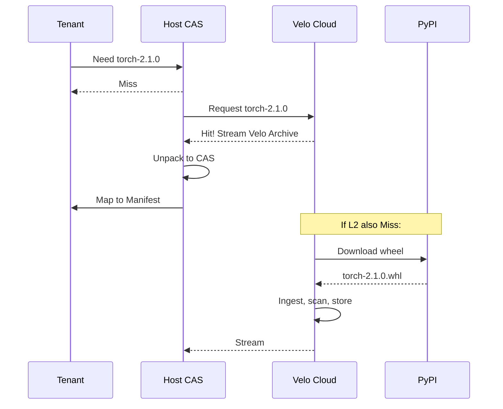

# Velo Technical Architecture Specification

> **Status**: Living Document  
> **Language**: English Only  
> **Scope**: Low-level implementation details, directory structures, data schemas, and internal protocols.

---

## 1. System Directory Layout (Physical View)

To achieve the "Hard Link Farm" efficiency and "OverlayFS" illusion, Velo enforces a strict physical layout on the Host Machine.

### 1.1 The RAM Disk Root
All tenant runtime data lives in a high-performance memory-backed location.
*   **Path**: `/mnt/velo_ram_disk` (Mounted as `tmpfs`)
*   **Purpose**: Ensures `link()` (hard links) work between the Warehouse and Tenant Roots.

### 1.2 Structure Hierarchy
```text
/mnt/velo_ram_disk/
├── pool/                       # The "Warehouse" (Shared Read-Only)
│   ├── numpy-1.26.0/           # Exploded package trees
│   │   ├── numpy/
│   │   └── numpy-1.26.0.dist-info/
│   └── torch-2.1.0/
│
├── tenants/                    # Tenant Runtime Roots (Ephemeral)
│   ├── tenant_A/
│   │   ├── upper/              # OverlayFS UpperDir (Private Writes)
│   │   ├── work/               # OverlayFS WorkDir
│   │   └── merged/             # The Tenant's Rootfs (Pivot Root Target)
│   └── tenant_B/
│
└── cas_store/                  # The Raw Blob Store (Optional: can be on NVMe)
    ├── a8/
    │   └── f9c1...             # Raw Content BLOB (BLAKE3)
    └── b2/
        └── d3e4...
```

### 1.3 Persistent Storage (NVMe/Disk)
*   **Path**: `/var/velo/meta.db` -> **LMDB** file for Git Metadata.
*   **Path**: `/var/velo/cas_cache/` -> Persistent cache for Cold Blobs.

---

## 2. Naming, Addressing & IDs

Velo uses a "Content-Addressable" everything approach. ID collision is impossible by design.

### 2.1 Hash Standard
*   **Algorithm**: **BLAKE3**.
*   **Length**: 256-bit (32 bytes).
*   **Encoding**: Hex string (64 chars) for display; Raw bytes for storage.

### 2.2 ID Formats
| Type | Prefix | Format | Example |
| :--- | :--- | :--- | :--- |
| **Blob ID** | `blob:` | `blake3:{hash}` | `blob:a8f9c1...` |
| **Tree ID** | `tree:` | `blake3:{hash}` | `tree:d4e5f6...` |
| **Commit ID** | `commit:` | `sha1:{git_hash}` | `commit:998877...` |
| **Tenant Ref** | `ref:` | `refs/tenants/{id}/HEAD` | `refs/tenants/user_123/HEAD` |
| **uv Lock Hash** | `uvlock:` | `sha256:{hash}` | `uvlock:7f8a...` (Derived from `uv.lock` content) |

---

## 3. Data Structures & Protocols

### 3.1 `velo.lock` (The Execution Spec)
This is the compiled "Bytecode" derived from `uv.lock`. It bridges the intent (Package Name) to the physical capability (Tree Hash).

```json
{
  "meta": {
    "engine": "velo-native-v1",
    "generated_at": 1706448000,
    "uv_lock_hash": "sha256:7f8a...",
    "target_platform": "linux_x86_64_gnu"
  },
  "roots": {
    "site_packages": {
      "mount_point": "/app/.venv/lib/python3.11/site-packages",
      "tree_hash": "tree:root_site_packages_merged_hash"
    }
  },
  "packages": {
    "numpy": {
      "version": "1.26.0",
      "source_tree": "tree:numpy_1.26.0_hash",
      "dist_info_tree": "tree:numpy_1.26.0_dist_info_hash"
    },
    "pandas": {
      "version": "2.1.0",
      "source_tree": "tree:pandas_2.1.0_hash"
    }
  }
}
```

### 3.2 In-Memory Git Schema (Within LMDB)
We "flatten" the Git graph into Key-Value pairs for O(1) access.

*   **Database 1: Objects**
    *   **Key**: `[Hash (20 bytes)]`
    *   **Value**: `[Type (1 byte)] + [Payload]`
*   **Database 2: References**
    *   **Key**: `refs/tenants/A/HEAD`
    *   **Value**: `[Commit Hash]`

### 3.3 The "Pointer Blob" Structure
Instead of storing file content in Git, we store a pointer to the CAS.

```rust
#[repr(C)]
struct VeloBlob {
    cas_hash: [u8; 32],  // BLAKE3 Hash of physical content
    size: u64,           // File size in bytes
    flags: u8,           // e.g., IsExecutable
}
```

---

## 4. The "Warehouse" Model (Implementation Logic)

How Velo achieves "Instant Install" and "Zero-Copy Sharing" using Hard Links.

### 4.1 The Pre-requisite
The **Host Warehouse** (`/mnt/velo_ram_disk/pool`) and the **Tenant Directory** (`/mnt/velo_ram_disk/tenants/A`) **MUST** reside on the same filesystem (Mountpoint). This allows `link()` syscalls to work.

### 4.2 The Construction Algorithm (O(1) Install)
When `velo.lock` says "Tenant A needs Numpy 1.26":

1.  **Lookup**: Velo checks `pool/numpy-1.26.0/`.
2.  **Link Farm Generation**:
    *   Velo creates destination dir: `tenants/A/lower/site-packages/numpy/`.
    *   For each file in `pool/numpy-1.26.0/numpy/`:
        *   `link(src="/pool/.../core.so", dst="/tenants/A/.../core.so")`.
    *   *Result*: The tenant has a physical file entry, but it points to the same inode as the pool.
3.  **Overlay Mount**:
    *   The `lower` directory (full of hard links) becomes the read-only base of the OverlayFS.

---

## 5. Isolation Implementation (The Sandwich Mount)

Details of the syscall sequence to build the "Standard VM Illusion".

### 5.1 The Layer Stack
1.  **LowerDir 1 (Base OS)**: `/opt/images/debian-slim` (Contains `glibc`, `python3`, `bash`).
2.  **LowerDir 2 (Injects)**: `/mnt/velo_ram_disk/tenants/A/lower` (The Hard Link Farm constructed above).
3.  **UpperDir**: `/mnt/velo_ram_disk/tenants/A/upper` (Private Tmpfs).

### 5.2 The Mount Sequence
```bash
# 1. Create Tenant Workspace
mkdir -p /mnt/velo_ram_disk/tenants/A/{upper,work,merged,lower}

# 2. Populate Lower (The Link Farm) via Velo Engine
velo-internal populate-links --lock velo.lock --target .../lower

# 3. Mount OverlayFS
mount -t overlay overlay \
    -o lowerdir=/mnt/velo_ram_disk/tenants/A/lower:/opt/images/debian-slim \
    -o upperdir=/mnt/velo_ram_disk/tenants/A/upper \
    -o workdir=/mnt/velo_ram_disk/tenants/A/work \
    /mnt/velo_ram_disk/tenants/A/merged

# 4. Bind Mount /dev/shm (For shared memory communication)
mount --bind /dev/shm/tenant_A /mnt/velo_ram_disk/tenants/A/merged/dev/shm
```

---

## 6. Distribution Architecture (Tiered Caching)

The traffic flow for "Miss & Backfill".

### 6.1 The Hierarchy
*   **L1: Host Cache** (`/mnt/velo_ram_disk/pool`)
    *   Serving latency: **< 1ms** (Link)
    *   Hit rate goal: 95%
*   **L2: Region Blob Store** (Internal S3 / MinIO)
    *   Serving latency: **10-50ms** (LAN Stream)
    *   Format: Compressed Velo Trees (e.g., `numpy-1.26.tar.zst` containing CAS-ready structures).
*   **L3: External Ecosystem** (PyPI / GitHub)
    *   Serving latency: **Seconds**
    *   Action: Ingest Workers download, verify, re-pack into Velo/CAS format, push to L2.

### 6.2 The "Backfill" Protocol
When a Tenant requests a `tree_hash` not present in L1:
1.  **Pause**: Tenant spawn is paused.
2.  **Fetch**: Host requests `tree_hash` from L2.
3.  **Stream**: L2 streams the specialized Velo archive.
4.  **Unpack**: Host unpacks directly into `/mnt/velo_ram_disk/pool`.
5.  **Resume**: Link Farm generation proceeds.

---

## 7. Shared Memory Security Details

### 7.1 "Read-Only" Enforcement
*   **Memory Object**: Created via `memfd_create`.
*   **Sealing**: `fcntl(F_SEAL_WRITE | F_SEAL_SHRINK | F_SEAL_GROW)`.
*   **Capability Downgrade**:
    *   Host holds: `fd_rw` (Sealed).
    *   Tenant receives: `fd_ro` (Created via `open("/proc/self/fd/...", O_RDONLY)`).
*   **Tenant Mapping**: Must use `mmap(..., PROT_READ)`. `PROT_WRITE` triggers `EPERM`.

### 7.2 Safety Valves
*   **Cgroups v2**: Hard limits on memory usage (`memory.max`) to prevent DoS via massive allocations in UpperDir.
*   **Seccomp**: `SCMP_ACT_ERRNO` for `mprotect` on mapped shared regions.

---

## 8. Multi-Tenant Isolation Architecture

Velo provides a complete "VM illusion" where tenants can perform any operation (pip install, apt, etc.) within a fully isolated environment.

### 8.1 Alpine Linux Security Shim

Alpine Linux serves as the base rootfs layer for tenant isolation:

*   **Rootfs Template**: `/opt/images/alpine-base` (Minimal ~5MB image)
*   **Why Alpine**: Musl libc + BusyBox = smallest attack surface, fast pivot.
*   **Role**: Provides standard POSIX environment (`/bin`, `/lib`, `/etc`) without glibc bloat.

**Alternative**: Debian-slim for full glibc compatibility when required.

### 8.2 Namespace Isolation Stack

Each tenant runs in isolated Linux namespaces:

```c
// Namespace Creation Sequence
unshare(
    CLONE_NEWNS   |  // Mount namespace (isolated filesystem view)
    CLONE_NEWPID  |  // PID namespace (process isolation)
    CLONE_NEWNET  |  // Network namespace (network isolation)
    CLONE_NEWIPC  |  // IPC namespace (shared memory isolation)
    CLONE_NEWUSER    // User namespace (UID/GID mapping)
);
```

**Post-Unshare Actions**:
1. `pivot_root(merged_view, old_root)` — Switch rootfs
2. `umount(old_root, MNT_DETACH)` — Hide host filesystem
3. Mount pseudo-filesystems: `/proc`, `/sys`, `/dev`

### 8.3 OverlayFS In-Depth Mechanics

OverlayFS is the core technology enabling the "看起来可写，实际上共享" illusion.

**Layer Architecture**:
```text
┌─────────────────────────────────────────────────┐
│              MergedDir (Tenant View)            │  <- /
├─────────────────────────────────────────────────┤
│   UpperDir (Tmpfs, Private, Read-Write)         │  <- Tenant writes here
├─────────────────────────────────────────────────┤
│   LowerDir[0]: Link Farm (Package Dependencies) │  <- Hard links to pool
├─────────────────────────────────────────────────┤
│   LowerDir[1]: Base OS (Alpine/Debian)          │  <- Read-only base
└─────────────────────────────────────────────────┘
```

**Key Mechanisms**:

| Operation | OverlayFS Behavior | Physical Action |
|-----------|-------------------|-----------------|
| **Read** | Top-down search | Upper → Lower[0] → Lower[1] |
| **Write (new file)** | Direct write | Written to UpperDir only |
| **Modify (existing)** | Copy-Up | File copied from Lower to Upper, then modified |
| **Delete** | Whiteout | Creates special whiteout file in Upper, hides Lower file |

**Copy-Up Trigger**: When tenant executes `echo "x" >> /etc/hosts`:
1. OverlayFS detects `/etc/hosts` exists in LowerDir
2. Creates copy in UpperDir
3. Appends modification to the copy
4. Future reads see the UpperDir version

### 8.4 Process-Level View Isolation (FUSE Mode)

When running VeloVFS as FUSE without full containers, isolation uses PID-based context:

```rust
struct SessionTable {
    // Maps process tree to their virtual root
    sessions: DashMap<Pid, VeloSession>,
}

struct VeloSession {
    root_tree_hash: Blake3Hash,   // Virtual filesystem root
    tenant_id: TenantId,
    dirty_files: HashSet<PathBuf>, // Tracked modifications
}
```

**FUSE Request Handling**:
```python
def fuse_lookup(req, parent_ino, name):
    pid = req.context.pid
    session = session_table.get_session_for_pid(pid)
    
    # Same path, different content based on caller
    tree = session.root_tree_hash
    return resolve_path(tree, parent_ino, name)
```

---

## 9. VeloVFS Runtime Architecture

### 9.1 LD_PRELOAD Shim Layer

For maximum performance without FUSE overhead, Velo uses syscall interception:

```text
[ User Code (Python) ]
       |  open("/app/main.py")
       v
[ libvelo_fs.so (LD_PRELOAD) ] <--- Intercepts open(), stat(), read()
       |
       | 1. Check Manifest: "/app/main.py" == Hash(0xDEADBEEF)
       | 2. Redirect: open("/dev/shm/cas/0xDEADBEEF", O_RDONLY)
       v
[ Linux Kernel ]
       |
       v
[ Physical RAM (CAS Store) ]  <--- Zero-copy mmap
```

**Intercepted Syscalls**:
*   `open()`, `openat()` — Path resolution & redirection
*   `stat()`, `lstat()`, `fstat()` — Metadata from Manifest
*   `readlink()` — Synthetic symlink resolution
*   `readdir()` — Virtual directory listing from Tree

### 9.2 The Manifest Data Structure

Manifest provides "路径 → Hash" mapping with two layers:

**A. Base Layer (Immutable, Shared)**
*   Contains: System libraries, common packages
*   Storage: Perfect Hash Map (PHF) or FST
*   Properties: Zero-copy mmap, O(1) lookup

**B. Delta Layer (Mutable, Per-Tenant)**
*   Contains: Tenant modifications, new files, deletions
*   Storage: High-performance HashMap (SwissTable)
*   Properties: Copy-on-Write semantics

```rust
struct ManifestLookup {
    base: MmapedPHF<PathHash, VnodeEntry>,   // Global, shared
    delta: DashMap<PathHash, DeltaEntry>,    // Per-tenant
}

enum DeltaEntry {
    Modified(VnodeEntry),   // Points to new hash
    Deleted,                // Whiteout marker
}
```

### 9.3 Vnode Entry Structure

Each file/directory in Manifest is represented by a compact Vnode:

```rust
#[repr(C, packed)]
struct VnodeEntry {
    // Content addressing (32 bytes)
    content_hash: [u8; 32],  // BLAKE3 Hash
    
    // Hot metadata for stat() acceleration (24 bytes)
    size: u64,               // File size
    mtime: u64,              // Modification time (Unix epoch)
    mode: u32,               // Permission bits (rwxr-xr-x)
    flags: u16,              // IsDir, IsSymlink, IsExecutable
    _pad: u16,
}
// Total: 56 bytes per entry
// 1M files = ~56 MB memory
```

### 9.4 Lookup Flow Algorithm

```python
def vfs_open(path: str, mode: int) -> FileDescriptor:
    path_hash = blake3(path.encode())
    
    # 1. Check Delta Layer (tenant modifications)
    if (entry := delta.get(path_hash)):
        if entry == Deleted:
            raise FileNotFoundError(ENOENT)
        return open_from_cas(entry.content_hash, mode)
    
    # 2. Check Base Layer (shared packages)
    if (entry := base.get(path_hash)):
        if mode & O_WRONLY:
            # Trigger Copy-on-Write
            new_hash = copy_to_private_area(entry.content_hash)
            delta.insert(path_hash, Modified(new_hash))
            return open_from_cas(new_hash, mode)
        return open_from_cas(entry.content_hash, O_RDONLY)
    
    # 3. Not found
    raise FileNotFoundError(ENOENT)
```

### 9.5 Directory Tree Handling Strategies

**Strategy A: Flat Map + Prefix Scan (Runtime Optimized)**
*   `readdir()` scans all paths with matching prefix
*   Pros: `open()` extremely fast (most common operation)
*   Cons: `ls -R` slower on large directories

**Strategy B: Merkle DAG (Git-like, Integrity Optimized)**
*   Directories are CAS objects containing child hashes
*   Pros: Fast `readdir()`, cryptographic verification
*   Cons: Write amplification (modify one file → rehash parent chain)

**Recommendation**: Strategy A for Python runtime (import-heavy, ls-rare).

---

## 10. Python-Specific Optimizations

### 10.1 PEP 683: Immortal Objects

PEP 683 enables truly read-only shared memory for Python objects:

```python
# Standard Python: Reference counting on every access
obj = shared_numpy_array  # Py_INCREF() 写入内存 → Cache失效

# PEP 683 Mode: Immortal objects skip refcount
# Reference count locked at special value, never modified
```

**Velo Integration**:
*   Pre-loaded modules marked as immortal during Warehouse construction
*   Shared across processes without refcount traffic
*   Requires Python 3.12+

### 10.2 Import Hook Mechanism

Velo injects into Python's import machinery:

```python
# /opt/velo/lib/velo_import_hook.py
import sys
from importlib.abc import MetaPathFinder, Loader

class VeloImportFinder(MetaPathFinder):
    def find_spec(self, fullname, path, target=None):
        # Query VeloVFS for module location
        manifest_entry = velo_vfs.lookup_module(fullname)
        if manifest_entry:
            return ModuleSpec(
                fullname,
                VeloLoader(manifest_entry.cas_hash),
                origin=manifest_entry.virtual_path
            )
        return None

# Injected via PYTHONPATH or sitecustomize.py
sys.meta_path.insert(0, VeloImportFinder())
```

### 10.3 Bytecode (.pyc) Caching

Velo pre-compiles and caches bytecode in the CAS:

```json
// CAS Entry for "numpy/__init__.py"
{
  "source_hash": "blake3:abc123...",
  "variants": {
    "cpython-311": "blake3:bytecode_def456...",
    "cpython-312": "blake3:bytecode_ghi789..."
  }
}
```

**Runtime Flow**:
1. Import requests `numpy/__init__.py`
2. Velo checks for cached bytecode matching current Python version
3. If hit: Return bytecode blob directly to interpreter
4. If miss: Compile, cache for next time

---

## 11. uv Deep Integration

### 11.1 Resolution-Only Mode

Velo leverages uv's resolver without performing actual installation:

```bash
# Traditional uv: Download + Extract + Install
uv pip install numpy pandas

# Velo-uv: Resolve Only → Query CAS → Instant Link
uv pip compile requirements.txt --universal -o deps.lock
velo ingest deps.lock  # Check CAS, download missing only
```

### 11.2 Virtual Installation Flow

```python
def handle_pip_install(packages: List[str]):
    # 1. Resolve (no network I/O if cached)
    lock_plan = uv_resolve_only(packages)
    
    # 2. Check Global CAS
    install_plan = {}
    missing = []
    for pkg in lock_plan:
        cas_key = f"{pkg.name}-{pkg.version}-{platform}"
        if (hash := global_cas.get(cas_key)):
            install_plan[pkg.name] = hash
        else:
            missing.append(pkg)
    
    # 3. Backfill missing packages
    if missing:
        staged = uv_install_to_staging(missing)
        for pkg, files in staged:
            tree_hash = ingest_to_cas(files)
            install_plan[pkg] = tree_hash
    
    # 4. Instant Install (pointer update only)
    tenant_manifest.update(install_plan)
    print(f"Installed {len(lock_plan)} packages in 0ms")
```

### 11.3 Metadata Deception

Making `pip list` and other tools see installed packages:

```text
/site-packages/
├── numpy/                    <- Mapped from CAS
├── numpy-1.26.0.dist-info/   <- Also mapped from CAS
│   ├── METADATA              <- Version: 1.26.0
│   ├── RECORD                <- File checksums
│   └── INSTALLER             <- "velo"
```

Standard tools scan `.dist-info` directories — Velo ensures they exist in the virtual view.

---

## 12. Performance Optimizations

### 12.1 Packfile / Blob Packing (Hotspot Consolidation)

Small files (node_modules, .pyc) cause random I/O. Velo packs related files together:

**Profile-Guided Packing**:
```python
# Trace: Record access order during startup
startup_trace = [
    ("hash_A", 0ms),   # index.js
    ("hash_B", 2ms),   # utils.js  
    ("hash_C", 5ms),   # config.js
]

# Pack: Write frequently co-accessed files contiguously
packfile = create_packfile([hash_A, hash_B, hash_C])
# Physical layout: [ContentA][ContentB][ContentC]

# Benefit: OS readahead loads all 3 with single I/O
```

**Index Update**:
```json
// Before: Hash → Loose Blob
{ "hash_A": { "type": "blob", "path": "/cas/a1/b2..." } }

// After: Hash → Packfile Offset
{ "hash_A": { "type": "packed", "pack": "pack_001", "offset": 0, "len": 1024 } }
```

### 12.2 V8 Bytecode Caching (Node.js)

For Node.js acceleration, Velo caches compiled V8 bytecode:

**Injection via NODE_OPTIONS**:
```bash
export NODE_OPTIONS="--require /opt/velo/lib/accelerator.js"
```

**Accelerator Logic**:
```javascript
const Module = require('module');
const v8 = require('v8');

Module._extensions['.js'] = function(module, filename) {
    const sourceHash = getVeloHash(filename);
    const v8Version = process.versions.v8;
    
    // Shadow path for cached bytecode
    const cachePath = `/.velo/cache/${sourceHash}/${v8Version}.bin`;
    
    if (fs.existsSync(cachePath)) {
        const cachedData = fs.readFileSync(cachePath);
        const script = new vm.Script(source, { cachedData });
        // V8 skips parsing, directly deserializes bytecode
        return script.runInThisContext();
    }
    
    // Fallback: compile and cache for next time
    const compiled = compileAndCache(filename, cachePath);
    return compiled;
};
```

### 12.3 velod Daemon Architecture

The Velo daemon (`velod`) manages background tasks:

```text
┌──────────────────────────────────────┐
│               velod                  │
├──────────────────────────────────────┤
│  ┌────────────┐  ┌────────────────┐  │
│  │ CAS Manager│  │ Session Tracker│  │
│  └────────────┘  └────────────────┘  │
│  ┌────────────┐  ┌────────────────┐  │
│  │ Pack Daemon│  │ Prefetch Worker│  │
│  └────────────┘  └────────────────┘  │
│  ┌─────────────────────────────────┐ │
│  │          LMDB Store             │ │
│  └─────────────────────────────────┘ │
└──────────────────────────────────────┘
```

**Components**:
*   **CAS Manager**: Hash → Location resolution
*   **Session Tracker**: PID → Manifest mapping
*   **Pack Daemon**: Background hotspot consolidation
*   **Prefetch Worker**: Predictive blob loading

---

## 13. Hash & ID Optimization Strategy

### 13.1 Storage vs Runtime Hash Sizes

| Layer | Hash Size | Rationale |
|-------|-----------|-----------|
| **Disk/Network** | 256-bit BLAKE3 | Cryptographic safety, global uniqueness |
| **Memory/Runtime** | 32-bit Local ID | Cache efficiency, CPU optimization |
| **CLI/Display** | Hex prefix (8+ chars) | Human readability |

### 13.2 Interning Pattern

Convert large hashes to compact sequential IDs:

```rust
struct HashRegistry {
    // Full Hash → Local ID
    hash_to_id: HashMap<Blake3Hash, u32>,
    // Local ID → Full Hash (array index = ID)
    id_to_hash: Vec<Blake3Hash>,
}

impl HashRegistry {
    fn intern(&mut self, hash: Blake3Hash) -> u32 {
        if let Some(&id) = self.hash_to_id.get(&hash) {
            return id;  // Already seen
        }
        let id = self.id_to_hash.len() as u32;
        self.id_to_hash.push(hash);
        self.hash_to_id.insert(hash, id);
        id  // New sequential ID
    }
}
```

**Benefits**:
*   Array access `O(1)` vs HashMap lookup
*   `u32` fits in single cache line with neighbors
*   32-bit comparison = single CPU instruction

### 13.3 Bit-Packed IDs (48-bit ID + 16-bit Flags)

Optimal memory layout using bit packing:

```rust
#[derive(Clone, Copy)]
pub struct VeloId(u64);

impl VeloId {
    const ID_MASK: u64   = 0x0000_FFFF_FFFF_FFFF;  // Low 48 bits
    const FLAG_MASK: u64 = 0xFFFF_0000_0000_0000;  // High 16 bits
    
    pub fn new(index: u64, flags: u16) -> Self {
        VeloId((index & Self::ID_MASK) | ((flags as u64) << 48))
    }
    
    #[inline(always)]
    pub fn index(&self) -> usize {
        (self.0 & Self::ID_MASK) as usize
    }
    
    #[inline(always)]
    pub fn is_dir(&self) -> bool {
        (self.0 & (1 << 63)) != 0
    }
}
```

**48-bit capacity**: 281 trillion IDs — physically impossible to exhaust (memory would OOM first).

---

## 14. Cross-Language Ecosystem Support

### 14.1 Protocol Adapter Architecture

VeloVFS is language-agnostic. Language-specific logic lives in adapters:

```text
┌─────────────────────────────────────────────────┐
│                 Application Layer               │
│  Node.js    Python    Rust/Cargo    Go         │
└────────┬────────┬────────┬────────┬────────────┘
         │        │        │        │
         v        v        v        v
┌─────────────────────────────────────────────────┐
│              Protocol Adapters                  │
│  npm-adapter  uv-adapter  cargo-adapter  go-mod│
└────────────────────┬────────────────────────────┘
                     │
                     v
┌─────────────────────────────────────────────────┐
│               VeloVFS Core                      │
│    CAS Storage  |  Git Trees  |  Mounting      │
└─────────────────────────────────────────────────┘
```

### 14.2 Cargo/Rust Acceleration

**Problem**: Path-based fingerprinting causes rebuild across projects.

**Velo Solution**: Path Illusion
```bash
# All projects see same virtual path
/app/workspace/  ← Project A code
/app/workspace/  ← Project B code (different physical location)

# Cargo computes identical fingerprints → cache hit
RUSTFLAGS="--remap-path-prefix $(pwd)=/app/workspace" cargo build
```

**Result**: Global compilation cache across all Rust projects.

### 14.3 NPM/Node.js node_modules Deduplication

**Problem**: `node_modules` black hole (100k+ files, GB of duplicates).

**Velo Solution**: Virtual node_modules
```json
// Manifest generates virtual tree
{
  "/node_modules/react/index.js": "hash_A",
  "/node_modules/lodash/lodash.js": "hash_B",
  "/node_modules/foo/node_modules/lodash/lodash.js": "hash_B"  // Same hash!
}
```

*   1000 packages → 1000 entries in manifest (not files)
*   Physical storage: Only unique content
*   `npm install` time: O(1) pointer updates

---

## 15. Cluster / Distributed Mode

### 15.1 Tiered Caching Architecture

```text
┌─────────────────────────────────────────────────────────┐
│ L1: Host Memory/NVMe                                    │
│     Latency: <1ms | Capacity: 10-100GB | Shared: Local  │
├─────────────────────────────────────────────────────────┤
│ L2: Datacenter Cache (Redis/Memcached)                  │
│     Latency: 1-5ms | Capacity: TB | Shared: Region      │
├─────────────────────────────────────────────────────────┤
│ L3: P2P Mesh (BitTorrent-style)                        │
│     Latency: 10-50ms | Capacity: ∞ | Shared: Cluster   │
├─────────────────────────────────────────────────────────┤
│ L4: Origin (S3/MinIO)                                   │
│     Latency: 50-200ms | Capacity: ∞ | Shared: Global   │
└─────────────────────────────────────────────────────────┘
```

### 15.2 Lazy Loading Protocol

Container starts before all data is downloaded:

```python
def lazy_start_container(manifest_hash):
    # 1. Download only metadata (KB)
    tree = fetch_tree(manifest_hash)  # ~10KB
    
    # 2. Mount immediately (VFS virtual view)
    vfs.mount(tree, "/app")
    
    # 3. Start process
    proc = spawn("/app/main.py")
    
    # 4. On page fault: fetch blob on-demand
    # VFS intercepts read() → triggers L1→L2→L3→L4 lookup
```

**Cold Start Time**: From minutes (full pull) → seconds (metadata only).

### 15.3 P2P Cache Sharing

When 1000 nodes need the same model weights:

```text
Traditional: 1000 × S3 download = $$$, bandwidth bottleneck

Velo P2P:
  - Node 1 downloads from S3
  - Node 2-1000 discover Node 1 has the blob
  - Parallel transfer within datacenter (free, 100Gbps)
```

**Discovery Protocol**: Gossip-based hash announcement.

---

## 16. Persistence & Recovery

### 16.1 LMDB Memory-Mapped Store

Why LMDB for Git metadata:
*   **mmap-based**: Data stays in kernel page cache
*   **Zero-copy reads**: No deserialization
*   **Instant restart**: Open file = ready to serve
*   **ACID transactions**: Crash-safe via CoW B-tree

```rust
// Restart time comparison
// SQLite: Load → Parse → Index Build → Ready (seconds)
// LMDB:   mmap() → Ready (milliseconds)
```

### 16.2 Turbo Configuration

For maximum performance with acceptable durability trade-offs:

```c
// Velo LMDB Config
mdb_env_set_flags(env, MDB_WRITEMAP);   // Direct memory writes
mdb_env_set_flags(env, MDB_NOSYNC);     // Async flush (~30s by OS)
mdb_env_set_flags(env, MDB_MAPASYNC);   // Non-blocking dirty page write
```

**Worst case**: Crash loses last 30 seconds of `pip install` — easily recoverable from `uv.lock`.

### 16.3 Rebuild from Source of Truth

LMDB is derived data. If lost, rebuild from:
1. **uv.lock / package-lock.json** — Intent (what packages)
2. **CAS Blobs** — Content (the actual files)

```python
def rebuild_metadata():
    lmdb = create_empty_lmdb()
    
    for tenant in discover_tenants():
        lockfile = read_lockfile(tenant.uv_lock_path)
        
        for package in lockfile.packages:
            tree_hash = build_tree_from_cas(package)
            lmdb.insert(f"refs/tenants/{tenant.id}/HEAD", tree_hash)
    
    print("Recovery complete")
```

**Recovery time**: Proportional to number of tenants, not data size.

---

## 17. Comparison with Existing Systems

### 17.1 VeloVFS vs Traditional Cluster Filesystems

| Feature | Ceph/GlusterFS | NFS | VeloVFS |
|---------|---------------|-----|---------|
| **Primary Goal** | Store data reliably | Share files | Accelerate code execution |
| **Deduplication** | Block-level (expensive) | None | Content-addressable (free) |
| **Mutable Data** | First-class | First-class | CoW overlay, immutable base |
| **Cold Start** | Full download | Remote mount | Lazy page fault |
| **Best For** | Large files, databases | General sharing | Package management, CI/CD |

### 17.2 VeloVFS vs Package Managers

| Feature | npm/pip | pnpm | Velo |
|---------|---------|------|------|
| **Dedup Scope** | None | Per-machine | Global/Cloud |
| **Install Mechanism** | File copy | Hard links | VFS pointers |
| **Cross-Project Share** | No | Yes | Yes + Memory |
| **Cold Start Overhead** | High | Medium | Near-zero |

### 17.3 Bun vs Node+Velo

| Dimension | Bun | Node.js + Velo |
|-----------|-----|----------------|
| **I/O Performance** | io_uring | mmap (no I/O) |
| **Install Speed** | Fast (hardlinks) | Instant (manifest) |
| **Ecosystem Compat** | ~95% | 100% |
| **Migration Cost** | High (new runtime) | Zero (same Node) |
| **Disk Usage** | Per-project cache | Global CAS |

---

## 18. Git Internal Format Optimization

Native Git storage format has three "performance sins" that VeloVFS must address:

### 18.1 Zlib Compression (The CPU Wall)

**Problem**: Git compresses every object with Zlib.
*   Each read requires CPU decompression (tens of microseconds)
*   Compressed data cannot be mmap'd directly
*   Memory copy required after decompression

**Velo Solution**:
*   Hot metadata: Store as raw binary (no compression)
*   File content: LZ4 (10x faster than Zlib) or uncompressed for mmap

### 18.2 Text Protocol Parsing

**Problem**: Git Tree objects are text/semi-binary format requiring parsing.

```text
100644 blob a906cb... index.js
040000 tree 8f02b3... src
```

*   String parsing is CPU-unfriendly (branch misprediction)
*   O(N) scan required for large directories

**Velo Solution**:
*   Binary serialization (rkyv, FlatBuffers)
*   B-Tree/HashMap layout on disk
*   O(1) or O(log N) lookup via Perfect Hash or binary search

### 18.3 SHA-1/SHA-256 Performance

**Problem**: SHA-1/SHA-256 are not optimal for high-throughput hashing.

**Velo Solution**:
*   Internal: BLAKE3 (several times faster, SIMD-parallelized)
*   Export: Async background conversion to SHA-1 only when pushing to Git

### 18.4 The "Hydrated Format" (Internal Representation)

Velo ingests Git data and transforms it into a high-performance internal format:

```rust
// Velo's memory/disk layout
#[repr(C)]
struct VeloTree {
    magic: u32,
    entry_count: u32,
    entries: [VeloEntry; entry_count],  // Sorted for binary search
}

#[repr(C)]
struct VeloEntry {
    name_hash: u64,      // Filename hash for fast comparison
    content_offset: u64, // Offset in Packfile
    flags: u32,
    _padding: u32,
}
```

**Flow**: mmap tree → binary search name_hash → return `ptr + offset` — zero malloc, zero memcpy.

---

## 19. Physical Storage Layout Design

### 19.1 Directory Depth Analysis

| Structure | Directories | Files per Dir (10M blobs) | Recommendation |
|-----------|-------------|---------------------------|----------------|
| `ab/...` (1-level) | 256 | ~39,000 | Good for local |
| `ab/cd/...` (2-level) | 65,536 | ~152 | Best for servers |
| `abc/...` | N/A | N/A | **Never** (1.5 bytes = misaligned) |

**Decision**: Use 2-level (`ab/cd/...`) for 10 billion file capacity.

### 19.2 First-Level Pre-initialization

Create all 256 first-level directories (`00` to `ff`) at startup:
*   Eliminate runtime `stat()` calls to check existence
*   Pre-open all 256 directory FDs into `[RawFd; 256]` array
*   Use `openat(shard_fds[idx], "subpath")` for O(1) access

### 19.3 Second-Level Lazy Creation with BitSet

```rust
struct StoreLayout {
    l1_fds: [RawFd; 256],           // Pre-opened at startup
    l2_existence: BitSet<65536>,    // 8KB, tracks created dirs
}
```

**Write flow**:
1. Extract `l1_id = hash[0]`, `l2_id = hash[1]`
2. Check `l2_existence.has(l1_id, l2_id)` — pure CPU operation
3. If 0: `mkdirat(l1_fds[l1_id], "xx")`, update bitset
4. Write file via `openat(l1_fds[l1_id], "xx/rest_hash...")`

---

## 20. FD Cache (Hot File Pool)

### 20.1 Why FD Caching Matters

| Operation | Without FD Cache | With FD Cache |
|-----------|-----------------|---------------|
| `openat()` | ~2.0 µs | Skipped |
| `read()` | ~0.5 µs | ~0.5 µs |
| `close()` | ~0.5 µs | Skipped |
| **Total** | ~3.0 µs | ~0.5 µs |

**Result**: 5-7x throughput improvement for small file reads.

### 20.2 LRU Architecture

```rust
struct HotFileCache {
    cache: Mutex<LruCache<u64, RawFd>>,
    base_fds: [RawFd; 256],
}

impl HotFileCache {
    fn read_blob(&self, hash: &[u8], buf: &mut [u8]) -> io::Result<usize> {
        let full_id = hash_to_id(hash);
        
        let fd = {
            let mut cache = self.cache.lock().unwrap();
            if let Some(&fd) = cache.get(&full_id) {
                fd  // Cache hit!
            } else {
                // Evict if full
                if cache.len() >= cache.capacity() {
                    let (_, old_fd) = cache.pop_lru().unwrap();
                    unsafe { libc::close(old_fd) };
                }
                let new_fd = self.physical_open(hash);
                cache.put(full_id, new_fd);
                new_fd
            }
        };
        
        // pread is atomic, supports concurrent reads on same FD
        unsafe { libc::pread(fd, buf.as_mut_ptr() as _, buf.len(), 0) }
    }
}
```

### 20.3 Important: Use `pread`, Not `read`

*   `pread` is atomic and doesn't modify file offset
*   Multiple threads can share same FD without locks
*   Essential for high-concurrency scenarios

---

## 21. Single-Threaded Core + State Machine (The Redis Model)

### 21.1 Why Single-Threaded?

For metadata-heavy systems, multi-threading creates overhead:
*   Lock contention wastes CPU cycles
*   Context switching
*   Cache thrashing between cores

Single-threaded event loop:
*   All requests enter a Ring Buffer queue
*   One "brain" thread processes at extreme speed (nanoseconds)
*   Zero lock contention, 100% cache hit rate

### 21.2 State Machine Design

Each blob has a defined lifecycle:

```rust
enum BlobState {
    Idle,       // Not loaded
    Opening,    // IO in progress
    Ready(RawFd), // FD available
    Evicting,   // LRU cleanup
    Error,      // Open failed
}

enum CoreCommand {
    Open { hash: u128, reply: Sender<Fd> },
    IoFinished { hash: u128, fd: RawFd },
}
```

**State transitions prevent race conditions**:
*   If blob is `Opening`, new requests queue up (no duplicate `open()`)
*   When `IoFinished` arrives, all waiters are notified

### 21.3 Architecture Separation

```text
┌─────────────────────────────────────────────────┐
│         The Brain (Single-Threaded)             │
│   State Machine | LRU | Path Resolution         │
│   Ring Buffer Consumer | Command Dispatcher     │
└────────────────────┬────────────────────────────┘
                     │ Ring Buffer
                     v
┌─────────────────────────────────────────────────┐
│         The Muscle (Multi-Threaded/io_uring)    │
│   pread() | openat() | memcpy() | Syscalls      │
└─────────────────────────────────────────────────┘
```

---

## 22. Ring Buffer (Zero Runtime Allocation)

### 22.1 Where to Use Ring Buffers

| Location | Producer | Consumer | Benefit |
|----------|----------|----------|---------|
| Command Queue | Workers | Core | Lockless task dispatch |
| Completion Queue | Workers | Core | Lockless result return |
| Flight Recorder | Core | Debug | Crash forensics |

### 22.2 Zero-Alloc Implementation

```rust
const RING_SIZE: usize = 4096;  // Must be power of 2
const RING_MASK: usize = RING_SIZE - 1;

#[derive(Clone, Copy)]
struct Task {
    op: u8,
    hash: u128,
    reply_ptr: u64,
}

struct CommandRing {
    buffer: [MaybeUninit<Task>; RING_SIZE],
    
    #[repr(align(64))]  // Prevent false sharing
    head: AtomicUsize,
    
    #[repr(align(64))]  // Separate cache line
    tail: AtomicUsize,
}
```

**Key points**:
*   Fixed-size array allocated at startup (static or stack)
*   Use `& RING_MASK` instead of `% RING_SIZE` for wrap-around
*   Cache-line padding (64 bytes) between head and tail

---

## 23. Ultra-Low-Latency Optimization Techniques

### 23.1 Bloom Filter (Intercept Non-Existent Files)

Node.js module resolution tries `.js`, `.json`, `.node`... causing many `ENOENT` errors.

```rust
fn open_file(hash: u128) -> Result<Fd> {
    if !bloom_filter.contains(hash) {
        return Err(NotFound);  // 0 syscalls, 0 latency
    }
    // Continue normal path
}
```

*   Cost: ~3 MB for millions of files
*   Benefit: 100% elimination of invalid syscalls

### 23.2 Pre-calculated Metadata

Since files are immutable, file size is known at ingest time:

*   Store size in manifest, not in filesystem
*   `stat()` returns from memory, no `fstat()` syscall
*   **Eliminates 1/3 of syscalls**

### 23.3 O_NOATIME Flag

```c
openat(dirfd, path, O_RDONLY | O_NOATIME);
```

*   Prevents kernel from updating access time on read
*   Converts read operation from "read+write" to "read-only"
*   Significant IOPS improvement for cached files

### 23.4 Memory Allocator Selection

| Allocator | Best For | VeloVFS Fit |
|-----------|----------|-------------|
| **Mimalloc** (Microsoft) | Speed, small objects | ⭐⭐⭐⭐⭐ |
| Jemalloc (Facebook) | Memory efficiency | ⭐⭐⭐ |
| TCMalloc (Google) | General purpose | ⭐⭐⭐ |

```rust
// main.rs - 3 lines for 10-30% free performance
use mimalloc::MiMalloc;

#[global_allocator]
static GLOBAL: MiMalloc = MiMalloc;
```

### 23.5 False Sharing Prevention

```rust
#[repr(align(64))]  // Force separate cache line
struct CachePadded<T>(T);

struct Ring {
    head: CachePadded<AtomicUsize>,
    tail: CachePadded<AtomicUsize>,
}
```

---

## 24. Fast Path Construction (Stack-Based Hex Conversion)

### 24.1 Problem Statement

Constructing `"ab/cd/efgh..."` from hash bytes for `openat()` must be allocation-free.

### 24.2 Pre-computed Hex Lookup Table

```rust
// 512 bytes, fits in L1 cache
static HEX_LUT: &[u8; 512] = b"000102...ff";
```

### 24.3 Template-Based Path Fill

Instead of "insert slashes", use "fill template with holes":

```rust
#[inline(always)]
fn with_fast_path<F, R>(hash: &[u8; 32], callback: F) -> R
where F: FnOnce(*const i8) -> R
{
    let mut buf = [0u8; 64];  // Stack allocation
    
    // Fixed slash position
    buf[2] = b'/';
    
    // Fill L2 directory (hash[1] -> "cd")
    let idx = hash[1] as usize * 2;
    buf[0..2].copy_from_slice(&HEX_LUT[idx..idx+2]);
    
    // Fill rest using u64 wide writes
    let mut out_ptr = 3;
    for &b in &hash[2..] {
        let idx = b as usize * 2;
        buf[out_ptr..out_ptr+2].copy_from_slice(&HEX_LUT[idx..idx+2]);
        out_ptr += 2;
    }
    
    buf[out_ptr] = 0;  // Null terminator
    callback(buf.as_ptr() as *const i8)
}
```

### 24.4 SIMD-Friendly u64 Batch Writes

Process 4 hash bytes → 8 hex chars → single `u64` write:

```rust
// Read 4 bytes, produce 8 hex chars as u64
let b0 = hash[i] as usize;
let h0 = HEX_PAIR_LUT[b0] as u64;
let h1 = HEX_PAIR_LUT[b1] as u64;
let h2 = HEX_PAIR_LUT[b2] as u64;
let h3 = HEX_PAIR_LUT[b3] as u64;

let combined: u64 = h0 | (h1 << 16) | (h2 << 32) | (h3 << 48);
ptr::write_unaligned(out_ptr as *mut u64, combined);
```

**Result**: 50-100x faster than `format!()`.

---

## 25. Profile-Guided Optimization (PGO)

### 25.1 Build Process

```bash
# Step 1: Build instrumented binary
RUSTFLAGS="-Cprofile-generate=/tmp/pgo-data" cargo build --release

# Step 2: Run typical workload
./target/release/velo < typical_workload.sh

# Step 3: Merge profile data
llvm-profdata merge -o velo.profdata /tmp/pgo-data

# Step 4: Rebuild with profile
RUSTFLAGS="-Cprofile-use=velo.profdata" cargo build --release
```

### 25.2 Expected Gains

*   10-20% free performance improvement
*   Compiler knows which branches are hot
*   Optimal function inlining decisions

---

## 26. Alpine Security Shim Architecture

Alpine serves as a "security shim" between untrusted tenant code and the Host kernel.

### 26.1 Why Alpine as Shim?

| Feature | Benefit |
|---------|---------|
| **musl libc** | Smaller attack surface vs glibc |
| **Minimal packages** | No unnecessary suid binaries |
| **BusyBox tools** | Single binary for core utils |
| **Read-only rootfs** | Immutable base layer |

### 26.2 memfd_create + F_SEAL Protection

```c
// Host: Create sealed memory for shared data
int fd = memfd_create("shared_model", MFD_CLOEXEC);
ftruncate(fd, model_size);

// Write model weights
write(fd, model_data, model_size);

// Seal: Prevent ALL modifications from ANY process
fcntl(fd, F_ADD_SEALS, 
    F_SEAL_WRITE |     // Block write()
    F_SEAL_SHRINK |    // Block truncate smaller
    F_SEAL_GROW |      // Block truncate larger
    F_SEAL_SEAL);      // Block removing seals

// Security: Even root in tenant cannot unseal
// Kernel enforces seals at syscall level
```

### 26.3 File Descriptor Downgrade (Capability Model)

```c
// Host holds READ+WRITE fd (capable of exec/mmap)
int host_fd = open("/var/velo/models/llama.bin", O_RDWR);

// Create read-only copy for tenant
// This is a new fd pointing to same inode, with reduced permissions
int tenant_fd = open("/proc/self/fd/{}", O_RDONLY);

// Pass to tenant via SCM_RIGHTS over Unix socket
// Tenant receives O_RDONLY fd - cannot escalate
```

### 26.4 Seccomp BPF Syscall Filter

```c
// Block dangerous syscalls in tenant namespace
struct sock_filter filter[] = {
    // Load syscall number
    BPF_STMT(BPF_LD | BPF_W | BPF_ABS, offsetof(struct seccomp_data, nr)),
    
    // Block: mount, umount, pivot_root, reboot, etc.
    BPF_JUMP(BPF_JMP | BPF_JEQ | BPF_K, __NR_mount, 0, 1),
    BPF_STMT(BPF_RET | BPF_K, SECCOMP_RET_KILL),
    
    // Allow most syscalls
    BPF_STMT(BPF_RET | BPF_K, SECCOMP_RET_ALLOW),
};
```

### 26.5 Complete Tenant Isolation Stack

```text
┌─────────────────────────────────────────────────────┐
│  Tenant Python Process (uid=nobody, gid=nogroup)   │
├─────────────────────────────────────────────────────┤
│  Seccomp BPF (Block: mount, ptrace, raw_socket)    │
├─────────────────────────────────────────────────────┤
│  Capabilities (Drop: ALL except CAP_NET_BIND_SERVICE) │
├─────────────────────────────────────────────────────┤
│  Namespaces (PID, MNT, NET, USER, UTS, IPC)        │
├─────────────────────────────────────────────────────┤
│  pivot_root to OverlayFS merged view               │
├─────────────────────────────────────────────────────┤
│  Cgroups (memory=1GB, cpu=100%, pids=1000)         │
└─────────────────────────────────────────────────────┘
```

---

## 27. OverlayFS Mechanics Deep-Dive

OverlayFS is the core illusion engine for tenant filesystem views.

### 27.1 Layer Composition

```text
┌───────────────────────────────────────────────────────┐
│  MERGED VIEW (/app)  ← Tenant sees this              │
│  - Union of all layers                               │
└───────────────────────────────────────────────────────┘
            ↓ Read: Top-down priority
┌───────────────────────────────────────────────────────┐
│  UPPER (tmpfs:/tenants/A/upper)  ← Writes go here    │
│  - Private to tenant                                 │
│  - Ephemeral (deleted on unmount)                    │
└───────────────────────────────────────────────────────┘
┌───────────────────────────────────────────────────────┐
│  LOWER[0] (Link Farm: site-packages)  ← Read-only    │
│  - Hard links to /pool/{packages}                    │
└───────────────────────────────────────────────────────┘
┌───────────────────────────────────────────────────────┐
│  LOWER[1] (Base: /opt/images/alpine)  ← Read-only    │
│  - Shared by ALL tenants                             │
└───────────────────────────────────────────────────────┘
```

### 27.2 Copy-Up Mechanism

```python
# When tenant first writes to a read-only file:
def overlay_write(path, data):
    if path in lowerdir:
        # 1. Create parent directories in upperdir
        mkdir_p(upperdir / parent(path))
        
        # 2. COPY entire file from lower to upper
        #    This is the "Copy-Up" operation
        full_copy(lowerdir / path, upperdir / path)
        
        # 3. Now write to the copy
        write(upperdir / path, data)
    else:
        write(upperdir / path, data)
```

**Cost**: First write to shared file = O(filesize). Subsequent writes = O(1).

### 27.3 Whiteout Files (Deletion)

```bash
# Tenant deletes /usr/bin/vim (exists in lowerdir)
# Kernel creates "whiteout" marker in upperdir:
$ ls -la /tenants/A/upper/usr/bin/
c--------- 1 root root 0, 0 Jan 29 vim

# The 'c' = character device with major:minor 0:0
# This "blocks" the underlying file from view
```

### 27.4 OverlayFS vs FUSE Comparison

| Aspect | OverlayFS | FUSE |
|--------|-----------|------|
| **Location** | Kernel space | User space |
| **Performance** | ~Native ext4 | 2-10x slower (context switches) |
| **Use Case** | Layer composition | Custom logic interception |
| **Complexity** | Single mount command | Write filesystem daemon |
| **Velo Use** | Tenant rootfs | Virtual CAS paths |

### 27.5 OverlayFS Mount Command

```bash
mount -t overlay overlay \
    -o lowerdir=/path/linkfarm:/opt/images/alpine,\
       upperdir=/tenants/A/upper,\
       workdir=/tenants/A/work \
    /tenants/A/merged
```

---

## 28. uv Deep Integration Architecture

Velo intercepts `uv` commands to provide "virtual installation".

### 28.1 Installation Flow

```python
def handle_uv_pip_install(packages):
    # 1. RESOLVE: Use uv's resolver (no download yet)
    lock_plan = uv_resolve_only(packages)
    # Returns: [("numpy", "1.26.0"), ("pandas", "2.1.0"), ...]
    
    # 2. CHECK CAS: Query global database
    missing_wheels = []
    install_plan = {}  # package_name -> CAS_Hash
    
    for pkg_name, version in lock_plan:
        pkg_hash = global_db.get(pkg_name, version, platform)
        if pkg_hash:
            install_plan[pkg_name] = pkg_hash
        else:
            missing_wheels.append((pkg_name, version))
    
    # 3. FILL GAPS: Download only missing packages
    if missing_wheels:
        staged = uv_install_to_sandbox(missing_wheels)
        for pkg, files in staged:
            cas_hash = ingest_to_cas(files)
            install_plan[pkg] = cas_hash
    
    # 4. INSTANT LINK: Update tenant manifest
    tenant_manifest.update(install_plan)
    
    # User sees: "Installed 15 packages in 0.01s"
```

### 28.2 Metadata Deception (.dist-info)

Python tools (pip list, importlib.metadata) expect proper metadata:

```text
/site-packages/
├── numpy/
│   └── __init__.py → CAS:blob_abc
└── numpy-1.26.0.dist-info/
    ├── METADATA → CAS:blob_meta  # Real metadata
    ├── RECORD → CAS:blob_record  # File checksums
    └── INSTALLER → "velo"        # Generated marker
```

**Velo generates** .dist-info entries so `pip list` works correctly.

### 28.3 Script Entry Points Handling

```python
# bin/uvicorn needs special handling
# Problem: Shebang might have wrong path

# Solution A: Generate shim script
# /tenant/bin/uvicorn contains:
#!/usr/bin/env python
# Velo auto-generated entry point
from uvicorn.__main__ import main
main()

# Solution B: Fix shebang on mount
# Replace #!/specific/path/python with #!/usr/bin/env python
```

---

## 29. Three-Tier Distribution Architecture

### 29.1 Cache Hierarchy

```text
┌─────────────────────────────────────────────────────────┐
│  L1: Host Local CAS (/mnt/velo_ram_disk/cas_store)     │
│  - Memory-backed, ~10GB                                 │
│  - Latency: μs (memory access)                          │
└─────────────────────────────────────────────────────────┘
                          ↓ Miss?
┌─────────────────────────────────────────────────────────┐
│  L2: Regional Mirror (Velo Cloud S3 + CDN)             │
│  - Pre-warmed with Top 5000 PyPI packages              │
│  - Latency: ms (internal network)                       │
│  - Security scanning happens here                       │
└─────────────────────────────────────────────────────────┘
                          ↓ Miss?
┌─────────────────────────────────────────────────────────┐
│  L3: Origin (PyPI / crates.io / npm)                   │
│  - Latency: seconds (internet)                          │
│  - Triggers backfill to L2                              │
└─────────────────────────────────────────────────────────┘
```

### 29.2 Miss & Backfill Flow



### 29.3 Pre-warming Strategies

**A. Golden Image (L2)**
```bash
# Nightly job on Velo Cloud
uv pip install numpy pandas torch transformers \
    scikit-learn matplotlib fastapi flask django ...
# Top 5000 packages always hot
```

**B. Host Pre-warming (L1)**
```python
# On new host boot, pull most popular packages
popular = ["numpy", "requests", "boto3", "pandas"]
for pkg in popular:
    prefetch_from_l2(pkg)
```

---

## 30. Git-in-Memory Metadata Architecture

Velo uses Git's data model but runs it entirely in memory.

### 30.1 Architecture Separation

```text
┌─────────────────────────────────────────────────────────┐
│  THE BRAIN (Git in Memory)                              │
│  - Commits, Trees, Refs                                 │
│  - Storage: DashMap / LMDB mmap                         │
│  - Operations: O(1) pointer moves                       │
└─────────────────────────────────────────────────────────┘
                          ↓ References
┌─────────────────────────────────────────────────────────┐
│  THE BODY (Raw CAS)                                     │
│  - Blobs (actual file content)                          │
│  - Storage: Flat files on NVMe, named by hash           │
│  - Access: mmap zero-copy                               │
└─────────────────────────────────────────────────────────┘
```

### 30.2 In-Memory Git Database

```rust
struct VeloGitDb {
    /// Commit and Tree objects (metadata only)
    objects: DashMap<Oid, GitObject>,
    
    /// Branch references
    refs: DashMap<String, Oid>,
    // e.g., "refs/tenants/user_123/HEAD" -> Commit_Hash
}

enum GitObject {
    Commit {
        parent: Option<Oid>,
        tree: Oid,
        message: String,
        timestamp: u64,
    },
    Tree {
        entries: Vec<TreeEntry>,
    },
}

struct TreeEntry {
    name: String,
    mode: u32,
    oid: Oid,  // Points to Tree (subdir) or Blob (file in CAS)
}
```

### 30.3 Pointer Blob Design

**Standard Git**: Blob contains actual file content.
**Velo Git**: Blob contains CAS pointer only.

```json
// Velo Tree Entry pointing to external CAS
{
    "name": "numpy.so",
    "mode": 0o100755,
    "oid": "blake3:a8f9c1..."  // This IS the CAS address
}
```

**Result**: Git database is tiny (MB), even for million-file projects.

### 30.4 Snapshot Compass (Time Travel)

```rust
struct CompassState {
    current_head: Oid,
    history: Vec<Commit>,        // Linear timeline
    branches: HashMap<String, Oid>,  // Named checkpoints
}

impl Compass {
    /// Jump to any historical state in O(1)
    fn jump_to(&mut self, target: Oid) {
        // 1. Update pointer (nanoseconds)
        self.current_head = target;
        
        // 2. Notify VFS layer
        vfs.update_root(get_tree_hash(target));
        
        // 3. Restart tenant process
        process_manager.restart_tenant();
    }
    
    /// Instant fork (no data copy)
    fn fork(&mut self, new_branch: &str) {
        self.branches.insert(
            new_branch.to_string(),
            self.current_head
        );
    }
}
```

**Use Cases**:
- `velo compass jump HEAD^` — Instant rollback
- `velo compass fork experiment` — Clone environment in 0ms
- `velo compass log` — Full audit trail

### 30.5 LMDB Persistence

```c
// Configuration for maximum performance
mdb_env_set_mapsize(env, 1TB);  // Pre-allocate virtual space
mdb_env_set_flags(env, 
    MDB_WRITEMAP |    // Direct memory writes
    MDB_NOSYNC |      // Async flush (lose last 30s on crash)
    MDB_MAPASYNC      // Background page writeback
);

// Recovery behavior:
// - Crash: Lose recent commits (acceptable for cache)
// - Clean restart: Open file = ready immediately (0ms)
```

### 30.6 Rebuilding from Source (Lazy Rehydration)

If LMDB is deleted or corrupted:

```python
def recover_tenant(tenant_id):
    # 1. Load SSOT (never deleted)
    uv_lock = load_from_s3(f"tenants/{tenant_id}/uv.lock")
    
    # 2. Verify CAS blobs exist
    for pkg in parse_lock(uv_lock):
        if not cas_exists(pkg.hash):
            download_from_l2(pkg.hash)
    
    # 3. Rebuild Git Tree in memory
    tree = build_tree_from_lock(uv_lock)
    commit = create_commit(tree, "Recovered")
    
    # 4. Update refs
    refs[f"refs/tenants/{tenant_id}/HEAD"] = commit.oid
    
    # Recovery time: milliseconds (mostly CPU)
```

---

## 31. Cargo Acceleration (Path Illusion)

Velo enables cross-project Rust build cache sharing via "Path Illusion".

### 31.1 The Problem

Rustc includes absolute paths in fingerprint calculations:
```text
Project A at /home/user/proj_a → Hash("tokio" + "/home/user/proj_a") = X
Project B at /home/user/proj_b → Hash("tokio" + "/home/user/proj_b") = Y
```
X ≠ Y → Both compile tokio from scratch.

### 31.2 The Solution: Forced Virtual Path

```bash
# Velo wrapper creates isolated namespace
velo build

# Inside namespace:
mount --bind /home/user/proj_a /app/workspace  # Project A
mount --bind /home/user/proj_b /app/workspace  # Project B (different run)

# Rustc sees: /app/workspace
# Both projects get identical fingerprints!
```

### 31.3 --remap-path-prefix Alternative

For lightweight environments without namespaces:

```bash
RUSTFLAGS="--remap-path-prefix $(pwd)=/velo/virtual/source" cargo build
```

Compiler records `/velo/virtual/source` in all outputs regardless of actual path.

### 31.4 Global Target Directory

```toml
# ~/.cargo/config.toml
[build]
target-dir = "/home/user/.velo/global_target"
```

All projects share one target directory. Combined with path illusion = instant cache hits.

### 31.5 Expected Savings

| Metric | Before Velo | After Velo |
|--------|-------------|------------|
| Cold build (10 projects) | 10 × 5min = 50min | 5min + 9×10s = 6.5min |
| Disk usage (10 projects) | 10 × 5GB = 50GB | ~5GB shared |
| Context switch pain | Build every time | Instant from cache |

---

## 32. NPM Acceleration (Eliminating node_modules)

Velo destroys the "node_modules black hole" with VFS + CAS.

### 32.1 Three Plagues of node_modules

| Plague | Traditional | Velo Solution |
|--------|-------------|---------------|
| Disk explosion | 50 projects × 500MB = 25GB | ~500MB (deduplicated) |
| Install speed | Minutes (100k small files) | Milliseconds (pointer update) |
| IO nightmare | Random reads on 10k files | Sequential mmap from Packfile |

### 32.2 Virtual node_modules

```text
# Physical CAS (shared by all projects)
/var/velo/cas/
├── abc123... (react.js)
├── def456... (lodash.js)
└── ...

# Virtual view for Project A
/projects/A/node_modules/    ← VFS projection
├── react/
│   └── index.js → mmap(abc123)
└── lodash/
    └── index.js → mmap(def456)
```

**No physical files created.** Just memory pointers.

### 32.3 Packfile Optimization (Hotspot Bundling)

```python
# Node.js startup access pattern:
# react/index.js → react/lib/core.js → react-dom/index.js → ...

# Velo learns access sequence
trace = record_access_during_startup()
# ["react/index.js", "react/lib/core.js", "react-dom/index.js"]

# Background daemon packs hot files together
def background_optimize():
    packfile = create_packfile("pack_react_startup")
    for path in trace:
        blob = cas_get(path_to_hash(path))
        packfile.append(blob)
    
    # Update index: hash → (packfile_id, offset)
    update_packfile_index(trace, packfile)
```

**Result**: OS readahead loads entire dependency chain in 1 IO.

### 32.4 Comparison with PNPM

| Feature | PNPM | Velo |
|---------|------|------|
| Dedup method | Hard links | CAS + VFS |
| inode consumption | Per file | Zero (virtual) |
| Install speed | Fast (create links) | Instant (update manifest) |
| Cross-machine sharing | Manual config | Native |

---

## 33. Hermetic Build Fingerprinting

Velo enables "CI-Free" deployment through deterministic builds.

### 33.1 Build Fingerprint Formula

```
BuildFingerprint = Hash(SourceTree + BuildEnv + BuildCmd)
```

### 33.2 Fingerprint Manifest

```json
{
    "inputs": {
        "source_tree": "blake3:a8f9c1d2...",
        "base_env_hash": "velo-image:rust-1.75-alpine-v3",
        "command": ["cargo", "build", "--release"],
        "env_vars": {
            "RUSTFLAGS": "-C target-cpu=native",
            "CARGO_HOME": "/velo/global_cache"
        },
        "virtual_cwd": "/app/workspace"
    },
    "output": "blake3:final_binary_hash"
}

// Cache Key = BLAKE3(this JSON)
```

### 33.3 Global Build Cache

```python
def build_with_cache(manifest):
    fingerprint = blake3(serialize(manifest))
    
    # Check global cache (local + L2 + Velo Hub)
    if cached := get_artifact(fingerprint):
        symlink(cached, "target/release/binary")
        return "Cached (0s)"
    
    # Build and upload
    run("cargo build --release")
    artifact_hash = ingest_to_cas("target/release/binary")
    put_artifact(fingerprint, artifact_hash)
    
    return "Built and cached"
```

### 33.4 Defeating Non-Determinism

| Enemy | Solution |
|-------|----------|
| Timestamps | `export SOURCE_DATE_EPOCH=0` |
| Absolute paths | Path Illusion (Section 31) |
| Random temp files | Sandboxed /tmp |
| Environment drift | Locked base image hash |

---

## 34. VeloVFS Cluster Mode (Lazy Loading)

Scaling VeloVFS from single machine to data center.

### 34.1 Location Independence

```python
def get_blob(hash):
    # Transparent multi-tier lookup
    if blob := l1_local_memory.get(hash):
        return blob
    if blob := l2_local_ssd.get(hash):
        l1_local_memory.put(hash, blob)  # Promote
        return blob
    if blob := l3_peer_p2p.get(hash):
        l2_local_ssd.put(hash, blob)  # Backfill
        return blob
    
    # Origin fetch (slowest)
    blob = l4_origin_s3.get(hash)
    l2_local_ssd.put(hash, blob)
    return blob
```

### 34.2 Streaming Container Launch

```text
Traditional Docker:
1. Pull entire 10GB image → 5 minutes
2. Start container

Velo Cluster Mode:
1. Pull Tree metadata (10KB) → 100ms
2. Start container immediately
3. Lazy-load blobs on first access
4. P2P fetch from nearby nodes

Cold start: 5 minutes → 2 seconds
```

### 34.3 P2P Cache Mesh

```text
┌─────────────┐     ┌─────────────┐
│  Node A     │←───→│  Node B     │
│ Has: torch  │     │ Has: numpy  │
└─────────────┘     └─────────────┘
       ↕ 10Gbps internal network ↕
┌─────────────────────────────────┐
│  Origin S3 (Last resort)       │
└─────────────────────────────────┘
```

Node C needs torch → Gets from A (microseconds) not S3 (seconds).

### 34.4 Cluster Scenarios

| Scenario | Traditional | Velo Cluster |
|----------|-------------|--------------|
| Scale to 1000 nodes | Docker Hub melts | P2P distribution |
| AI model swap | Re-download 100GB | Delta transfer |
| Regional failover | Full image sync | Lazy + P2P |

---

## 35. Bit-Packed ID Design (48+16)

Optimizing memory layout for extreme performance.

### 35.1 The Design

```text
[ 16-bit Flags ] [ 48-bit ID / Index ]
63            48 47                  0
```

**48-bit ID**: 281 trillion possible values. Never recycles.
**16-bit Flags**: File type, status, permissions.

### 35.2 Rust Implementation

```rust
#[derive(Clone, Copy, PartialEq, Eq, Hash)]
#[repr(transparent)]
pub struct VeloId(u64);

impl VeloId {
    const ID_MASK: u64 = 0x0000_FFFF_FFFF_FFFF;
    const FLAG_SHIFT: u32 = 48;

    #[inline(always)]
    pub fn new(index: usize, flags: u16) -> Self {
        let encoded = (index as u64 & Self::ID_MASK)
            | ((flags as u64) << Self::FLAG_SHIFT);
        VeloId(encoded)
    }

    #[inline(always)]
    pub fn index(&self) -> usize {
        (self.0 & Self::ID_MASK) as usize
    }

    #[inline(always)]
    pub fn flags(&self) -> u16 {
        (self.0 >> Self::FLAG_SHIFT) as u16
    }

    #[inline(always)]
    pub fn is_dir(&self) -> bool {
        (self.0 & (1 << 63)) != 0
    }
    
    #[inline(always)]
    pub fn is_dirty(&self) -> bool {
        (self.0 & (1 << 62)) != 0
    }
}
```

### 35.3 Flag Bit Allocation

| Bit | Name | Purpose |
|-----|------|---------|
| 63 | IsDirectory | Skip content lookup |
| 62 | IsDirty | Needs sync |
| 61 | IsSymlink | Dereference on access |
| 60 | IsExecutable | Set +x mode |
| 59 | IsLoaded | Content in memory |
| 58-48 | Reserved | Future extensions |

### 35.4 Why Not u32 + u16 Struct?

```rust
// BAD: 8 bytes with padding
struct BadEntry {
    id: u32,       // 4 bytes
    flags: u16,    // 2 bytes
    _pad: u16,     // 2 bytes (wasted)
}

// GOOD: 8 bytes, atomic-capable
struct GoodEntry(u64);
```

**Benefits**:
- `AtomicU64` enables lock-free updates
- Single cache line for 8 entries
- 50% better cache density

### 35.5 Interning vs Truncation

| Strategy | Hash Storage | Lookup |
|----------|--------------|--------|
| **Interning** (Velo choice) | Sequential u32/u48 ID | Array index O(1) |
| **Truncation** | First 64 bits of hash | HashMap O(1) with collision |

Interning wins: Array access >> HashMap lookup.

---

## 36. Cross-Language Acceleration Scenarios

VeloVFS is language-agnostic infrastructure.

### 36.1 Universal Architecture

```text
┌────────────────────────────────────────────────┐
│           APPLICATION LAYER                    │
├──────────┬──────────┬──────────┬──────────────┤
│ Python   │ Node.js  │ Cargo    │ Bun          │
│ (CPython)│ (V8)     │ (Rustc)  │ (JSC+Zig)    │
├──────────┴──────────┴──────────┴──────────────┤
│           VeloVFS LAYER                        │
│  [Mmap] [CoW] [CAS] [Manifest] [Packfile]     │
├───────────────────────────────────────────────┤
│           PHYSICAL LAYER                       │
│  [NVMe SSD] [RAM] [P2P Network] [S3]          │
└───────────────────────────────────────────────┘
```

### 36.2 Bun Acceleration

Even the fastest runtime benefits from VeloVFS:

```text
Bun alone: 
  Zig-optimized IO, but still disk-bound

Bun + Velo:
  - bun install → 0ms (manifest update)
  - Startup → Memory-speed IO (mmap)
  - Heavy dependency projects → Largest gains
```

### 36.3 AI/ML Scenarios

| Use Case | Velo Solution |
|----------|---------------|
| Model swapping | Mount different tree hash → Instant switch |
| Multi-version experiments | Git branches → Parallel universes |
| Large model serving | Lazy load on first inference |
| Training checkpoints | CAS for deduplication |

### 36.4 Beyond Development

| Domain | Application |
|--------|-------------|
| **SaaS Hosting** | 5000 WordPress sites, 1 copy of core |
| **Docker Alternative** | Lazy image pull, P2P distribution |
| **Data Science** | Zero-copy shared datasets |
| **Edge/IoT** | Atomic OTA updates |
| **Gaming** | Instant asset switching |

---

## 37. V8 Bytecode Caching (Opt-in Turbo Mode)

Optional acceleration for Node.js cold starts.

### 37.1 Storage Schema

```json
// CAS entry for "react.production.min.js"
{
    "source_blob": "blake3:source_abc123...",
    "accelerators": {
        "v8_11.3_arm64": "blake3:bytecode_xyz...",
        "v8_10.2_x64": "blake3:bytecode_qwe...",
        "v8_9.4_x64": "blake3:bytecode_rty..."
    }
}
```

Key = Hash(source) + Hash(v8_version) + Hash(arch)

### 37.2 Transparent Injection

```bash
# Velo container sets this automatically in turbo mode
export NODE_OPTIONS="--require /opt/velo/lib/accelerator.js"
```

```javascript
// /opt/velo/lib/accelerator.js
const Module = require('module');
const v8 = require('v8');

Module._extensions['.js'] = function(module, filename) {
    const sourceHash = getVeloHash(filename);
    const v8Tag = process.versions.v8;
    
    // Try shadow path
    const bytecodePath = `/.velo/shadow/${sourceHash}/${v8Tag}.bc`;
    
    if (fs.existsSync(bytecodePath)) {
        const cached = fs.readFileSync(bytecodePath);
        const script = new vm.Script(source, { cachedData: cached });
        // Skip parsing → Direct execution
        return;
    }
    
    // Fallback to normal load
    originalCompile.call(this, module, filename);
    
    // Async: Generate bytecode for next time
    generateBytecodeAsync(filename, sourceHash, v8Tag);
};
```

### 37.3 Turbo Mode Activation

```bash
# Standard mode (safe, always works)
node app.js

# Turbo mode (opt-in, maximum speed)
velo run node app.js
# or
alias vnode="velo run node"
vnode app.js
```

### 37.4 Expected Speedup

| Project Size | Standard Node | Velo Turbo |
|--------------|---------------|------------|
| Small (10 files) | 100ms | 80ms |
| Medium (1k files) | 500ms | 200ms |
| Large (10k files) | 2000ms | 400ms |

Bytecode skip = 50-80% faster cold start.

---

## 38. VeloVFS vs Traditional Cluster File Systems

Understanding VeloVFS's unique positioning.

### 38.1 Design Philosophy Comparison

| Aspect | Traditional (Ceph/GlusterFS) | VeloVFS |
|--------|------------------------------|---------|
| **Primary Goal** | Store data durably | Accelerate computation |
| **Optimized For** | Large files, sequential IO | Small files, random access |
| **Consistency** | Strong (distributed locks) | Eventual (immutable CAS) |
| **Deduplication** | Optional, costly | Native, free |
| **Versioning** | Snapshots (heavy) | Git-style (lightweight) |

### 38.2 POSIX Compliance

| Feature | Ceph/Gluster | VeloVFS |
|---------|--------------|---------|
| Full POSIX | Yes | Partial* |
| mmap support | Yes | Yes (optimized) |
| Hard links | Yes | Emulated via CAS |
| atime updates | Yes | Disabled (O_NOATIME) |
| Directory rename | Atomic | Virtual (instant) |

*VeloVFS prioritizes speed over edge-case POSIX compliance.

### 38.3 Use Case Matrix

| Use Case | Best Choice |
|----------|-------------|
| General storage | Ceph |
| Video streaming | GlusterFS |
| Package dependencies | **VeloVFS** |
| Build artifacts | **VeloVFS** |
| AI model serving | **VeloVFS** |
| Databases | Neither (use local NVMe) |
| High-frequency trading | Neither (kernel bypass) |

### 38.4 Key Differentiators

**VeloVFS Unique Strengths**:
1. **Content-Addressable**: Automatic deduplication across all tenants
2. **Git-Native**: Built-in versioning, branching, rollback
3. **Compute-Centric**: Optimized for process launch, not storage
4. **Zero-Copy**: mmap directly into process address space
5. **Language-Aware**: Python/Node/Rust specific optimizations

**When NOT to use VeloVFS**:
- Long-term archival storage
- Databases requiring fsync guarantees
- Real-time media streaming
- POSIX-strict legacy applications

---

## 39. Summary: Velo Architecture Principles

### 39.1 Core Design Axioms

| # | Axiom | Implementation |
|---|-------|----------------|
| 1 | Content is King | BLAKE3 CAS for all blobs |
| 2 | Metadata is Cheap | Git in-memory, LMDB for persistence |
| 3 | Data Never Moves | mmap zero-copy, CoW for writes |
| 4 | Structure is Virtual | VFS generates views on demand |
| 5 | Cache Everywhere | L1/L2/L3/P2P hierarchy |
| 6 | Fail Safe | SSOT enables rebuild from scratch |

### 39.2 Performance Targets

| Operation | Target Latency |
|-----------|----------------|
| `uv pip install` (cached) | < 100ms |
| File open (CAS hit) | < 10μs |
| Directory listing (1000 files) | < 1ms |
| Environment switch | < 100ms |
| Cold start (Python) | < 500ms |
| Cold start (Node.js) | < 200ms |

### 39.3 Memory Efficiency Targets

| Metric | Target |
|--------|--------|
| Metadata per file | < 64 bytes |
| 1M file project | < 64 MB RAM |
| Base overhead | < 20 MB |
| Peak during install | < 100 MB |

---

*Document Version: 3.0*
*Last Updated: 2026-01-29*
*Total Sections: 39*

---

## 40. Competitive Analysis: VeloVFS vs Distributed File Systems

### 40.1 NFS / SMB (Traditional Solutions)

| Aspect | NFS | VeloVFS |
|--------|-----|---------|
| **Mechanism** | Network RPC per operation | Local metadata cache |
| **ls performance** | 10k files = 10k RPC calls | Pure memory operation |
| **Consistency** | Weak (simple cache) | Strong (immutable CAS) |
| **Small files** | Terrible (per-file overhead) | Excellent (optimized) |

### 40.2 CephFS / GlusterFS (Storage Titans)

| Aspect | CephFS | VeloVFS |
|--------|--------|---------|
| **Design Goal** | PB-scale durable storage | Runtime acceleration |
| **Complexity** | Extremely complex (MDS cluster) | Lightweight daemon |
| **Awareness** | Sees blocks | Sees content relationships |
| **CoW/Mmap** | Throughput-focused | Zero-copy focused |

### 40.3 Lustre / GPFS (HPC Giants)

| Aspect | Lustre | VeloVFS |
|--------|--------|---------|
| **Optimized For** | Large sequential files | Small random files |
| **Use Case** | Weather simulation | Code loading |
| **Hardware** | InfiniBand (expensive) | Commodity NVMe |
| **Complementary** | Bad at small files | Bad at large files |

### 40.4 JuiceFS (Closest Competitor)

| Dimension | JuiceFS | VeloVFS |
|-----------|---------|---------|
| **Core Position** | Cloud-native general FS | Runtime acceleration FS |
| **Metadata** | External DB (Redis/TiKV) | Internal Git-like Merkle |
| **Small File Strategy** | Merge storage, still DB lookup | Packfile + Memory Tree + Mmap |
| **Deduplication** | Block-level | Content-level (Global CAS) |
| **Cache Mechanism** | Local disk cache | Memory-mapped (Mmap) + CoW |
| **Killer Feature** | POSIX-compatible HDFS replacement | Instant cold start + Isolation |

### 40.5 VeloVFS Core Differentiators

**Unique Strengths:**
1. **Content Awareness**: Traditional FS sees inodes/blocks. Velo sees Hash, Commit, Dependency
2. **Immutability First**: 99% read-only assumption → no locks needed
3. **Virtualization**: Directory structure exists only in memory

**Use Case Matrix:**
| Scenario | Best Choice |
|----------|-------------|
| 1PB video storage | Ceph / JuiceFS |
| Weather simulation | Lustre |
| Office file sharing | NAS / SMB |
| Code build / CI/CD / AI models | **VeloVFS** |

---

## 41. The Semantic Gap Philosophy

### 41.1 Block-Centric vs File-Centric

```text
Traditional FS (Block-Centric):
┌─────────────────────────────────────────────┐
│ "Write 4KB to disk sector 1024"            │
│ → FS doesn't know if it's code, image, or  │
│   garbage. No optimization possible.        │
└─────────────────────────────────────────────┘

VeloVFS (File-Centric):
┌─────────────────────────────────────────────┐
│ "This Hash is react-dom.js, 120KB"         │
│ → Atomic dedup, whole-file mmap,           │
│   intelligent bundling (Packfile)           │
└─────────────────────────────────────────────┘
```

### 41.2 Impedance Matching

```text
Compute Layer (CPU/Runtime):
  → Thinks in FILES (source files, modules, libraries)

Storage Layer (Disk):
  → Thinks in BLOCKS (sectors, extents)

Traditional FS:
  → Painful translator, assembles blocks into files

VeloVFS:
  → Exposes file-level interface, manages file-level data
  → No "block assembly" tax
```

### 41.3 Architectural Decoupling

```text
┌────────────────────────────────────────────────┐
│  VeloVFS (THE BRAIN)                           │
│  - Metadata management                          │
│  - Directory virtualization                     │
│  - Cache policy, access control                 │
└────────────────────────────────────────────────┘
                      ↓ Get(Hash) → Bytes
┌────────────────────────────────────────────────┐
│  STORAGE BACKENDS (THE WAREHOUSE)              │
│  - S3/OSS: Cold data, cheap infinite           │
│  - Ceph/MinIO: Private cloud                   │
│  - Local NVMe: Hot cache                       │
│  - P2P Network: Neighbor nodes                 │
│  - IPFS: Decentralized option                  │
└────────────────────────────────────────────────┘
```

**Slogan**: "Accelerate Compute by Virtualizing Data"

---

## 42. Git Performance Optimization (The Three Sins)

VeloVFS uses Git's **logic** but not its **physics**.

### 42.1 Sin #1: Zlib Compression

**Problem:**
```text
Every read = Zlib decompress = tens of μs
Cannot mmap compressed data directly
Memory copy required
```

**Velo Solution:**
- Hot data: No compression or LZ4 (10x faster decompress)
- Mmap-friendly aligned storage format
- Zero-copy capable

### 42.2 Sin #2: Text-Based Tree Objects

**Problem:**
```text
100644 blob a906cb... index.js
040000 tree 8f02b3... src

→ Parse strings for every path lookup
→ Linear scan O(N) for large directories
→ Branch prediction failures
```

**Velo Solution:**
```rust
// Binary serialization with rkyv/FlatBuffers
#[repr(C)]
struct VeloTree {
    magic: u32,
    entry_count: u32,
    entries: [VeloEntry; N],  // Sorted, binary searchable
}

// O(log N) or O(1) with perfect hash
```

### 42.3 Sin #3: SHA-1 Hash

**Problem:**
- SHA-1/SHA-256 throughput limited without special instructions
- Merkle tree computation is serial

**Velo Solution:**
- BLAKE3 internally (parallelizable, SIMD optimized)
- SHA-1 only on Git export (background async conversion)

### 42.4 The Hydrated Format

```text
Git Repository (Source)
        ↓ Ingest (Transcode)
Velo Internal Format
  - BLAKE3 hashes
  - LZ4 or raw blobs
  - Binary sorted trees
  - Zero-copy metadata
        ↓ Egest (Export)
Standard Git (for GitHub push)
```

---

## 43. Zero-Allocation Path Construction

### 43.1 The Template-with-Holes Strategy

**Don't insert slashes. Fill fixed positions.**

```text
Memory Layout for "cd/efgh..."
┌────────────────────────────────────────────┐
│ [c][d][/][e][f][g][h][i][j]...[k][l][\0]  │
│  0  1  2  3  4  5  6  7  8    ...  63     │
│  ↑     ↑  ↑                               │
│  L2   Fixed  Rest of hash                  │
│  Hex  Slash                                │
└────────────────────────────────────────────┘
```

### 43.2 Implementation

```rust
// Pre-computed hex lookup table (512 bytes, fits L1 cache)
static HEX_LUT: &[u8; 512] = b"000102...feff";

#[inline(always)]
fn with_fast_path<F, R>(hash: &[u8; 32], callback: F) -> R
where F: FnOnce(*const i8) -> R
{
    // Stack allocation (no heap)
    let mut buf = [0u8; 64];
    
    // Fixed slash at position 2
    buf[2] = b'/';
    
    // Fill L2 directory (hash[1] → "cd")
    let idx = hash[1] as usize * 2;
    buf[0..2].copy_from_slice(&HEX_LUT[idx..idx+2]);
    
    // Fill rest using lookup table
    let mut out_ptr = 3;
    for &b in &hash[2..] {
        let idx = b as usize * 2;
        buf[out_ptr..out_ptr+2].copy_from_slice(&HEX_LUT[idx..idx+2]);
        out_ptr += 2;
    }
    
    buf[out_ptr] = 0;  // Null terminator
    callback(buf.as_ptr() as *const i8)
}
```

### 43.3 u64 Wide Writes (Batch Processing)

```rust
// Process 4 hash bytes → 8 hex chars → single u64 write
let b0 = hash[i] as usize;
let h0 = HEX_PAIR_LUT[b0] as u64;
let h1 = HEX_PAIR_LUT[b1] as u64;
let h2 = HEX_PAIR_LUT[b2] as u64;
let h3 = HEX_PAIR_LUT[b3] as u64;

let combined: u64 = h0 | (h1 << 16) | (h2 << 32) | (h3 << 48);
ptr::write_unaligned(out_ptr as *mut u64, combined);
```

**Result**: 75% fewer memory operations, SIMD-friendly pipeline.

### 43.4 Compiler Optimizations

LLVM automatically applies:
1. **Full Loop Unrolling**: Fixed 32 bytes → no branch instructions
2. **Instruction Level Parallelism**: Reordered for CPU pipeline
3. **Register Allocation**: HEX_LUT base locked in register

---

## 44. FD Cache with LRU Eviction

### 44.1 Why Cache File Descriptors?

| Operation | Without FD Cache | With FD Cache |
|-----------|------------------|---------------|
| openat() | ~1.5-3.0 μs | 0 (cached) |
| read() | ~0.5 μs | ~0.5 μs |
| close() | ~0.5 μs | 0 (deferred) |
| **Total** | ~3.0-4.0 μs | ~0.55 μs |

**Small file throughput: 5-7x improvement**

### 44.2 LRU Cache Design

```rust
struct HotFileCache {
    // Key: file hash, Value: open FD
    cache: Mutex<LruCache<u64, RawFd>>,
    
    // Pre-opened L1 directory FDs
    base_fds: [RawFd; 256],
}

impl HotFileCache {
    fn read_blob(&self, hash: &[u8; 32], buf: &mut [u8]) {
        let full_id = compute_full_id(hash);
        
        let fd = {
            let mut cache = self.cache.lock().unwrap();
            if let Some(&fd) = cache.get(&full_id) {
                fd  // Cache hit!
            } else {
                // Cache miss - evict LRU if full
                if cache.len() == cache.cap() {
                    let (_, old_fd) = cache.pop_lru().unwrap();
                    unsafe { libc::close(old_fd) };
                }
                
                let new_fd = self.open_blob_physically(hash);
                cache.put(full_id, new_fd);
                new_fd
            }
        };
        
        // pread is atomic - multiple threads can share FD
        unsafe { libc::pread(fd, buf.as_mut_ptr() as *mut _, buf.len(), 0) };
        // DO NOT close(fd)!
    }
}
```

### 44.3 pread for Concurrent Access

```c
// pread is atomic and doesn't change FD offset
// Multiple threads can read same FD at different offsets
ssize_t pread(int fd, void *buf, size_t count, off_t offset);
```

**Benefit**: No mutex needed for actual reads, only for cache updates.

### 44.4 ulimit Adaptation

```rust
fn init_cache() -> HotFileCache {
    let limit = get_ulimit_n();
    let capacity = match limit {
        ..=1024 => 800,
        ..=4096 => 3500,
        _ => 50000,
    };
    HotFileCache::new(capacity)
}
```

---

## 45. Single-Threaded Core + State Machine (The Redis Model)

### 45.1 Why Single-Threaded?

**Multi-threaded Locking:**
```text
Thread A: wants to read metadata → acquire read lock
Thread B: wants to update LRU → acquire write lock
Result: Lock contention, cache thrashing, context switches
```

**Single-threaded Core:**
```text
All requests → Ring Buffer → One core thread processes sequentially
Result: Zero lock contention, 100% cache hit rate
```

For metadata operations (lookup, bit test, state update), single thread can handle **millions of ops/sec**.

### 45.2 State Machine Design (FSM)

```rust
enum BlobState {
    Idle,       // Not loaded
    Opening,    // IO in progress
    Ready(RawFd), // FD available
    Evicting,   // Being closed
    Error(ErrorKind),
}

enum CoreCommand {
    Open { hash: u128, reply: Sender<Fd> },
    Stat { hash: u128, reply: Sender<Metadata> },
    IoFinished { hash: u128, fd: RawFd },
}
```

### 45.3 Actor Model Event Loop

```rust
fn core_loop(mut rx: Receiver<CoreCommand>, mut state: CoreState) {
    while let Some(cmd) = rx.recv().await {
        match cmd {
            CoreCommand::Open { hash, reply } => {
                match state.lookup.get(&hash).state {
                    State::Ready(fd) => {
                        // Hit: return immediately
                        state.lru.promote(&hash);
                        reply.send(fd);
                    },
                    State::Opening => {
                        // In progress: queue the request
                        state.pending_requests.entry(hash).push(reply);
                    },
                    State::Idle => {
                        // Miss: trigger async IO
                        state.set_state(hash, State::Opening);
                        spawn_io_task(hash, tx_back_to_core);
                    }
                }
            },
            CoreCommand::IoFinished { hash, fd } => {
                state.set_state(hash, State::Ready(fd));
                state.lru.put(hash, fd);
                // Wake all waiters
                if let Some(waiters) = state.pending_requests.remove(&hash) {
                    for w in waiters { w.send(fd); }
                }
            }
        }
    }
}
```

### 45.4 Non-Blocking IO Integration

**Option A: Thread Pool**
```text
Core → spawn_blocking(openat) → Thread Pool
       ← IoFinished message ←
```

**Option B: io_uring (Ultimate)**
```text
Core → Submit OPENAT to SQ → No wait, process next command
       ← Poll CQ for completions ←
```

---

## 46. Ring Buffer Architecture

### 46.1 Why Ring Buffer?

| Approach | malloc/free per op | Lock contention |
|----------|-------------------|-----------------|
| Vec/LinkedList | Yes | High |
| Ring Buffer | No (pre-allocated) | Zero (SPSC) or Low (MPSC) |

### 46.2 Core Command Queue (Brain ↔ Muscle)

```rust
#[derive(Clone, Copy)]
struct Task {
    op: u8,           // 0=Open, 1=Read...
    hash: u128,       // File ID
    reply_ptr: u64,   // Callback pointer
}

const RING_SIZE: usize = 4096;  // Must be power of 2
const RING_MASK: usize = RING_SIZE - 1;

struct CommandRing {
    buffer: [MaybeUninit<Task>; RING_SIZE],
    
    #[repr(align(64))]  // Prevent false sharing
    head: AtomicUsize,
    
    #[repr(align(64))]
    tail: AtomicUsize,
}
```

### 46.3 Three Ring Buffer Applications

| Location | Purpose | Pattern |
|----------|---------|---------|
| **Command Queue** | Core → Workers | SPSC |
| **Completion Queue** | Workers → Core | MPSC |
| **Flight Recorder** | Debug logging | Overwrite ring |

### 46.4 Zero Runtime Allocation

```rust
// Option A: Stack allocation
fn batch_process() {
    let mut ring: [Task; 64] = [Task::default(); 64];
}

// Option B: Static BSS
static mut COMMAND_RING: CommandRing = CommandRing::new();

// Option C: Const generics
struct FixedRing<T, const N: usize> {
    data: [MaybeUninit<T>; N],
    head: usize,
    tail: usize,
}
```

---

## 47. Low-Hanging Fruit Optimizations

### 47.1 Bloom Filter (Intercept Invalid Requests)

Node.js module resolution tries `.js`, `.json`, `.node`... most fail with ENOENT.

```rust
fn open_file(hash: u128) -> Result<Fd> {
    if !bloom_filter.contains(hash) {
        return Err(NotFound);  // 0 syscalls, 0 latency
    }
    // Continue with actual open...
}
```

**Cost**: ~1MB for millions of files, all in L1/L2 cache.
**Benefit**: 100% interception of invalid requests.

### 47.2 Pre-calculated Metadata (Eliminate fstat)

Standard flow: `open` → `fstat` (get size) → `read`

Velo optimization: File size known at ingest time, stored in manifest.

```rust
fn stat(path: &str) -> Metadata {
    let entry = manifest.get(path);
    // Return from memory, no syscall
    Metadata { size: entry.size, mode: entry.mode }
}
```

**Result**: Eliminates 1/3 of syscalls.

### 47.3 Quick Wins Checklist

| Optimization | Effort | Impact |
|--------------|--------|--------|
| Mimalloc allocator | 3 lines | +10-30% throughput |
| O_NOATIME flag | 1 line | Reduces IOPS |
| Bloom Filter | 1 hour | 100% invalid interception |
| Cache Line Padding | 1 line per struct | Prevents false sharing |
| Metadata Pre-calc | Design change | -33% syscalls |
| PGO Build | Build config | +10-20% free |

---

## 48. memfd_create + File Sealing (Hardware-Level Memory Protection)

### 48.1 The Problem: Read-Causes-Write in Python

Python's reference counting means even reading an object writes to its `ob_refcnt`:
```python
data = shared_dict["key"]  # This WRITES to memory!
```

If memory is marked `PROT_READ`, this causes `SIGSEGV`.

### 48.2 Solution: PEP 683 Immortal Objects + memfd Sealing

**Step 1: Python Layer (PEP 683)**
```python
# Mark objects as immortal (Python 3.12+)
make_objects_immortal(shared_data)  # refcnt = IMMORTAL_VALUE
# Now reading doesn't modify refcnt
```

**Step 2: OS Layer (memfd + Sealing)**
```c
// Host process
int fd = memfd_create("shared_data", MFD_CLOEXEC);
write(fd, data, size);

// CRITICAL: Seal the memory
fcntl(fd, F_ADD_SEALS, F_SEAL_WRITE | F_SEAL_SHRINK | F_SEAL_GROW);
// Now NOBODY can write - not even root!
```

### 48.3 FD as Capability Token

```text
Host Process:
  fd_rw = memfd_create()  → Full access token
  write(fd_rw, data)
  fcntl(fd_rw, F_SEAL_WRITE)  → Token powers revoked
                ↓
          Pass fd to tenant
                ↓
Tenant Process:
  mmap(fd, PROT_WRITE)  → ❌ EPERM
  mmap(fd, PROT_READ)   → ✅ Success
```

### 48.4 Defense in Depth with Seccomp

```python
# Prevent tenant from calling mprotect to restore write access
apply_seccomp_filter(deny_syscalls=["mprotect", "ptrace"])
```

---

## 49. OverlayFS Deep Dive

### 49.1 Core Concepts

```text
┌─────────────────────────────────────────┐
│          MERGED VIEW (What user sees)   │
│  /usr/bin/python  /app/main.py  /tmp/   │
└─────────────────────────────────────────┘
          ↑ Overlay Mount
┌─────────────────────────────────────────┐
│  UPPERDIR (Tmpfs - Writable)            │
│  /tmp/user_created.txt (new file)       │
│  .wh.deleted_file (whiteout marker)     │
└─────────────────────────────────────────┘
┌─────────────────────────────────────────┐
│  LOWERDIR (Read-Only Base Image)        │
│  /usr/bin/python  /lib/libc.so.6        │
└─────────────────────────────────────────┘
```

### 49.2 Key Mechanisms

| Operation | OverlayFS Behavior |
|-----------|-------------------|
| **Read** | Search upper first, then lower |
| **Write (new)** | Create in upper |
| **Write (existing)** | Copy-up to upper, then modify |
| **Delete** | Create whiteout file in upper |

### 49.3 Copy-up Mechanics

```text
User: open("/etc/passwd", O_WRONLY)

1. File exists in LowerDir (read-only)
2. OverlayFS creates copy in UpperDir
3. Modification applied to copy
4. Original in LowerDir untouched
5. Future reads see UpperDir version
```

### 49.4 Mount Command

```bash
mount -t overlay overlay \
  -o lowerdir=/base_image,upperdir=/tenant/data,workdir=/tenant/work \
  /merged_root
```

---

## 50. The Sandwich Architecture (Complete Tenant Isolation)

### 50.1 Three-Layer Stack

```text
Layer 3: UPPERDIR (Tmpfs, per-tenant)
  - User writes go here
  - Destroyed on exit
  - Memory-limited by cgroups

Layer 2: INJECTION (memfd data)
  - Shared models, configs
  - Sealed read-only
  - Zero-copy access

Layer 1: BASE IMAGE (Debian Slim)
  - System binaries, Python, libs
  - Shared by all tenants
  - ~100MB, read-only
```

### 50.2 Why Tmpfs for Upper?

| Benefit | Description |
|---------|-------------|
| **Speed** | Memory-speed writes |
| **Stateless** | Unmount = instant cleanup |
| **Isolation** | No disk pollution |
| **Security** | `rm -rf /` only affects memory view |

### 50.3 Startup Sequence

```python
def spawn_tenant(tenant_id):
    # 1. Create ephemeral scratch space
    mount("tmpfs", f"/mnt/tenants/{tenant_id}", "tmpfs", size="512M")
    
    # 2. Overlay base + scratch
    mount_overlay(
        lower="/opt/base_image",
        upper=f"/mnt/tenants/{tenant_id}/data",
        merged=f"/mnt/overlay/{tenant_id}"
    )
    
    # 3. Enter isolated namespace
    unshare(CLONE_NEWNS | CLONE_NEWPID)
    
    # 4. Pivot root
    pivot_root(f"/mnt/overlay/{tenant_id}", ".")
    
    # 5. Mount proc/sys for tool compatibility
    mount("proc", "/proc", "proc")
    
    # 6. Execute user code
    exec("/bin/bash")
```

---

## 51. Hard Link Farm + Page Cache Optimization

### 51.1 The Warehouse Model

```text
Physical Storage (Single Copy):
  /dev/shm/velo_warehouse/
    numpy-1.24/
    pandas-2.0/
    torch-2.1/

Tenant Views (Hard Links):
  Tenant_A/site-packages/numpy → hardlink → warehouse/numpy-1.24
  Tenant_B/site-packages/numpy → hardlink → warehouse/numpy-1.24
```

### 51.2 Page Cache Magic

```text
1. Tenant A loads numpy
   → Kernel reads from disk → Page Cache

2. Tenant B loads numpy (same inode!)
   → Kernel: "Already in Page Cache"
   → Return pointer directly

Result: 1000 tenants, 1 copy in RAM
```

### 51.3 Requirements

| Constraint | Reason |
|------------|--------|
| Same filesystem | Hard links can't cross mounts |
| Use Tmpfs for both | Warehouse + tenant dirs on same mount |
| Hard links, not symlinks | Symlinks expose real paths |

---

## 52. VeloVFS Manifest Architecture

### 52.1 Two-Layer Manifest

```rust
struct VeloManifest {
    // Shared by all tenants (read-only, mmap'd)
    base: PerfectHashMap<Path, VnodeEntry>,
    
    // Per-tenant modifications
    delta: HashMap<Path, DeltaEntry>,
}

enum DeltaEntry {
    Modified(VnodeEntry),  // Points to new hash
    Deleted,               // Tombstone marker
}
```

### 52.2 Vnode Entry Structure

```rust
#[repr(C)]  // C-compatible layout for zero-copy
struct VnodeEntry {
    content_hash: [u8; 32],  // BLAKE3 hash
    file_size: u64,
    mode: u32,               // Unix permissions
    mtime: u64,
    flags: u8,               // File type flags
    // ~64 bytes total
}

// 1M files = 64MB metadata (fits in RAM)
```

### 52.3 Lookup Algorithm

```rust
fn lookup(path: &str) -> Option<Fd> {
    // 1. Check tenant Delta first
    if let Some(entry) = manifest.delta.get(path) {
        return match entry {
            DeltaEntry::Deleted => None,
            DeltaEntry::Modified(v) => Some(open_by_hash(v.content_hash)),
        };
    }
    
    // 2. Fall back to Base layer
    if let Some(entry) = manifest.base.get(path) {
        return Some(open_by_hash(entry.content_hash));
    }
    
    None  // File not found
}
```

### 52.4 Directory Listing Strategy

| Strategy | Use Case | Trade-off |
|----------|----------|-----------|
| **Lazy Prefix Scan** | Runtime (Python) | Fast open, slow ls |
| **Merkle DAG** | Full FS emulation | Fast ls, complex writes |

**Recommendation**: Lazy scan for Velo (Python rarely calls `listdir`).

---

## 53. CAS Blob Storage Layout

### 53.1 Physical Structure

```text
/velo/cas/
  ├── a1/
  │   ├── b2c3d4e5...  (BLAKE3 hash)
  │   └── f6a7b8c9...
  ├── a2/
  │   └── ...
  └── packfiles/       (Phase 2: consolidated)
      ├── pack_001.data
      └── pack_001.idx
```

### 53.2 Persistence Strategy

**Write Path:**
```text
User: pip install numpy
  ↓ Intercepted
Velo: Write to staging tmpfs
  ↓ On close
Velo: Calculate BLAKE3 hash
  ↓
Velo: Store in /velo/cas/{hash[0:2]}/{hash[2:]}
  ↓
Velo: Update tenant manifest
```

**Recovery Path:**
```text
Velo Restart:
  1. mmap CAS directory (lazy)
  2. Load tenant manifest (small JSON/DB)
  3. Rebuild in-memory index
  4. Ready in milliseconds
```

### 53.3 Deduplication in Action

```text
Tenant A: install numpy 1.24
  → Files hashed → CAS entries created

Tenant B: install numpy 1.24 (same version)
  → Files hashed → All hashes already exist!
  → Only manifest updated (0 bytes stored)

Disk usage: O(unique content), not O(tenants × packages)
```

---

## 54. uv Deep Integration (Virtual Installation)

### 54.1 Architecture

```text
┌─────────────────────────────────────────┐
│  User: "uv pip install fastapi"         │
└─────────────────────────────────────────┘
          ↓ Intercepted by Velo
┌─────────────────────────────────────────┐
│  Velo-uv Wrapper                        │
│  1. Parse command                       │
│  2. Run: uv pip compile (resolve only)  │
│  3. Get lockfile (no download yet)      │
└─────────────────────────────────────────┘
          ↓ Check Global Store
┌─────────────────────────────────────────┐
│  Global Wheel Store Query               │
│  "Do we have fastapi-0.109.0?"          │
│  "Do we have pydantic-2.6.0?"           │
└─────────────────────────────────────────┘
          ↓
    ┌─────────────┬─────────────┐
    │  ALL HIT    │  MISS       │
    │  (Instant)  │  (Download) │
    └─────────────┴─────────────┘
```

### 54.2 All-Hit Path (Milliseconds)

```python
def install_virtual(packages: List[str]):
    # 1. Resolve dependencies (no I/O)
    lockfile = uv_compile(packages)
    
    # 2. Check global store
    all_present = all(
        global_store.has(pkg) for pkg in lockfile
    )
    
    if all_present:
        # 3. Update manifest only (no file I/O!)
        for pkg in lockfile:
            manifest.add_mapping(
                path=f"/site-packages/{pkg.name}",
                hash=global_store.get_hash(pkg)
            )
        print(f"Installed {len(lockfile)} packages in 1ms")
        return
    
    # 4. Cache miss: actually download missing
    missing = [p for p in lockfile if not global_store.has(p)]
    uv_download(missing, staging_dir)
    ingest_to_cas(staging_dir)
    # Then update manifest
```

### 54.3 Metadata Compatibility

For `pip list` / `uv pip list` to work:

```text
Global Store:
  /cas/abc123.../  → numpy code files
  /cas/def456.../  → numpy-1.24.0.dist-info/
    ├── METADATA
    ├── RECORD
    └── WHEEL

Tenant Manifest:
  /site-packages/numpy/ → /cas/abc123.../
  /site-packages/numpy-1.24.0.dist-info/ → /cas/def456.../

Result: pip sees standard structure, thinks it's real installation
```

---

## 55. Multi-Version Coexistence

### 55.1 Same Package, Different Versions

```text
Global CAS:
  /cas/aaaaa.../  → numpy 1.24 files
  /cas/bbbbb.../  → numpy 2.0 files

Tenant A Manifest:
  /site-packages/numpy/core.py → hash_aaaaa

Tenant B Manifest:
  /site-packages/numpy/core.py → hash_bbbbb

Physical storage: 2 copies (different content)
Logical isolation: Complete (different universes)
```

### 55.2 Dedup Across Versions

```text
numpy 1.24:
  README.md → hash_readme
  core.py   → hash_v1

numpy 2.0:
  README.md → hash_readme  (SAME!)
  core.py   → hash_v2

Storage: README stored once, cores stored separately
Savings: Automatic, no configuration needed
```

### 55.3 Persistence Summary

| Component | Storage | Recovery Time |
|-----------|---------|---------------|
| CAS Blobs | Disk (/velo/cas/) | mmap (lazy) |
| Base Manifest | Disk (perfect hash) | ~1ms |
| Tenant Delta | SQLite/JSON | ~10ms |

---

## 56. Tiered Distribution Architecture (L1/L2/L3)

### 56.1 Three-Level Cache Hierarchy

```text
┌─────────────────────────────────────────────┐
│  L1: Host Cache (Per-Machine)               │
│  - /var/velo/cas/ on local NVMe             │
│  - Shared by all tenants on this host       │
│  - OS Page Cache = memory-speed reads       │
│  - Hit latency: ~0ms                        │
└─────────────────────────────────────────────┘
                    ↓ Miss
┌─────────────────────────────────────────────┐
│  L2: Regional Mirror (Velo Cloud)           │
│  - S3 bucket + internal CDN                 │
│  - Pre-warmed with Top 5000 packages        │
│  - Security scanning gate                   │
│  - Hit latency: ~10ms (internal network)    │
└─────────────────────────────────────────────┘
                    ↓ Miss
┌─────────────────────────────────────────────┐
│  L3: Public Internet (PyPI/npm/crates.io)   │
│  - Last resort                              │
│  - Backfill to L2 after download            │
│  - Hit latency: ~100-1000ms                 │
└─────────────────────────────────────────────┘
```

### 56.2 Miss & Backfill Flow

```text
User: uv pip install unknown-package

L1 Check: Miss
L2 Query: Miss
L3 Download: 
  → Worker downloads from PyPI
  → Security scan
  → Hash calculation
  → Store in L2
  → Push to requesting L1
  → Map to tenant
```

### 56.3 Pre-Warming Strategy

| Strategy | Description |
|----------|-------------|
| **Golden Image** | Pre-download Top 5000 packages to L2 |
| **Host Pre-warm** | New hosts auto-pull Top 100 to L1 |
| **Lazy Fill** | On-demand for long-tail packages |

### 56.4 Benefits

- **Bandwidth**: 100,000 installs of torch = 1 download from internet
- **Availability**: PyPI down? L2 cache still serves
- **Security**: Single gate for supply chain scanning

---

## 57. Hash-Native Protocol (Beyond pip)

### 57.1 From Packages to Merkle Trees

**Legacy (pip world):**
```text
Unit: Package (numpy-1.24.0.whl)
Identity: Name + Version + Platform
Operation: Download → Unpack → Install → Copy files
```

**Native (Velo world):**
```text
Unit: Blob + Tree (content chunks)
Identity: BLAKE3 hash
Operation: Sync hash → mmap
```

### 57.2 velo.lock vs uv.lock

| Aspect | uv.lock | velo.lock |
|--------|---------|-----------|
| **Purpose** | Human intent | Machine execution |
| **Content** | Package names, versions | Hash → mount point |
| **Portability** | Cross-platform | Velo-native only |
| **Analogy** | Java source | Java bytecode |

### 57.3 velo.lock Structure

```json
{
  "meta": {
    "uv_lock_hash": "sha256:7f8a...",
    "platform": "linux_x86_64",
    "timestamp": 1706448000
  },
  "runtime_map": {
    "/site-packages/numpy": {
      "type": "cas_tree",
      "hash": "blake3:tree_numpy_1_26_0"
    },
    "/site-packages/pandas": {
      "type": "cas_tree", 
      "hash": "blake3:tree_pandas_2_1_0"
    }
  }
}
```

### 57.4 True Incremental Updates

```text
numpy 1.24 → 1.25:
  - README.md: hash_a (unchanged)
  - core.py: hash_b → hash_c (changed)

Transfer: Only hash_c downloaded
```

---

## 58. Git-Based Metadata Model (Memory-Resident)

### 58.1 Git for Layout, CAS for Payload

```text
┌─────────────────────────────────────────┐
│  THE BRAIN (Git in Memory)              │
│  - Commits, Trees, Refs                 │
│  - Directory structure                  │
│  - Version history                      │
│  - ~MB scale, fits in RAM               │
└─────────────────────────────────────────┘
┌─────────────────────────────────────────┐
│  THE BODY (Raw CAS on Disk)             │
│  - Actual file content (blobs)          │
│  - No compression, mmap-ready           │
│  - ~GB scale, disk + page cache         │
└─────────────────────────────────────────┘
```

### 58.2 Memory Git Database

```rust
struct VeloGitDb {
    // Commit and Tree objects (metadata)
    objects: DashMap<Oid, GitObject>,
    // Branch pointers
    refs: DashMap<String, Oid>,
}

// Blob objects contain CAS pointers, not content:
// blob 64\0{"cas_ref": "blake3:a8f9...", "size": 1048576}
```

### 58.3 Mapping from Git to CAS

| Git Concept | Velo Mapping |
|-------------|--------------|
| Blob | CAS pointer (not content) |
| Tree | Directory structure |
| Commit | Tenant snapshot |
| Ref/Branch | Tenant ID / HEAD |
| Tag | Base image version |

### 58.4 Why This is Fast

- Git becomes pure index (~MB for 100K files)
- No Zlib compression overhead
- Commit/checkout = HashMap ops (nanoseconds)
- Zero IO for metadata operations

---

## 59. Snapshot Compass (Time Travel)

### 59.1 Core Concept

```text
┌─────────────────────────────────────────┐
│  📍 Compass Needle (Current HEAD)       │
│  ────────────●──────────────────────    │
│              ↑                          │
│         10:05 Installed PyTorch         │
│                                         │
│  ────────○──────○──────○───────────     │
│       09:00  09:30  09:55               │
│       Init   Pandas  NumPy              │
│                                         │
│  User: "Jump to 09:30"                  │
│  Velo: Move pointer (12ms)              │
└─────────────────────────────────────────┘
```

### 59.2 Technical Implementation

```rust
impl Compass {
    fn jump_to(&mut self, target_commit: Oid) {
        // 1. Move pointer (nanoseconds)
        self.current_head = target_commit;
        
        // 2. Update VFS root
        vfs_layer.update_root(get_tree_hash(target_commit));
        
        // 3. Restart tenant process
        process_manager.restart_tenant();
    }
}
```

**Total time**: Stop (1ms) + Move HEAD (1ns) + Start (10ms) = **~12ms**

### 59.3 Three Modes

| Mode | Use Case |
|------|----------|
| **Undo** | Revert bad install instantly |
| **Fork** | Create parallel test environment |
| **Bisect** | Binary search to find breaking change |

### 59.4 CLI Example

```bash
$ velo compass show
> [Current] 10:05 - Installed PyTorch (a1b2c)
  [History] 09:55 - Updated Pandas (d4e5f)
  [History] 09:00 - System Init (99887)

$ velo compass jump d4e5f
>>> Rewinding... DONE (12ms)
>>> Now at: "Updated Pandas"
```

---

## 60. LMDB Persistence (Zero-Wait Restart)

### 60.1 Why LMDB?

| Feature | Benefit |
|---------|---------|
| Memory-mapped | Read = pointer access |
| Copy-on-Write | Crash-safe, no corruption |
| Zero load time | Open file = ready |
| Transaction-safe | ACID guarantees |

### 60.2 KV Structure

```text
Database 1: Objects
  Key: [Hash (32 bytes)]
  Value: [Serialized Git Object]

Database 2: Refs
  Key: "refs/tenants/{tenant_id}/HEAD"
  Value: [Commit Hash]
```

### 60.3 Restart Flow

```text
Crash → Restart:
  1. Open LMDB file (< 1ms)
  2. mmap establishes virtual mapping
  3. Ready to serve (no loading needed)

First request triggers lazy page fault:
  - OS loads relevant pages on-demand
  - Hot data stays in page cache
```

### 60.4 Turbo Configuration

```c
// Maximum async performance
env_set_flags(MDB_WRITEMAP | MDB_NOSYNC | MDB_MAPASYNC);

// Risk: Lose last ~30s on power failure
// Benefit: 100x write performance
// Mitigation: Data is rebuildable anyway
```

---

## 61. Derived Data Architecture (Rebuildable Cache)

### 61.1 Source vs Cache

| Type | Example | Storage | Loss Tolerance |
|------|---------|---------|----------------|
| **Source** | uv.lock, pyproject.toml | S3/RAID | None |
| **Source** | CAS blobs | Disk | None |
| **Cache** | LMDB (Git trees) | Local | Rebuildable |

### 61.2 Rehydration Flow

```text
LMDB missing → Tenant A requests environment:

1. Read tenant's uv.lock from durable storage
2. Parse and compile to hash list
3. Verify all hashes exist in CAS
4. Rebuild Git Tree in new LMDB
5. Write new Commit, update Ref
6. Serve request

Cold penalty: ~100ms (one-time)
Subsequent requests: ~1ms
```

### 61.3 Delete and Rebuild

```text
Recipe (uv.lock) + Ingredients (CAS) = Dish (LMDB)

Kitchen fire? Recipe and ingredients survive.
LMDB is just the pre-plated meal.
Re-plate at any time.
```

---

## 62. Universal Package Adapter (Cargo/NPM/Go)

### 62.1 Protocol-Agnostic Core

```text
VeloVFS Core only understands:
  - put_blob(data) → hash
  - put_tree(structure) → tree_hash
  - mount(tree_hash, path)

Adapters translate ecosystem-specific formats.
```

### 62.2 Adapter Examples

| Ecosystem | Lock File | Adapter Logic |
|-----------|-----------|---------------|
| Python | uv.lock | Parse wheels → ingest → mount |
| Node | package-lock.json | Flatten node_modules → dedupe → mount |
| Rust | Cargo.lock | Map registry + target → mount |
| Go | go.sum | Map GOMODCACHE → mount |

### 62.3 velo.mount (Universal Format)

```json
{
  "target_root": "/",
  "fs_layers": [
    {
      "mount_point": "/site-packages/numpy",
      "source_hash": "blake3:tree_numpy",
      "mode": "RO"
    },
    {
      "mount_point": "/node_modules/react",
      "source_hash": "blake3:tree_react",
      "mode": "RO"
    }
  ]
}
```

### 62.4 NPM node_modules Deduplication

```text
Traditional: 100 copies of lodash in nested node_modules
Velo: 100 mount points → 1 hash
Physical RAM: 1 copy
```

---

## 63. Path Illusion for Build Caching

### 63.1 The Problem: Path in Hash

Rust/C++ compilers embed absolute paths in build fingerprints:
```text
Project A: /users/alice/proj/src/main.rs → hash_A
Project B: /users/bob/proj/src/main.rs → hash_B

Same code, different paths → cache miss → full rebuild
```

### 63.2 Velo Solution: Fixed Anchor Point

```text
Actual locations:
  Alice: ~/workspace/project_v1/
  Bob: ~/workspace/project_v2/

Velo mounts both to: /app/workspace

Compiler sees:
  Alice: /app/workspace/src/main.rs
  Bob: /app/workspace/src/main.rs

Same path → cache hit → instant build
```

### 63.3 Implementation

```bash
$ cd ~/my_project
$ velo build

# Velo internally:
# 1. Mount ~/my_project → /app/workspace (in container)
# 2. Mount global cache → /app/target
# 3. Run cargo build inside container
# 4. Artifacts written to shared cache
```

### 63.4 Cross-User Build Sharing

| Scenario | Traditional | Velo |
|----------|-------------|------|
| Alice builds tokio | 2 minutes | 2 minutes |
| Bob builds tokio (same version) | 2 minutes | **Instant** (cache hit) |
| 1000 developers build tokio | 2000 minutes | 2 minutes total |

---

*Document Version: 6.0*
*Last Updated: 2026-01-29*
*Total Sections: 63*
